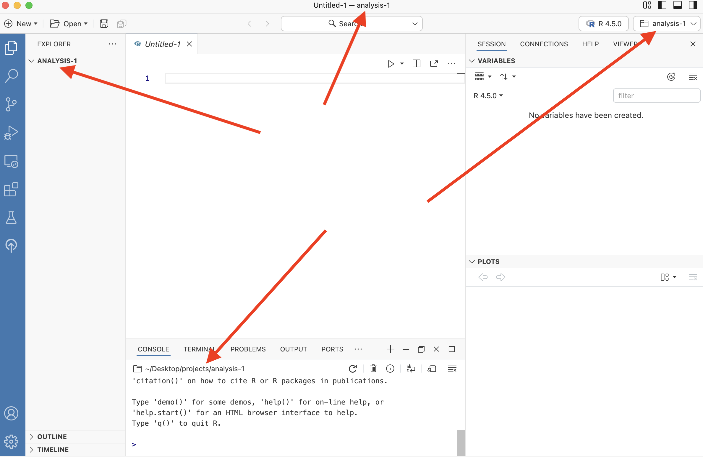

```{r setup, include = FALSE}
library(learnr)
library(tutorial.helpers)
library(tidyverse)
library(knitr)

# Needed because fs::path_home() seems to be the best thing to use to identify the core home 
# directory on Windows, and it works on the Mac as well. ?fs::path_home gives lots of details
# and discussion.

library(fs)

knitr::opts_chunk$set(echo = FALSE)
knitr::opts_chunk$set(out.width = '90%')
options(tutorial.exercise.timelimit = 60, 
        tutorial.storage = "local")
```

```{r copy-code-chunk, child = system.file("child_documents/copy_button.Rmd", package = "tutorial.helpers")}
```

```{r info-section, child = system.file("child_documents/info_section.Rmd", package = "tutorial.helpers")}
```

<!-- From Luit:

For tutorial code 01
Could we add that 
If I wanted to choose my own file name to put the project into I should put dir.create("filename", recursive = TRUE) -->


## Introduction
### 

This tutorial teaches you how to use [**Positron**](https://positron.posit.co) with [**R**](https://www.r-project.org/about.html) scripts and how to create [projects](https://docs.posit.co/ide/user/ide/guide/code/projects.html). It assumes that you have some knowledge of R code, perhaps at the level of the "Introduction" tutorial from [**r4ds.tutorials**](https://ppbds.github.io/r4ds.tutorials/) package. It includes some information from [*R for Data Science (2e)*](https://r4ds.hadley.nz/) by Hadley Wickham, Mine Çetinkaya-Rundel, and Garrett Grolemund. 

###

After starting the tutorial, your Positron window looked something like this:

```{r}

```

Your Console is currently "busy" running the tutorial. But, you will still want to run R commands, so you will need a second Console. Create it by pressing the "Start a New Session" button --- the `+` sign in the Console menu as indicated by the red arrow --- and choose the R option, if you are asked. After you do so, the Console should look like:

```{r}

```

You can switch back-and-forth between the two Consoles, but you will rarely want to since the first is just running the tutorial.

###

The other solution to the problem of a busy-running-the-tutorial Console is to start a new Positron window with `File -> New Window`. You then move back and forth between the two windows. This is generally the better approach for any tutorial beyond the introductory level. We recommend this workflow.

## Installing Git
### 

This tutorial assumes that you have read and completed all the steps in the "Tutorials in Positron" tutorial from the [**tutorial.helpers**](https://ppbds.github.io/tutorial.helpers/) package. We will ask you to **c**opy/**p**aste the **c**ommand/**r**esponse so often, we shorten this instruction to CP/CR.

### Exercise 1

The Terminal tab is next to the Console tab within the Panel in the lower left portion of the Positron window.  We use the Console tab to talk to R. We use the Terminal tab to talk directly with the computer.

At the Terminal, type `git --version`. Hit `Enter/Return`. (Your computer may respond by asking if you want to install Git. You do. Go ahead and install.)

CP/CR.

```{r installing-git-1}
question_text(NULL,
	answer(NULL, correct = TRUE),
	allow_retry = TRUE,
	try_again_button = "Edit Answer",
	incorrect = NULL,
	rows = 3)
```

###

My answer looks like this:

````
dkane@macbook positron.tutorials % git --version
git version 2.39.3 (Apple Git-146)
dkane@macbook positron.tutorials % 
````

As long as you have some version of Git installed, you are OK. 

But many of you will get an error like:

````
command not found: git
````

Or:

````
The term 'git' is not recognized as the name of a cmdlet, function, script file, or operable program.
````

Either means that Git is not installed on your computer.

### Exercise 2

If you got an error in the previous question, follow [these instructions](https://git-scm.com/book/en/v2/Getting-Started-Installing-Git) to install Git, if it was not installed automatically. If asked, you should allow "Git BASH" to be installed. This is a much better shell than the Powershell which comes with Windows.

Next, quit Positron using the menu commands: `Positron -> Quit Positron`. This is the safest way to ensure that Positron "discovers" your new Git installation.

Start Positron again. This tutorial will have been closed when you quit Positron. Restart the tutorial with:

````
learnr::run_tutorial("01-code", "positron.tutorials")
````

You will, probably, need to `File -> New Window` again to have a new Console to work with.

At the Terminal, type `git --version`. Hit `Enter/Return`.

```{r installing-git-2}
question_text(NULL,
	answer(NULL, correct = TRUE),
	allow_retry = TRUE,
	try_again_button = "Edit Answer",
	incorrect = NULL,
	rows = 3)
```

###

If this works, you should be all set. If not, seek help. You need Git!

### Exercise 3

From the Terminal, run `echo $0`. (To "run" a command at the Terminal or the Console means to type the command and then click the `Enter/Return` key.)

CP/CR.

```{r installing-git-3}
question_text(NULL,
	answer(NULL, correct = TRUE),
	allow_retry = TRUE,
	try_again_button = "Edit Answer",
	incorrect = NULL,
	rows = 3)
```

###

On a Mac, I get:

````
dkane@macbook positron.tutorials % echo $0      
/bin/zsh
dkane@macbook positron.tutorials % 
````

This means that, in the Terminal, I am using [Z shell](https://en.wikipedia.org/wiki/Z_shell). On Windows, your answer will probably be something like `bash`, referring to the [Bash](https://en.wikipedia.org/wiki/Bash_(Unix_shell)), a different shell. Don't worry about the differences. 

The important thing is that, first, you now have Git installed and, second, if you are a Windows user, you now have a better shell than Powershell.

If this works, you should be all set. If not, seek help. You need a decent shell in the Terminal.

###

If you are a Windows user and this is not working, here are some things to try: 

* At the Console, run this command:

````
tutorial.helpers::set_positron_settings(positron_settings = 
   list("terminal.integrated.defaultProfile.windows" = "Git Bash"))
````

## Checking your setup
### 

Now that Git and your Terminal shell are working, we can turn our attention to working with Positron and R.

### Exercise 1

At the Console, type `show_file()`. CP/CR.

```{r checking-your-setup-1}
question_text(NULL,
	answer(NULL, correct = TRUE),
	allow_retry = TRUE,
	try_again_button = "Edit Answer",
	incorrect = NULL,
	rows = 3)
```

###

Your answer should look like this:

````
> show_file()
Error in `show_file()`:
! could not find function "show_file"
````

Going forward, we won't bother with boilerplate like "Your answer should look like this." Instead, you can assume that any quote directly after a question is our answer to the question.

In this case, the error is that we have not yet loaded the **tutorial.helpers** package, which is where `show_file()` is located.  If we had specified the package as part of the function call, as with `tutorial.helpers::show_file()`, R would have found the function.

### Exercise 2

Load the **tutorial.helpers** package into your Console using the `library()` function.

Run `search()` in the Console to see the libraries that you've currently loaded. CP/CR. That is, copy and paste that command and the result into the space below.

```{r checking-your-setup-2}
question_text(NULL,
	answer(NULL, correct = TRUE),
	allow_retry = TRUE,
	try_again_button = "Edit Answer",
	incorrect = NULL,
	rows = 3)
```

### 

````
> library(tutorial.helpers)
> search()
 [1] ".GlobalEnv"               "package:tutorial.helpers" "tools:rstudio"           
 [4] "tools:positron"           "package:stats"            "package:graphics"        
 [7] "package:grDevices"        "package:utils"            "package:datasets"        
[10] "package:methods"          "Autoloads"                "package:base"            
````

The string "package:tutorial.helpers" should be in the output. Don't worry if your answer does not match our answer exactly, either in this question or in any other question.

### Exercise 3

At the Console, run:

````
show_file(file.path(R.home(), "COPYING"), end = 7)
````

```{r checking-your-setup-3}
question_text(NULL,
	answer(NULL, correct = TRUE),
	allow_retry = TRUE,
	try_again_button = "Edit Answer",
	incorrect = NULL,
	rows = 3)
```

###

````
> show_file(file.path(R.home(), "COPYING"), end = 7)
		    GNU GENERAL PUBLIC LICENSE
		       Version 2, June 1991

 Copyright (C) 1989, 1991 Free Software Foundation, Inc.
                       51 Franklin St, Fifth Floor, Boston, MA  02110-1301  USA
 Everyone is permitted to copy and distribute verbatim copies
 of this license document, but changing it is not allowed.
````

###

This command would have failed if we had not loaded the **tutorial.helpers** package already.

### Exercise 4

Restart R within the current Console --- not the Console which is running this tutorial --- by pressing the "Start Console" button, the curling arrow in the Console menu:

```{r}

```

CP/CR the top of the restarted Console.

```{r checking-your-setup-4}
question_text(NULL,
	answer(NULL, correct = TRUE),
	allow_retry = TRUE,
	try_again_button = "Edit Answer",
	incorrect = NULL,
	rows = 3)
```

###

````
R 4.5.0 - 2 exited (preparing for restart)
R 4.5.0 - 2 restarted.
>
````

As always, it is not important that your answer looks *exactly* like our answer.

### Exercise 5

Let's run this command again:

````
show_file(file.path(R.home(), "COPYING"), end = 7)
````

CP/CR.


```{r checking-your-setup-5}
question_text(NULL,
	answer(NULL, correct = TRUE),
	allow_retry = TRUE,
	try_again_button = "Edit Answer",
	incorrect = NULL,
	rows = 3)
```

###

````
> show_file(file.path(R.home(), "COPYING"), end = 7)
Error in `show_file()`:
! could not find function "show_file"
````

It failed, even though it had just worked before. The reason is that, whenever you restart R, you get a "clean slate," with nothing but the default packages loaded.

### Exercise 6

Run `library(tutorial.helpers)` again. CP/CR.

```{r checking-your-setup-6}
question_text(NULL,
	answer(NULL, correct = TRUE),
	allow_retry = TRUE,
	try_again_button = "Edit Answer",
	incorrect = NULL,
	rows = 3)
```

###

````
> library(tutorial.helpers)
````

Loading some packages prints a bunch of messages to the Console. But most packages, like **tutorial.helpers**, print nothing.

### Exercise 7

Load the **tidyverse** package into your Console using the `library()` function.

If this fails, the most likely cause is that you failed to installed the **tidyverse** package. Run `install.packages('tidyverse')` in the Console to fix this and then try `library(tidyverse)` again.

CP/CR.

```{r checking-your-setup-7}
question_text(NULL,
    answer(NULL, correct = TRUE),
    allow_retry = TRUE,
    try_again_button = "Edit Answer",
    incorrect = NULL,
    rows = 3)
```

### 

````
> library(tidyverse)
── Attaching core tidyverse packages ───── tidyverse 2.0.0 ──
✔ dplyr     1.1.4     ✔ readr     2.1.5
✔ forcats   1.0.0     ✔ stringr   1.5.1
✔ ggplot2   3.5.2     ✔ tibble    3.2.1
✔ lubridate 1.9.4     ✔ tidyr     1.3.1
✔ purrr     1.0.4     
── Conflicts ─────────────────────── tidyverse_conflicts() ──
✖ dplyr::filter() masks stats::filter()
✖ dplyr::lag()    masks stats::lag()
ℹ Use the conflicted package to force all conflicts to become errors
````

The **tidyverse** package is warning us about various conflicts. Don't worry about those conflicts for now.

### Exercise 8

Look at the upper right of the Positron window. You should see the version of R you are running. 

Type `R.version$version.string` into the Console and hit `Enter`. CP/CR.

```{r checking-your-setup-8}
question_text(NULL,
    answer(NULL, correct = TRUE),
    allow_retry = TRUE,
    try_again_button = "Edit Answer",
    incorrect = NULL,
    rows = 3)
```

### 

This should be the same as the version you see at the top left of the Console screen and at the top right on the Positron window. Make sure it is the [most recently released](https://cran.r-project.org/) version of R.

### Exercise 9

Shortly, we will create a new "project" for you to work in. Before we do this, it might be useful to understand where you are right now.

In the Console, run `getwd()`. CP/CR.

```{r checking-your-setup-9}
question_text(NULL,
    answer(NULL, correct = TRUE),
    allow_retry = TRUE,
    try_again_button = "Edit Answer",
    incorrect = NULL,
    rows = 3)
```

### 

If you are on a Mac, you answer probably looks like:

````
> getwd()
[1] "/Users/dkane"
>
````

This is especially true if you are new to Positron. If you have used Positron before, then it might start out in the last directory in which you were working. Otherwise, it defaults to your "home" directory.

###

If I were on Windows, then the home directory would be something like `C:\Users\dkane\Documents` or even  `C:\Users\dkane\OneDrive\Documents` or even one of these with`\\` instead of `\` to separate out the directories. Note that on Windows:

* The file system starts on the `C:` drive.

* The directories are separated with backward slashes, instead of the forward slashes which we see on the Mac.

* The notion of a "home" directory is tricky, both in general and when compared with a Mac. On the Mac, the "home" directory is almost always something like `/Users/dkane`. On Windows, the "home" directory generally refers to a user's `Documents` folder, which is sometimes housed on `OneDrive`.

* `OneDrive`, like many cloud-backup systems, does not play particularly well with Git, the program almost everyone uses to keep track of changes in your code. **Do not put your data science projects in a folder which is backed up with OneDrive.**

### Exercise 10

In the Console, run `fs::path_home()`. If this fails, then you probably need to install the **fs** package. Please do so and try again. 

CP/CR.

```{r checking-your-setup-10}
question_text(NULL,
	answer(NULL, correct = TRUE),
	allow_retry = TRUE,
	try_again_button = "Edit Answer",
	incorrect = NULL,
	rows = 3)
```

###

````
> fs::path_home()
/Users/dkane
````

This function returns the "path" to your home directory. A path is simply the information which allows you to reach a location on your computer. In this case, if you wanted to find the folder from which R is running, you would use `getwd()` to **get** the **w**orking **d**irectory.

More info on paths can be found [here](https://people.ischool.berkeley.edu/~kevin/unix-tutorial/section3.html).

If you are on Windows, you should have gotten a similar answer, something like:

````
C:\Users\dkane
````

Because it is Windows, the path begins with `C:` and the slashes are backwards slashes. 

The important point is that, in almost all non-pathological set ups, you will have a home directory. It is important to know where that is.


### Exercise 11

Let's take a look at the directories in your home directory. From the Console, run `list.files(fs::path_home())`. CP/CR.

```{r checking-your-setup-11}
question_text(NULL,
	answer(NULL, correct = TRUE),
	allow_retry = TRUE,
	try_again_button = "Edit Answer",
	incorrect = NULL,
	rows = 3)
```

### 

My answer:

```
> list.files(fs::path_home())
 [1] "AppData"      "Applications" "Desktop"      "Documents"   
 [5] "Downloads"    "Library"      "miniconda3"   "Movies"      
 [9] "Music"        "Pictures"     "Public"       "temp"        
>           
```

If you are on a Mac, then the `Desktop` directory is a handy location in which to store all your coding projects.  If you are on Windows, then the `Desktop` directory might be less convenient because it is often, but not always, backed up on OneDrive.

**Avoid doing data science in any directory which is backed up by OneDrive, or any other backup service.**

### Exercise 12

Whenever you start a new project, you will want to store it in a location which you can easily find. Right now, you are likely in an arbitrary location on your computer. It would be much more useful to have a location dedicated to your projects.

From the Console, run `file.exists(file.path(fs::path_home(), "Desktop"))`. 

CP/CR.

```{r checking-your-setup-12}
question_text(NULL,
	answer(NULL, correct = TRUE),
	allow_retry = TRUE,
	try_again_button = "Edit Answer",
	incorrect = NULL,
	rows = 3)
```

### 

My answer:

```
> file.exists(file.path(fs::path_home(), "Desktop"))
[1] TRUE
```

For almost all Mac users and many Windows users, this should return `TRUE` because there is a `Desktop` directory. For some Windows users, it will return `FALSE` because their `Desktop` directory is within a `OneDrive` directory which is automatically backed up to the cloud.


### Exercise 13

Let's make a folder, and call it `projects`. If `file.exists(file.path(fs::path_home(), "Desktop"))` returned `TRUE`, then run this at the Console:

```
dir.create(file.path(fs::path_home(), "Desktop", "projects"))
```

That should put your `projects` directory in your `Desktop` directory. (Note that "folder" and "directory" mean the same thing.) If you get a warning message, here or below, that this directory "already exists," then you are all set.

If `file.exists(file.path(fs::path_home(), "Desktop"))` returned `FALSE`, then run this at the Console:

```
dir.create(file.path(fs::path_home(), "projects"))
```

That will also create a `projects` directory, but n your home directory. 

CP/CR. 

```{r checking-your-setup-13}
question_text(NULL,
	answer(NULL, correct = TRUE),
	allow_retry = TRUE,
	try_again_button = "Edit Answer",
	incorrect = NULL,
	rows = 3)
```

### 

If that command works, you are all set. (If you get a message that the directory already exists, then you are also all set.) If not, you will need to create a `projects` directory by hand. Helpful resources can be found [here](https://support.microsoft.com/en-us/office/create-a-new-folder-cbbfb6f5-59dd-4e5d-95f6-a12577952e17) for Windows, and [here](https://support.apple.com/guide/mac-help/organize-files-using-folders-mh26885/mac) for macOS.

### 

**The path to your data science projects should not include any folders with spaces (or other weird characters) in their names.** For example, this is a reasonable location for R projects if you are using a Mac:

```
/Users/dkane/Desktop/projects/
```

And if you are using Windows . . .

````
C:/Users/dkane/projects/
````

Again, you can place your `projects` directory where you want, as long as you keep track of where it is.

### Exercise 14

It is handy for Positron to know where your `projects` directory is so that it can offer that directory as a default when you start a new project, as you will in the next section. To do so, from the Console, run this command after replacing "PUT YOUR PROJECT PATH HERE" with your project path.

````
tutorial.helpers::set_positron_settings(positron_settings = 
   list("files.dialog.defaultPath" = "PUT YOUR PROJECT PATH HERE"))
````

So, for example, I would run:

````
tutorial.helpers::set_positron_settings(positron_settings = 
   list("files.dialog.defaultPath" = "/Users/dkane/Desktop/projects"))
````

But you should not run that! That only works for me. You need to run the command with your `projects` path.

CP/CR.

```{r checking-your-setup-14}
question_text(NULL,
	answer(NULL, correct = TRUE),
	allow_retry = TRUE,
	try_again_button = "Edit Answer",
	incorrect = NULL,
	rows = 3)
```

###

You can examine the `settings.json` file in which these settings are recorded. Ask AI where this file is located on your computer and how to access it.

### Exercise 15

From the Terminal, run this command:

````
cat ~/AppData/Roaming/Positron/User/settings.json 2>/dev/null || cat ~/Library/Application\ Support/Positron/User/settings.json 2>/dev/null || echo "Settings file not found"
````

CP/CR.

```{r checking-your-setup-15}
question_text(NULL,
	answer(NULL, correct = TRUE),
	allow_retry = TRUE,
	try_again_button = "Edit Answer",
	incorrect = NULL,
	rows = 3)
```

###

This command is experimental and might not work. No worries if so. But, for me on a Mac, I see:

````
dkane@macbook positron.tutorials % cat ~/AppData/Roaming/Positron/User/settings.json 2>/dev/null || cat ~/Library/Application\ Support/Positron/User/settings.json 2>/dev/null || echo "Settings file not found"
{
  "files.dialog.defaultPath": "/Users/dkane/Desktop/projects",
  "terminal.integrated.defaultProfile.windows": "Git Bash"
}
dkane@macbook positron.tutorials % 
````

Which is what I expect. I have two settings, the first is what we just created. The second, which does not effect me since I use the Mac and not Windows, was created when I went through "[Getting Started with Positron](https://ppbds.github.io/primer/getting-started-with-positron.html)."

If you are a Windows user who does not see the second setting, please run this command from the Console:

````
tutorial.helpers::set_positron_settings(positron_settings = 
   list("terminal.integrated.defaultProfile.windows" = "Git Bash"))
````

You want "Git Bash" to be the default value for "terminal.integrated.defaultProfile.windows".


## Projects
### 

Good data scientists keep their work organized. You should place your work in different projects, which are simply folders (that is, directories) on your computer. Each separate project is a folder within your main folder for your data science work, i.e.,  `/Users/dkane/Desktop/projects/`.  

### Exercise 1

**Read all the instructions before starting the steps.**

From the `File` menu, select `New Project ...`. 

From the "Project Type" screen, select "R Project." Click "Next." Doing so brings up the "Create New Project" screen:

```{r}
include_graphics("images/set-project-1.png")
```

Enter `analysis-1` as your "Project Name." Set the "Parent Directory" to your `projects` directory. (You may have to "Browse" your computer to find it, but, with luck, your `projects` directory is provided as the default.) Do **not** initialize the project as a Git repository.

```{r}

```

Click "Next."

The "Set up project configuration" screen should appear. Accept the default option, which should be the version of R which you installed. Click "Create." Then:

```{r}
include_graphics("images/set-project-3.png")
```

**Choose "New Window."** You need two Positron windows to work on tutorials. The first one --- this one --- runs the tutorial. The second one is where you do the work. So, you need to select the "New Window" option.

Your new window should look like this:

```{r}

```

You are in the `analysis-1` project, as you can see in four ways, indicated by the red arrows.

**Instructions ended. Please follow them now.**

### 

Run `getwd()` in the Console in the new Window, the one which is running the `analysis-1` project.

CP/CR.

```{r projects-1}
question_text(NULL,
    answer(NULL, correct = TRUE),
    allow_retry = TRUE,
    try_again_button = "Edit Answer",
    incorrect = NULL,
    rows = 3)
```

### 

This path should now be different than our previous path, similar to the path below. Creating/opening a project moves the R session to that directory.

````
/Users/dkane/Desktop/projects/analysis-1/
````

### 

If your path does not include your `projects` folder, you probably did not fill in the "Parent Directory" box correctly. It should be the path to your `projects` folder, including `projects` itself.


### Exercise 2

The new window should look like this:

```{r}

```

The *Welcome* screen has disappeared. There is a blank, unsaved file named *`Untitled-1`* in the Editor pane. You can tell it is unsaved because its name is *italicized*. By default, the Explorer button in the Activity Bar on the far left has been activated, showing us that the `analysis-1` directory has no files in it yet.

### 

Run `list.files()`. 

CP/CR.

```{r projects-2}
question_text(NULL,
    answer(NULL, correct = TRUE),
    allow_retry = TRUE,
    try_again_button = "Edit Answer",
    incorrect = NULL,
    rows = 3)
```

### 

`list.files()` returns files contained in your current project. There are none so far.

Keeping all the files associated with a given project --- input data, R scripts, analytic results, and figures --- together in one directory is very wise.

Everything you need is in one place and cleanly separated from all the other projects that you are working on.

## Script 1
### 

So far, we have only worked in the Console, but it's quite difficult to type more than a few lines of code into the Console at once. One solution is to use [R scripts](https://r4ds.hadley.nz/workflow-scripts.html#scripts), files which contain a permanent copy of our code.

### Exercise 1

The file `Untitled-1` should already be in your Editor window. If it is not, you can create a new file by clicking the `File -> New File ...` drop down menu, and then selecting `R File`.

### 

Type `5 + 5` into your R script file. Save the file. Name it `script-1.R`. (Note that R will provide the `.R` suffix, so you only need to type `script-1`.) 

In the Console, run:

````
tutorial.helpers::show_file("script-1.R")
````

CP/CR.

```{r script-1-1}
question_text(NULL,
	answer(NULL, correct = TRUE),
	allow_retry = TRUE,
	try_again_button = "Edit Answer",
	incorrect = NULL,
	rows = 3)
```

### 

You might have gotten this warning:

````
Warning message:
In readLines("script-1.R") : incomplete final line found on 'script-1.R'
````

This means that your file needs a blank line at the end. As a rule of thumb, it is always a good idea to have the last line of any text file be blank.

R scripts are permanent copies of your code. You can save them and also work with them interactively.

### Exercise 2

Note the "Source" button, which is in the top right corner of the Editor. 

```{r}

```

If you hover your cursor over it, you will see "Source R File." Press the Source button. (We will sometimes shorten the instruction "press the source button" to just "source" the script.)

Note what happens in the Console. CP/CR.


```{r script-1-2}
question_text(NULL,
    answer(NULL, correct = TRUE),
    allow_retry = TRUE,
    try_again_button = "Edit Answer",
    incorrect = NULL,
    rows = 2)
```

### 

You answer should look like this:

````
> source("/Users/dkane/Desktop/projects/analysis-1/script-1.R")
````

### 

Whenever you run an R script file by hitting the "Source" button, Positron will send all the code in the file to the Console. 

### Exercise 3

Right next to the Source button is a small downward pointing arrow. Clicking on it produces three options, the top (default) of which is the simple "Source R File" which you ran in the last question.

```{r}

```

Select the second option: "Source R File with Echo." CP/CR.

```{r script-1-3}
question_text(NULL,
	answer(NULL, correct = TRUE),
	allow_retry = TRUE,
	try_again_button = "Edit Answer",
	incorrect = NULL,
	rows = 3)
```

### 

```
> source("/Users/dkane/Desktop/projects/analysis-1/script-1.R", echo = TRUE)

> 5 + 5
[1] 10
>
```

The file is sourced, as before. But, this time, each line in the file is "echoed," meaning we see both the code, `5 + 5` in this case, and the return value, if any, which is `10`.

### Exercise 4

There are often "shortcut key" combinations which perform the same task as clicking a button. Placing your cursor inside the R script window and using the keyboard shortcut `(Cmd/Ctrl) + Shift + (Return/Enter)` is the same as hitting the "Source R File with Echo" option. 

Note that `Return` is the name of a Mac key and `Enter` the name of the corresponding Windows key, just like `Cmd` ("Command") is a Mac key and `Ctrl` ("Control") is the equivalent Windows key. In other words, on the Mac, we hit `Cmd + Shift + Return` while on Windows it is `Ctrl + Shift + Enter`. However, typing `Return/Enter` when writing these tutorials is annoying, so, going forward, we will just use `Enter`. Mac users are expected to remember that this means the `Return` key.

Try it now. CP/CR.

```{r script-1-4}
question_text(NULL,
    answer(NULL, correct = TRUE),
    allow_retry = TRUE,
    try_again_button = "Edit Answer",
    incorrect = NULL,
    rows = 2)
```

### 

Using shortcut keys is quicker and more professional than clicking buttons. 

### Exercise 5

In your R script, type `6 * 3` in the line after `5 + 5`. Save the file with `Cmd/Ctrl + s`. 

Source this file with echo. CP/CR.

```{r script-1-5}
question_text(NULL,
    answer(NULL, correct = TRUE),
    allow_retry = TRUE,
    try_again_button = "Edit Answer",
    incorrect = NULL,
    rows = 2)
```

### 

The answer is what you might expect:

````
> source("/Users/dkane/Desktop/projects/analysis-1/script-1.R", echo = TRUE)

> 5 + 5
[1] 10

> 6 * 3
[1] 18
>
````

### 

Each line is *echoed*. Each line is *executed*.  The results of each line, if there are any, are printed.

The output you see is the same as what would happen if you copied each line to the Console and hit `Enter` after each one.

### Exercise 6

Instead of sourcing the entire file, we can just execute (or "run") a single line. In `script-1.R`, place your cursor on the same line as `6 * 3` and click the "Run Selection in Console" option, the third choice in the Source button. CP/CR.

```{r script-1-6}
question_text(NULL,
    answer(NULL, correct = TRUE),
    allow_retry = TRUE,
    try_again_button = "Edit Answer",
    incorrect = NULL,
    rows = 2)
```

###

You should get:

````
> 6 * 3
[1] 18
>
````

### 

Instead of both lines in the script executing, only the second line does. And the process by which this happens has nothing to do with the entire script. **Run is not the same thing as Source.** With Run, you are just copy/pasting some of the lines from the script to the Console at a time. With Source, you're copy/pasting *all* lines from the script. 

### Exercise 7

The shortcut key for running a single line of code is `Cmd/Ctrl + Enter`. In your R script, place your cursor on the same line as `5 + 5` and hit `Cmd/Ctrl + Enter`. CP/CR.

```{r script-1-7}
question_text(NULL,
    answer(NULL, correct = TRUE),
    allow_retry = TRUE,
    try_again_button = "Edit Answer",
    incorrect = NULL,
    rows = 2)
```

### 

````
> 5 + 5
[1] 10
>
````

Only the first line of the script is executed. `Cmd/Ctrl + Enter` is probably the single most commonly used shortcut key because it is very handy to execute your code line-by-line.

`Cmd/Ctrl + Enter` is "smart" in two ways. First, if you highlight more than one line of code, and then place your cursor within the highlighted area, it will execute all the code in that area. Second, even if nothing is highlighted,  if the line with the cursor is part of a block of code which extends over multiple lines --- like creating a plot --- it will execute all the code in that block.

<!-- Add a question which shows this by adding an example to the file, like addition over two lines, and then shows it? -->

### Exercise 8

Go back to the first line in your R script. Change `5 + 5` to `x <- 5 + 5`, thereby creating an object named `x` with a value of 10. Save the file. Click the "Source R File with Echo" option. CP/CR.

```{r script-1-8}
question_text(NULL,
	answer(NULL, correct = TRUE),
	allow_retry = TRUE,
	try_again_button = "Edit Answer",
	incorrect = NULL,
	rows = 3)
```

###

Your answer should look like:

````
> source("~/Desktop/projects/analysis-1/script-1.R", echo=TRUE)

> x <- 5 + 5

> 6 * 3
[1] 18
> 
````

### 

Note how the `x <- 5 + 5` is executed (and echoed) but nothing is printed. The assignment operator, `<-`, does not generate a return value.

<!-- Being a little sloppy in using the (correct?) term "return value" here but not above. -->

### Exercise 9

In the Console tab, run `ls()`. CP/CR.

```{r script-1-9}
question_text(NULL,
    answer(NULL, correct = TRUE),
    allow_retry = TRUE,
    try_again_button = "Edit Answer",
    incorrect = NULL,
    rows = 2)
```

### 

````
> ls()
[1] "x"
>
````

###

`ls()` returns a list of objects present in your environment. These are the same objects displayed under Variables in your Session tab in the Secondary Side Bar in Positron (on the right side). 

```{r}

```

In this case, the object `x`, which has a value of 10, exists in your workspace. As you can confirm by typing `x` at the Console and hitting `Enter`.

````
> x
[1] 10
>
````

## Script 2
### 

Let's create a plot like this one:

```{r diamond-hist}
hist_p <- ggplot(data = diamonds,
                 mapping = aes(x = carat)) +
  geom_histogram(bins = 100,
                 color = "white") +
  scale_y_continuous(labels = scales::comma_format()) +
  labs(title = "Histogram of Carat (Weight) among 50,000 Diamonds",
       subtitle = "Carats just at or above meaningful numbers are very common",
       x = "Carat",
       y = "Number",
       caption = "diamonds data set from ggplot2 package")

hist_p
```

### Exercise 1

Click `File -> New File ... -> R File`. At the top of the Editor, the file should be called *`Untitled-1`* (or something similar). 

### 

Click the "Save current document" icon -- the disk image to the right of the Open dropdown menu. Or use the shortcut `Cmd/Ctrl + s` to save the script. Let's call this file `script-2.R`. The `.R` suffix is not always added automatically. Make sure it is there.

In the Console, run `list.files()`. CP/CR.

```{r script-2-1}
question_text(NULL,
    answer(NULL, correct = TRUE),
    allow_retry = TRUE,
    try_again_button = "Edit Answer",
    incorrect = NULL,
    rows = 2)
```

### 

````
> list.files()
[1] "script-1.R" "script-2.R"
````

Save your scripts (with informative names) in the project, edit them, run them line-by-line or in their entirety. Restart R frequently to make sure you’ve captured everything in your scripts.

Scripts and projects give you a solid workflow that will serve you well in the future. Always remember to create one project for each data analysis project. That project may contain multiple script files, along with other material.

### Exercise 2

Restart your R session with `Cmd/Ctrl + Shift + 0`. 

From the Console, run `list.files()`. CP/CR.

```{r script-2-2}
question_text(NULL,
	answer(NULL, correct = TRUE),
	allow_retry = TRUE,
	try_again_button = "Edit Answer",
	incorrect = NULL,
	rows = 3)
```

### 

```
R 4.5.0 exited (preparing for restart)
R 4.5.0 restarted.
> list.files()
[1] "script-1.R" "script-2.R"
>
```

The two files we had from before --- `script-1.R`, and `script-2.R` --- still exist. Our work, if we have saved it, is preserved even when R (or Positron) restarts. 

### Exercise 3

From the Console, run `ls()`. CP/CR.

```{r script-2-3}
question_text(NULL,
	answer(NULL, correct = TRUE),
	allow_retry = TRUE,
	try_again_button = "Edit Answer",
	incorrect = NULL,
	rows = 3)
```

### 

````
> ls()
character(0)
>
````

`x` is gone! The environment --- the place in the computer where R creates and uses objects --- is cleaned, by default, each time R restarts. This is a good thing! For our work to be "reproducible," we want to be able to start from nothing except our code and raw data.   

### Exercise 4

At the top of `script-2.R`, type

````
library(tidyverse)
````

You will see, in the top bar of the Editor, that `script-2.R`, the name of the file, has a black dot next to it. This indicates that there are unsaved changes in the file.

### 

Run the entire file with `Cmd/Ctrl + Shift + Enter`. Note how much material --- the "Attaching core tidyverse packages" and so on --- is produced in the Console. 

### 

Run `search()` in the Console. CP/CR.

```{r script-2-4}
question_text(NULL,
    answer(NULL, correct = TRUE),
    allow_retry = TRUE,
    try_again_button = "Edit Answer",
    incorrect = NULL,
    rows = 2)
```

### 

This function returns a list of loaded packages. This should include the string `package:tidyverse`.

### Exercise 5

Skip a line and add the following comment to the file:

````
# This is an example of a code comment within an R script.
````

Save the file. 

In the Console, run:

````
tutorial.helpers::show_file("script-2.R")
````

CP/CR.


```{r script-2-5}
question_text(NULL,
    answer(NULL, correct = TRUE),
    allow_retry = TRUE,
    try_again_button = "Edit Answer",
    incorrect = NULL,
    rows = 2)
```

### 

Did you remember to have a blank line at the end of the file? If not, you got a warning. Always have a blank line at the end of any text file.

### 

Comments begin with a hash (also known as a "pound sign"): `#`. R will ignore everything on the line to the right of the hash when running the code.

Comments are an extremely useful tool when writing code. If they're placed well, it becomes much easier to *debug* (find and fix mistakes) if something goes wrong. 

There are a few "guidelines" to writing comments, for example:

  - Comments should be used sparingly. 
  - Comments are unnecessary and in fact distracting if they state the obvious. 
  - Comments that contradict the code are worse than no comments. Always make a priority of keeping the comments up-to-date when the code changes!

Typically, when reading code, you should be able to answer 3 questions fairly easily, for every line: 

  - **What** is this code doing, 
  - **How** is it doing it, and
  - **Why** is it being done. 
  
The **what** and **how** can be deduced from the code itself. The **why**, though, is a bit trickier, and it is highly recommended that you use comments to make it easier to tell **why** something is being done. 

````
# This is an example of a poor comment:
...
x <- x + 1    # Increment x
...

# This is an example of a good comment:
...
x <- x + 1    # Account for borders
...
````

### Exercise 6

Change the code comment in `script-2.R` from "This is an example of a code comment within an R script." to a one sentence description of one of your recent meals. Save the file. 

In the Console, run:

````
tutorial.helpers::show_file("script-2.R")
````

CP/CR.


```{r script-2-6}
question_text(NULL,
    answer(NULL, correct = TRUE),
    allow_retry = TRUE,
    try_again_button = "Edit Answer",
    incorrect = NULL,
    rows = 2)
```

### 

Get in the habit of adding comments.

Figuring out *why* something was done is much more difficult than understanding *how* it was done. For example, `geom_smooth()` has an argument called `span`, which controls the smoothness of the curve, with larger values yielding a smoother curve. Suppose you decide to change the value of `span` from its default of 0.75 to 0.9: it’s easy for a future reader to understand what is happening, but unless you note your thinking in a comment, no one will understand *why* you changed from the default.


### Exercise 7

<!-- At this stage, we could just copy/paste in all the code. Or even ask AI for the code? We are no longer in the business of asking students to add one line of code at a time. -->

Skip a line after your comment. Call `ggplot()`, setting `data` to `diamonds` and mapping `x` to `carat` within `aes()`. 

Run the entire file again. Note the sloppiness of the word "run" in this instruction. It is not always clear what "run" means. In general, "run" means to "execute" all the code in the file, most commonly by either using `Cmd/Ctrl + Enter` line-by-line or by using `Cmd/Ctrl + Shift + Enter` for the whole file at once or by pressing the "Source" button.

### 

This should generate a blank plot in the Plots tab in bottom of the Secondary Side Bar.

### 

In the Console, run:

````
tutorial.helpers::show_file("script-2.R")
````

CP/CR.


```{r script-2-7}
question_text(NULL,
    answer(NULL, correct = TRUE),
    allow_retry = TRUE,
    try_again_button = "Edit Answer",
    incorrect = NULL,
    rows = 2)
```

### 

`ggplot()` will generate a blank plot, at least until a `geom` layer is added. 


### Exercise 8

Add a layer with `geom_histogram()`. Change the border color in our graph by setting `color` to `"white"` within `geom_histogram`, and change the number of columns in our plot by setting the `bins` argument to `100`. Remember that, to connect the `ggplot()` call to `geom_histogram()`, we need a `+`. 

Run the file. Again, to "run" a script generally means to "execute" it, meaning sending it to the R process. We have learned two ways to (easily) execute an entire file: pressing the "Source" button or hitting the associated shortcut key: `Cmd/Ctrl + Shift + Enter`. In interactive work, however, the most common approach is to use `Cmd/Ctrl + Enter` and go through the file line-by-line, while also occasionally restarting R with `Cmd/Ctrl + Shift + 0`.

<!-- DK: Does `Cmd/Ctrl + Shift + Enter` work on Windows? -->

### 

This should generate bars on your plot. Did you remember to place a `+` after the `ggplot()` call and before the `geom_histogram()` layer?

### 

In the Console, run:

````
tutorial.helpers::show_file("script-2.R")
````

CP/CR.


```{r script-2-8}
question_text(NULL,
    answer(NULL, correct = TRUE),
    allow_retry = TRUE,
    try_again_button = "Edit Answer",
    incorrect = NULL,
    rows = 5)
```

### 

The `color` argument used here modifies the *border* color of our columns. To change the *fill* color, use the `fill` argument.

### Exercise 9

It would be nice if the numbers on the Y-axis were formatted better, i.e., with commas. The easiest way to do that is to add this line to the script.

````
scale_y_continuous(labels = scales::comma_format())
````

Do so. Run the file. Note that you don't need to save the file first. If you execute a file using either the "Source" button or `Ctrl + Shift + Enter`, Positron will save the file automatically.

Don't forget that you will need a `+` after the call to `geom_histogram()`.

In the Console, run:

````
tutorial.helpers::show_file("script-2.R")
````

CP/CR.

```{r script-2-9}
question_text(NULL,
	answer(NULL, correct = TRUE),
	allow_retry = TRUE,
	try_again_button = "Edit Answer",
	incorrect = NULL,
	rows = 3)
```

### 

Note how the histogram in the Positron Plot window has not been updated. When you run and entire file with the "Source" button or `Cmd/Ctrl + Shift + Enter" 

We use `scale_y_continuous()` (and `scale_x_continuous()`) to modify the labels and the breaks in numeric axes. The **scales** package provides a variety of useful formatting tools, including `comma_format()`, `dollar_format()` and others.


### Exercise 10

Now let's make our graph look a little nicer by adding a `labs()` layer with an appropriate title, subtitle, and axis labels.

Reminder, this is what our graph should look like

```{r}
hist_p
```

Run your R script to see your completed plot. Again, note the wording here! In casual language, we use the word "run" to generically mean "Tell the computer to execute the commands in this file." We don't necessarily care how that is achieved.

### 

In the Console, run:

````
tutorial.helpers::show_file("script-2.R")
````

CP/CR.

```{r script-2-10}
question_text(NULL,
    answer(NULL, correct = TRUE),
    allow_retry = TRUE,
    try_again_button = "Edit Answer",
    incorrect = NULL,
    rows = 8)
```

### 

Good coding style is like correct punctuation: you can manage without it, butitsuremakesthingseasiertoread. Even as a very new programmer, it’s a good idea to work on your code style. Using a consistent style makes it easier for others (including future-you!) to read your work and is particularly important if you need to get help from someone else. 

Note the nice formatting. After the `ggplot()` call, the next two commands --- `geom_histogram()` and `labs()` --- are both indented the same amount. Similarly, arguments to a given function --- like `bins` and `color` --- are lined up with each other.


### Exercise 11

Now we have the code which creates a plot in `script-2.R`. How do we use this plot for other things? Right now we have to run `script-2.R` every time we want to see the plot, which is a little inconvenient.

### 

We can use the `ggsave()` function. Type `?ggsave` in the Console. This will open the help page for `ggsave()`. Copy and paste the Description from the help page into the space below.

```{r script-2-11}
question_text(NULL,
    answer(NULL, correct = TRUE),
    allow_retry = TRUE,
    try_again_button = "Edit Answer",
    incorrect = NULL,
    rows = 5)
```

`ggsave()` is used to save a plot as an individual file which is separate from the code which created the plot. In this case we will be using the "png" format.

### Exercise 12

We want to save our entire graph to an object, which can be done by setting our plot equal to a variable. Call this variable `hist_p`.

Now using the `ggsave()` function we can create a PNG of our plot from our code. In `ggsave()`, set `plot` to `hist_p` and `file` to `"diamonds.png"`.

Your entire file should look like:

````
library(tidyverse)

# Had an OK filet mignon at Cheesecake Factory.
hist_p <- ggplot(data = diamonds,
                 mapping = aes(x = carat)) +
  geom_histogram(bins = 100,
                 color = "white") +
  scale_y_continuous(labels = scales::comma_format()) +                
  labs(title = "Histogram of Carat (Weight) among 50,000 Diamonds",
       subtitle = "Carats just at or above meaningful numbers are very common",
       x = "Carat",
       y = "Count",
       caption = "diamonds data set from ggplot2 package")

ggsave(plot = hist_p, file = "diamonds.png")
````

Run your code. CP/CR.

```{r script-2-12}
question_text(NULL,
	answer(NULL, correct = TRUE),
	allow_retry = TRUE,
	try_again_button = "Edit Answer",
	incorrect = NULL,
	rows = 3)
```

###

Your answer should look something like:

```
> source("/Users/dkane/Desktop/projects/analysis-1/script-2.R", echo = TRUE)

> library(tidyverse)

> # Had an OK filet mignon at Cheesecake Factory.
> 
> hist_p <- ggplot(data = diamonds,
+                  mapping = aes(x = carat)) +
+   geom_histo .... [TRUNCATED] 

> ggsave(plot = hist_p, file = "diamonds.png")
Saving 3.33 x 3.33 in image
>
```

You are witnessing a conversation between your script and R. Your script tells R to do this, then do that, and then do this other thing. R does those things, occasionally providing a response or update.


### Exercise 13

In the Console, run `list.files()`. CP/CR.

```{r script-2-13}
question_text(NULL,
    answer(NULL, correct = TRUE),
    allow_retry = TRUE,
    try_again_button = "Edit Answer",
    incorrect = NULL,
    rows = 2)
```

### 

````
> list.files()
[1] "diamonds.png" "script-1.R"   "script-2.R"  
>
````

###

You should see the `diamonds.png` file which contains your plot. Click on the Explorer button on the Activity Bar on the left in order to see all the files in the `analysis-1` directory. Click on the `diamonds.png` file to open your plot in the Editor.

If the title text flows out of the image, you might want to modify the `scale` argument in `ggsave()` to find a better image size. `scale` is set to 1 by default.

## Script 3
### 

Let's create a new project, `analysis-2`, and another script, `script-3`, within it.

### Exercise 1

Type `getwd()` into the Console. CP/CR. 

```{r script-3-1}
question_text(NULL,
    answer(NULL, correct = TRUE),
    allow_retry = TRUE,
    try_again_button = "Edit Answer",
    incorrect = NULL,
    rows = 5)
```

### 

```
"/Users/dkane/Desktop/projects/analysis-1"
```

Note that "project" has multiple meanings. First, "project" is a generic term for an a project which contains our code/data, generally with a sensible name. Second, `analysis-1` --- note the use of typewriter font --- is the name of a specific project. Third, `analysis-1` --- the same string in the same font --- can refer to the directory in which the project is located. 

For the most part, the names of projects and the directories in which they reside are used interchangeably.

### Exercise 2

From the Positron menu, select `File -> New Project ...`. (Again, all of this occurs in the Positron window in which you are **not** running this tutorial.) Select  "R Project" and click "Next." 

Use `analysis-2` for the "Project Name." Ensure that "Parent Directory" is set to the location of your `projects` directory. Click "Next" and then "Create." (You might need to select the R version, although it would be best to only have one version installed.)

Choose "Current Window". This will close the `analysis-1` project, which is fine because we are done with it.

### 

One the Positron window has closed and re-opened, you should be in the brand new `analysis-2` project. Type `getwd()` into the Console. CP/CR.

```{r script-3-2}
question_text(NULL,
    answer(NULL, correct = TRUE),
    allow_retry = TRUE,
    try_again_button = "Edit Answer",
    incorrect = NULL,
    rows = 5)
```

### 

```
"/Users/dkane/Desktop/projects/analysis-2"
```

It is convenient to leave the other Positron window, the one in which you are doing the tutorial, untouched so that you won't need to restart the tutorial.

### Exercise 3

Type `list.files(path = "..")` into the Console. CP/CR. 

```{r script-3-3}
question_text(NULL,
	answer(NULL, correct = TRUE),
	allow_retry = TRUE,
	try_again_button = "Edit Answer",
	incorrect = NULL,
	rows = 3)
```

### 

By `path = ".."` tells `list.files()` to look in the directory which is one above the current working directory, which should be your `projects` directory and which should contain, at least, the `analysis-1` and `analysis-2` directories.

### Exercise 4

Create a script which we will use to make our plot.

In the Positron menu bar on the top of the screen, select `File -> New File ... -> R File`. Type `5 + 5` and a newline into the file and hit `Cmd/Ctrl + s` to save it. Save it as `script-3.R`. 

In the console, run `list.files()`. CP/CR. 

```{r script-3-4}
question_text(NULL,
	answer(NULL, correct = TRUE),
	allow_retry = TRUE,
	try_again_button = "Edit Answer",
	incorrect = NULL,
	rows = 3)
```

### 

````
> list.files()
[1] "script-3.R"
>
````

Instead of creating a new file, you could have just saved the *`Untitled-1`* file which was probably in the Editor when the Positron window reappeared after you created `analysis-2`. Regardless, this file probably disappeared when you make the new file explicitly. Positron is just trying to help you by placing a file in the Editor for you to use at the start, if you so choose. It then helps you by making that file disappear once you have created a new file of your own.

### Exercise 5

Go back to editing `script-3.R`. Remove `5 + 5`.  Ask your favorite AI to make a nice looking plot using data from one of the packages in the **tidyverse** package.

Paste the code from the AI into `script-3.R`. Run the script interactively, line-by-line, using `Cmd/Ctrl + Enter`. If there are problems, ask the AI for help. It will probably take several iterations to get something you like.

Advice -- and you should feel free to tell this to the AI:

* Begin the script with `library(tidyverse)` at the top. 

* The `title` should mention the key variables. Those are, after all, the subjects of the plot.

* The `subtitle` should provide the key takeaway, the one sentence which you want viewers to come away understanding.

* The `caption` should mention the data source.

* In empty line at the end of the file. 

When you have something that looks nice, save it in `script-3.R`.

###

Back in the Console, run `tutorial.helpers::show_file('script-3.r')`. CP/CR. 

```{r script-3-5}
question_text(NULL,
	answer(NULL, correct = TRUE),
	allow_retry = TRUE,
	try_again_button = "Edit Answer",
	incorrect = NULL,
	rows = 3)
```

###

In many ways, the `subtitle` is the most important part of any graphic. People are busy. You can't expect them to study your plot closely. You need to help them. You need to highlight the one key lesson, the one fact that you hope people will remember. Spell it out for them clearly.


## Summary
### 


This tutorial taught you how to use [**Positron**](https://positron.posit.co) with [**R**](https://www.r-project.org/about.html) scripts and how to create [projects](https://docs.posit.co/ide/user/ide/guide/code/projects.html). It assumed that you have some knowledge of R code, perhaps at the level of the "Introduction" tutorial from [**r4ds.tutorials**](https://ppbds.github.io/r4ds.tutorials/) package. It included some information from [*R for Data Science (2e)*](https://r4ds.hadley.nz/) by Hadley Wickham, Mine Çetinkaya-Rundel, and Garrett Grolemund. 


```{r download-answers, child = system.file("child_documents/download_answers.Rmd", package = "tutorial.helpers")}
```
