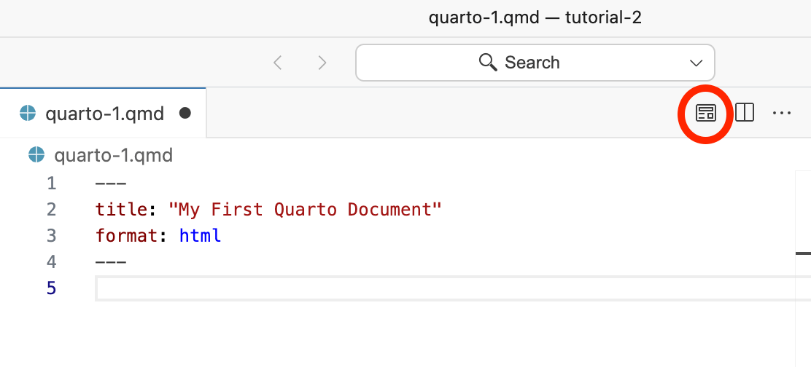
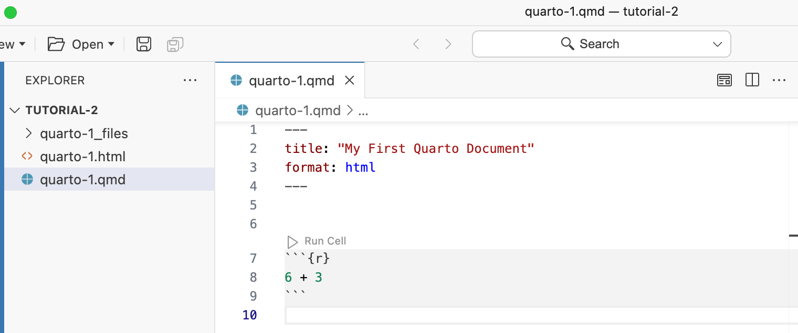

```{r setup, include = FALSE}
library(learnr)
library(tutorial.helpers)
library(tidyverse)
library(knitr)
knitr::opts_chunk$set(echo = FALSE)
knitr::opts_chunk$set(out.width = '90%')
options(tutorial.exercise.timelimit = 60, 
        tutorial.storage = "local")
```

```{r copy-code-chunk, child = system.file("child_documents/copy_button.Rmd", package = "tutorial.helpers")}
```

```{r info-section, child = system.file("child_documents/info_section.Rmd", package = "tutorial.helpers")}
```

## Introduction
### 

This tutorial covers how to create [Quarto documents](https://docs.posit.co/ide/user/ide/guide/documents/quarto-project.html#creating-new-documents)). Some material is from [*R for Data Science (2e)*](https://r4ds.hadley.nz/) by Hadley Wickham, Mine Çetinkaya-Rundel, and Garrett Grolemund.

## Quarto 1
### 

Quarto is a file format for making dynamic documents with R and other languages, like Python. To learn more about Quarto and how to use it, check out the [official webpage](https://quarto.org/). Quarto is the successor technology to [R Markdown](https://rmarkdown.rstudio.com/). This section introduces Quarto documents.

### Exercise 1

Always do your data science work in a project. From the Positron menu, select `File -> New Project ...`. 

Select "R Project" and click "Next."

Set the "Project Name" to `tutorial-2` and ensure that the "Parent Directory" is set to your `projects` directory. 

Click "Next" and then "Create."

Click "New Window" because the Console in your current Positron window is being used to run the tutorial. You always need two windows when completeing a tutorial.

Run `getwd()` in the Console. CP/CR.


```{r quarto-1-1}
question_text(NULL,
	answer(NULL, correct = TRUE),
	allow_retry = TRUE,
	try_again_button = "Edit Answer",
	incorrect = NULL,
	rows = 3)
```

### 

Your answer should be something like:

```
> getwd()
[1] "/Users/dkane/Desktop/projects/tutorial-2"
>
```

Soon, we will stop providing these step-by-step instructions for making a new project. Instead, we will just tell you to create a new project and leave it to you to do so.

### Exercise 2

Click `File -> New File ... -> Quarto Document` at the top left of your Positron window. 

This will bring up a new file in your Editor, usually named `Untitled-2`. (If there is already an `Untitled-1` document, you can just close it.) 

The top of the new document is called the YAML header. It should look like:

```
---
title: "Untitled"
format: html
---
```

Change the title to “My First Quarto Document”.

Run `list.files()` in the Console. CP/CR.

```{r quarto-1-2}
question_text(NULL,
    answer(NULL, correct = TRUE),
    allow_retry = TRUE,
    try_again_button = "Edit Answer",
    incorrect = NULL,
    rows = 2)
```

### 

Since we have not saved the file yet, it does not appear in this listing.

Quarto is a command line interface tool, not an R package. This means that help is, by-and-large, not available through `?` at the Console. Instead, as you work through this tutorial, and use Quarto in the future, you should refer to the [Quarto documentation](https://quarto.org/).


### Exercise 3

Save the Quarto document with `File -> Save`. You can also click the disk icon toward the upper left of the Source pane or by use the shortcut `Cmd/Ctrl + S`. 

Name the file `quarto-1.qmd`.

Now that the document is saved, run `list.files()`. CP/CR.

```{r quarto-1-3}
question_text(NULL,
    answer(NULL, correct = TRUE),
    allow_retry = TRUE,
    try_again_button = "Edit Answer",
    incorrect = NULL,
    rows = 2)
```

### 

There will probably just be one file, `quarto-1.qmd`, the file you just made.

### Exercise 4

In the Console, run:

````
tutorial.helpers::show_file("quarto-1.qmd", end = 2)
````

CP/CR.

```{r quarto-1-4}
question_text(NULL,
	answer(NULL, correct = TRUE),
	allow_retry = TRUE,
	try_again_button = "Edit Answer",
	incorrect = NULL,
	rows = 3)
```

### 

The argument `end = 2` to `show_file()` causes just the first two lines of `quarto-1.qmd` to be printed.

Again, there is no necessary connection between the **title** of a Quarto document --- which is “My First Quarto Document” in this case --- and the **name** of the file --- which here is `quarto-1.qmd`.


### Exercise 5

Here is an example of a Quarto file:

````
---
title: "My First Quarto Document"
author: "Your Name"
format: html
---

## Quarto

Quarto enables you to weave together content and executable code into a finished document. To learn more about Quarto see <https://quarto.org>.

## Running Code

When you click the **Render** button a document will be generated that includes both content and the output of embedded code. You can embed code like this:

```{r}
1 + 1
```

You can add options to executable code like this 

```{r}
#| echo: false
2 * 2
```

The `echo: false` option disables the printing of code (only output is displayed).
````

### 

As you can see, a lot of the text is regular plain text, not code. However, there are code chunks (denoted by triple backticks on both ends, \`\`\`[code here]\`\`\`) which allow us to execute code when the document is "rendered." (To "render" a Quarto document is to transform it into an html/pdf/docx or other output file format while also running any embedded code.) Here's an example of an R code chunk (note the triple backticks):

````
```{r}
1 + 1
```
````

Quarto documents utilize Markdown (an easy-to-write plain text format), which can contain chunks of embedded code. These code chunks can be written in many languages, including R and Python. Code chunks allow you to use a programming language to create plots and other graphics.

### 

The [YAML header](https://bookdown.org/yihui/rmarkdown-cookbook/rmarkdown-anatomy.html) is everything between the dashed lines at the top of the file, including the dashed lines themselves. Copy-and-paste the YAML header from the file below.

```{r quarto-1-5}
question_text(NULL,
    answer(NULL, correct = TRUE),
    allow_retry = TRUE,
    try_again_button = "Edit Answer",
    incorrect = NULL,
    rows = 4)
```

### 

The YAML header includes "metadata" about the document itself, things like the title and the author. In this case, `format: html` means that the document will be rendered as an HTML file.

### Exercise 6

To "render" our Quarto document, click the `Preview` button at the top right of the Editor:


```{r}

```

 Even better is to use the shortcut `Cmd/Ctrl + Shift + K`. Professionals don't click button.

###

Run `list.files()`. CP/CR.

```{r quarto-1-6}
question_text(NULL,
	answer(NULL, correct = TRUE),
	allow_retry = TRUE,
	try_again_button = "Edit Answer",
	incorrect = NULL,
	rows = 3)
```

### 

Our answer:

```
> list.files()
[1] "quarto-1_files" "quarto-1.html"  "quarto-1.qmd"  
>
```

In the Explorer, you should see a new file, `quarto-1.html`. This is the file created by rendering. The Viewer tab in the Secondary Side Bar should also display the file.

### 

You should also see a new directory: `quarto-1_files`. Anytime you render a Quarto document, you create a directory like this, with the same name as the file plus `_files`. Quarto uses this directory to store intermediate work products associated with the creation of the associated output file.


### Exercise 7

The HTML document created from a QMD file will, by default, show both the code and the result(s) generated by that code. This is the magic of Quarto. We can easily document and reproduce our work. 

Add a couple of blank lines to the bottom of `quarto-1.qmd`. Then, add an R code chunk by selecting the `More Actions ...` button --- the three dots to the left of the `Preview` buttom. 

```{r}

```

Then, choose `Insert Code Cell`, selecting `r` from the list of options. Within the code cell, add `6 + 3`.

```{r}

```

You can also insert a code cell with the shortcut key: `Cmd/Ctrl + Option/Alt + i`. (The `Option` key on the Mac is the same as the `Alt` key on Windows.)

Save the file. Render it again.

In the Console, run:

````
tutorial.helpers::show_file("quarto-1.qmd", pattern = "6")
````

CP/CR.


```{r quarto-1-7}
question_text(NULL,
	answer(NULL, correct = TRUE),
	allow_retry = TRUE,
	try_again_button = "Edit Answer",
	incorrect = NULL,
	rows = 17)
```

### 

This should return a single character vector with `"6 + 3"`, the line which you added to the code cell. Apologies for the complexity of the call needed to pull out just that line.

Strictly speaking, you did not need to save the file before rendering it. Clicking the "Preview" button saves the file automatically. Nevertheless, you should make a habit of saving your work before running (if you come across some software that *doesn't* autosave upon running, you'll be running old code and wondering why something still doesn't work when you just fixed it).

###

The "Preview" button does two things. First, it renders the document. Second, it places the output document in the Viewer tab in the Secondary Side Bar.

### Exercise 8

Delete the code cell. Add `This is my first Markdown text.` two lines below the YAML header. Save the file.

In the Console, run:

````
tutorial.helpers::show_file("quarto-1.qmd")
````

CP/CR.

```{r quarto-1-8}
question_text(NULL,
	answer(NULL, correct = TRUE),
	allow_retry = TRUE,
	try_again_button = "Edit Answer",
	incorrect = NULL,
	rows = 3)
```

### 

This should return your entire Quarto document. If you do not have an empty line at the end of your file, you will get a warning message like this:

<span style="color: red;">
Warning message:
In readLines("quarto-1.qmd") :
  incomplete final line found on 'quarto-1.qmd'
</span>

The solution is to add an empty line to the end of the file. This is (almost) always a good idea! Don't be stingy with whitespace. 

### Exercise 9

Render the document. It is good to get in the practice of using the shortcut key `Cmd/Ctrl + Shift + K` instead of the "Preview" button. Efficient people use shortcut keys. They don't press buttons.

This will rewrite the current `quarto-1.html` file, both in the current directory and in the Viewer pane.

In the following box, copy all of the text from your rendered Quarto document, from the Viewer tab.


```{r quarto-1-9}
question_text(NULL,
	answer(NULL, correct = TRUE),
	allow_retry = TRUE,
	try_again_button = "Edit Answer",
	incorrect = NULL,
	rows = 6)
```

### 

Quarto files are designed to be used in three ways:

* For communicating to decision-makers, who want to focus on the conclusions, not the code behind the analysis.

* For collaborating with other data scientists (including future you!), who are interested in both your conclusions, and how you reached them (i.e. the code).

* As an environment in which to do data science, as a modern-day lab notebook where you can capture not only what you did, but also what you were thinking.


### Exercise 10

In Quarto documents, you can use [Markdown syntax](https://quarto.org/docs/authoring/markdown-basics.html). You can use this to create **bold** or *italic* text (and even text that's both ***bold and italic***), and headers.

### 

Replace the one sentence already in `quarto-1.qmd` with `## My Header`. Skip a line and add this text. 

````
You can do a lot of cool things in Quarto like **bold** and *italic* text.
````

Render the file again. Does everything look good in the Viewer?

### 

In the Console, run:

````
tutorial.helpers::show_file("quarto-1.qmd")
````

CP/CR.


```{r quarto-1-10}
question_text(NULL,
    answer(NULL, correct = TRUE),
    allow_retry = TRUE,
    try_again_button = "Edit Answer",
    incorrect = NULL,
    rows = 6)
```

### 

You can find a full list of Markdown formatting styles and commands [here](https://www.markdownguide.org/basic-syntax/).

To encourage the use of shortcut keys going forward, we will start using them directly in our instructions to you. So, instead of writing "Render the document," we will just write `Cmd/Ctrl + Shift + K`. 

<!-- DK: Is what happens in the Console tab whenever we render a document confusing? -->

## Quarto 2
### 

Restart your R session. The best way to do this is with the shortcut key `Cmd/Ctrl + Shift + 0`. There is also a "Restart console" button in the upper right portion of the Console tab. 

```{r}

```

Restarting the Console just means restarting R.

Let's create another Quarto document so that we can explore how to include R code within the document.

### Exercise 1

Follow the same procedure as last time to create a new Quarto document. `File -> New File -> Quarto Document...`. Use "My Second Quarto Document" as the title. Save the document as `quarto-2.qmd`. `Cmd/Ctrl + Shift + K`

Run `list.files()`. CP/CR.

```{r quarto-2-1}
question_text(NULL,
	answer(NULL, correct = TRUE),
	allow_retry = TRUE,
	try_again_button = "Edit Answer",
	incorrect = NULL,
	rows = 3)
```

### 

The listing should include `quarto-2.qmd`, `quarto-2.html` and the `quarto-2_files` directory. 


### Exercise 2

Add a code cell by using the shortcut key combination: `Cmd/Ctrl + Option/Alt + I`. (In other words, on the Mac, the shortcut key is `Cmd + Option + i` while on Windows it is `Ctrl + Alt + I`.)

The newly created code chunk will be empty, looking like:

````
```{r}

```
````

Save the file.

In the Console, run:

````
tutorial.helpers::show_file("quarto-2.qmd")
````

CP/CR.


```{r quarto-2-2}
question_text(NULL,
    answer(NULL, correct = TRUE),
    allow_retry = TRUE,
    try_again_button = "Edit Answer",
    incorrect = NULL,
    rows = 6)
```

### 

Note the curly braces `{}` at the top of the chunk, with an `r` inside. The `r` indicates that the language which Quarto should use with the code is R.

In this tutorial, we will only include R code within our code chunks. But code chunks can have any programming language in them, from common ones like Python, Java, and C, to esoteric ones like INTERCAL and Whitespace. All you need to do is indicate the language in the curly braces (e.g., `{py}`, `{ruby}`, etc). 


### Exercise 3

Put `2 * 2` within the code chunk. `Cmd/Ctrl + Shift + K`. Copy and paste the entire HTML document, as it appears in the Viewer tab, below. (This allows us to confirm that your HTML file is correct.)


```{r quarto-2-3}
question_text(NULL,
	answer(NULL, correct = TRUE),
	allow_retry = TRUE,
	try_again_button = "Edit Answer",
	incorrect = NULL,
	rows = 8)
```

### 

We see both the code itself and the result of the code. This is an example of a "reproducible" analysis. We can re-render the document anytime we like, thereby confirming our results.

### Exercise 4

You can add options to executable code. For example, add `#| echo: false` within the code chunk, above the `2 * 2` calculation. It should look like:


````
```{r}
#| echo: false

2 * 2
```
````

`Cmd/Ctrl + Shift + K`. Copy/paste the HTML below.

```{r quarto-2-4}
question_text(NULL,
	answer(NULL, correct = TRUE),
	allow_retry = TRUE,
	try_again_button = "Edit Answer",
	incorrect = NULL,
	rows = 6)
```

### 

`echo: false` prevents the code, but not the results, from appearing in the finished file. Use this when writing reports aimed at people who don’t want to see the underlying R code. 

### Exercise 5

Code cells are also referred to as code chunks. (The cell terminology is more common in Python.)

In Quarto, Code chunk options are always preceded by `#|` -- pronounced "hash-pipe". This is followed by an option/value pair, separated by a colon.

Add another code option for this code chunk: `#| label: calculation`. You can have multiple code chunk options for a single code chunk. The order does not matter, but each belongs on its own line and must be proceeded by `#|`. `Cmd/Ctrl + Shift + K`. Copy/paste the HTML below.

```{r quarto-2-5}
question_text(NULL,
	answer(NULL, correct = TRUE),
	allow_retry = TRUE,
	try_again_button = "Edit Answer",
	incorrect = NULL,
	rows = 5)
```

### 

The `label` option has no effect on the output. Your chunk labels should be short but evocative and should not contain spaces. We recommend using dashes (`-`) to separate words (instead of underscores, `_`) and avoiding other special characters in chunk labels.


### Exercise 6

Delete the current code chunk. Add a new one. In this new code chunk, put `library(tidyverse)`. `Cmd/Ctrl + Shift + K`. A message about "Attaching core tidyverse packages" should appear in the HTML file. Copy/paste that message below.


```{r quarto-2-6}
question_text(NULL,
	answer(NULL, correct = TRUE),
	allow_retry = TRUE,
	try_again_button = "Edit Answer",
	incorrect = NULL,
	rows = 10)
```

### 

We will include the **tidyverse** package in almost every Quarto document which we create. Indeed, the top of most Quarto documents includes a code chunk which loads all the packages which we use in the analysis.

### Exercise 7

Add `#| message: false` to the code chunk. `Cmd/Ctrl + Shift + K`. Copy/paste the entire HTML file below.

```{r quarto-2-7}
question_text(NULL,
	answer(NULL, correct = TRUE),
	allow_retry = TRUE,
	try_again_button = "Edit Answer",
	incorrect = NULL,
	rows = 5)
```

### 

We want to make our Quarto HTML files beautiful. That means we will almost always "mask" ugly messages like this. Our readers don't care about such a**R**cana. They care about our analysis.

### Exercise 8

Add another code chunk option: `echo: false`. Don't forget to proceed it with the hash-pipe: `#|`. `Cmd/Ctrl + Shift + K`. Copy/paste the HTML below.

```{r quarto-2-8}
question_text(NULL,
	answer(NULL, correct = TRUE),
	allow_retry = TRUE,
	try_again_button = "Edit Answer",
	incorrect = NULL,
	rows = 3)
```

### 

The HTML is empty, except for the title.

`echo: false` prevents the code from being "echoed," from appearing in the final document. We generally want this because most readers don't know R and don't care about our code. 


### Exercise 9

Add another code chunk option: `label: setup`. Don't forget to preface with the hash-pipe: `#|`. It is conventional to label the code chunk which loads libraries and takes care of other housekeeping as the "setup" code chunk.

`Cmd/Ctrl + Shift + K`. Copy/paste the HTML below.

```{r quarto-2-9}
question_text(NULL,
	answer(NULL, correct = TRUE),
	allow_retry = TRUE,
	try_again_button = "Edit Answer",
	incorrect = NULL,
	rows = 3)
```

### 

You are generally free to label your chunk however you like, but there is one chunk name that imbues special behavior: `setup`. When you’re in a notebook mode, the chunk named `setup` will be run automatically once, before any other code is run.

Chunk labels cannot be duplicated. Each chunk label must be unique.

### Exercise 10

**Important Point**: There are two different "worlds" with which we are dealing. First is the world of the Quarto document, the QMD file. Second is the world of the Console in our current Positron window. **These worlds only connect when we connect them**. Something written in a Quarto document --- or an R script --- is not, by default, part of our current R session.

### 

Right now, the **tidyverse** package has not been loaded into the current R session. To load it, you must run the code chunk. To do so, first place your cursor inside the code chunk. Then, you have multiple options, including:

* `Cmd/Ctrl + Shift + Enter` will run all the code in the code chunk.

* `Cmd/Ctrl + Enter` will run just the code at the line in which the cursor is located.

* Press the small triangle --- labeled "Run Cell" --- directly above the code chunk. This runs all the code in the chunk/cell. (Again, the terms cell and chunk are used interchangeably.)

Run the code chunk. Then, run `pull(mtcars, 1)` in the Console. CP/CR.

```{r quarto-2-10}
question_text(NULL,
	answer(NULL, correct = TRUE),
	allow_retry = TRUE,
	try_again_button = "Edit Answer",
	incorrect = NULL,
	rows = 3)
```

### 

If you run this command without running `library(tidyverse)` in the Console, you will get an error about not finding the "pull" function. The fact that `library(tidyverse)` exists in the QMD, and that you have "used" it there by rendering the document, has no bearing on the world of the Console.

### Exercise 11

Let's create the following scatterplot in our Quarto document:

```{r}
scat_p <- ggplot(data = iris,
                 mapping = aes(x = Sepal.Width,
                               y = Sepal.Length,
                              color = Species)) +
  geom_point() +
  labs(title = "Measurements for Different Species of Iris",
       subtitle = "Virginica has the longest sepals",
        x = "Sepal Width",
        y = "Sepal Length",
       caption = "Fisher (1936)")
scat_p
```

### 

Create a new code chunk. Add this code.

````
ggplot(data = iris,
       mapping = aes(x = Sepal.Width,
                     y = Sepal.Length,
                     color = Species))
````

### 

Render the file. You should now see your R code (since we did not set `echo: false`), as well as a blank plot (since we have not added a geom layer).

In the Console, run:

````
tutorial.helpers::show_file("quarto-2.qmd", chunk = "Last")
````

CP/CR.


```{r quarto-2-11}
question_text(NULL,
    answer(NULL, correct = TRUE),
    allow_retry = TRUE,
    try_again_button = "Edit Answer",
    incorrect = NULL,
    rows = 10)
```

### 

Make sure to format your code so that it looks neat and tidy. Specifically:

* Put spaces on either side of mathematical operators apart from `^` (i.e. `+`, `-`, `==`, `<`, `…`), and around the assignment operator (`<-`).

* Don’t put spaces inside or outside parentheses for regular function calls. Always put a space after a comma, just like in standard English.

* `|>` should always have a space before it and should typically be the last thing on a line.

* If the function you’re piping into has named arguments (like `mutate()` or `summarize()`), put each argument on a new line. If the function doesn’t have named arguments (like `select()` or `filter()`), keep everything on one line unless it doesn’t fit, in which case you should put each argument on its own line.

A good resource on neat code is the [Tidyverse Style Guide](https://style.tidyverse.org/syntax.html). 


### Exercise 12

To add a geom layer, add `geom_point()` to your plot. Render the file again. Now our plot isn't empty! It shows a scatterplot!

### 

In the Console, run:

````
tutorial.helpers::show_file("quarto-2.qmd", chunk = "Last")
````

CP/CR.

```{r quarto-2-12}
question_text(NULL,
    answer(NULL, correct = TRUE),
    allow_retry = TRUE,
    try_again_button = "Edit Answer",
    incorrect = NULL,
    rows = 10)
```

### 

Positron automatically saves the contents of the Editor when you quit, and automatically reloads it when you re-open. Nevertheless, it’s a good idea to avoid Untitled-1, Untitled-2, Untitled-3, and so on. Instead, save your documents and give them informative names.

### Exercise 13

We just built the basic graph, but it still looks a little ugly. Labels are important for adding context to the graph and making it easier to understand.

Use the `labs()` function to add an appropriate title and some axis labels to the graph.

Reminder, this is what our plot should look like:

```{r}
scat_p
```

### 

Render the file again to see your completed graph.

### 

In the Console, run:

````
tutorial.helpers::show_file("quarto-2.qmd", chunk = "Last")
````

CP/CR.

```{r quarto-2-13}
question_text(NULL,
    answer(NULL, correct = TRUE),
    allow_retry = TRUE,
    try_again_button = "Edit Answer",
    incorrect = NULL,
    rows = 2)
```

### 

We recommend you always start your Quarto documents with the packages you need. That way, if you share your code with others, they can easily see which packages they need to install. 

**You should never include `install.packages()` in a Quarto document or R script which you share.** Be careful since generative AI tools will often suggest this.

It’s inconsiderate to hand off something that will change something on their computer if they’re not being careful!

## Quarto 3
### 

This section will teach you how to use *inline* R code, allowing you to insert calculated results in the middle of text.

### Exercise 1

Create a new Quarto document with "My Third Quarto Document" as the title and you as the author. Save the file as `quarto-3.qmd`. `Cmd/Ctrl + Shift + K`.

Run `list.files()`. CP/CR.

```{r quarto-3-1}
question_text(NULL,
	answer(NULL, correct = TRUE),
	allow_retry = TRUE,
	try_again_button = "Edit Answer",
	incorrect = NULL,
	rows = 3)
```

### 

The files `quarto-3.qmd` and `quarto-3.html` should appear in this list, along with the `quarto-3_files` directory.  
 
### Exercise 2

Add a new code chunk. Add `x <- 123456789` to that code chunk. `Cmd/Ctrl + Shift + K`.

Copy/paste the HTML file below.

```{r quarto-3-2}
question_text(NULL,
	answer(NULL, correct = TRUE),
	allow_retry = TRUE,
	try_again_button = "Edit Answer",
	incorrect = NULL,
	rows = 5)
```

### 

Because we have not added any code chunk options, we see the code in the HTML, displayed in the Viewer, along with the title. But there is no output because assignment of a value does not result in printed output in R.

Remember that variable names (those created by `<-` and those created by `mutate()`) should use only lowercase letters, numbers, and `_`. Use `_` to separate words within a name.
 
As a general rule of thumb, it’s better to prefer long, descriptive names that are easy to understand rather than concise names that are fast to type but hard to understand. 

### Exercise 3

Instead of using the `echo: false` code chunk option in every code chunk in a document, we can set this option in the YAML header itself. Add

````
execute:
  echo: false
````

to the bottom of the YAML header. This sets `echo` to `false` throughout the document. `Cmd/Ctrl + Shift + K`. The resulting HTML is empty, other than the title.

In the Console, run:

````
tutorial.helpers::show_file("quarto-3.qmd", start = -5)
````

CP/CR.

```{r quarto-3-3}
question_text(NULL,
	answer(NULL, correct = TRUE),
	allow_retry = TRUE,
	try_again_button = "Edit Answer",
	incorrect = NULL,
	rows = 6)
```

### 

If we are just using a code option for one or two code chunks, then we can just place them in the relevant code chunks, using the hash-pipe: `#|`. However, any code chunk option which applies to most/all code chunks should be placed in the YAML header under the `execute:` category.

Be careful of the formatting in the YAML header. It is very fussy! For example, if you forget to indent the `echo: false` line with spaces, you will get an error.

<!-- DK: Add an exercise which demonstrates this error. -->

### Exercise 4

Below the code chunk, add the following sentence to `quarto-3.qmd`: `The value of x is ?, a surprisingly high value.` `Cmd/Ctrl + Shift + K`.

In the Console, run:

````
tutorial.helpers::show_file("quarto-3.qmd", start = -6)
````

CP/CR.

```{r quarto-3-4}
question_text(NULL,
	answer(NULL, correct = TRUE),
	allow_retry = TRUE,
	try_again_button = "Edit Answer",
	incorrect = NULL,
	rows = 6)
```

### 

We want the actual value of `x` to appear in the document, in place of the `?`. To do so, we need to make use of *inline* code.

### Exercise 5

<!-- Formatting this in this Rmd is very tricky. If you try to include the inline code in the middle of a sentence, all hell breaks loose, even if you comment out that line! So, we hack. -->

Replace the `?` in your sentence with:

````
r x
````

surrounded by backticks. They `r` tells Quarto that you want to evaluate the code (`x`) using the R language. In this case, that code is just the letter `x`, which evaluates to (i.e., prints out) the number we have assigned to it. `Cmd/Ctrl + Shift + K`.

Copy/paste the resulting HTML.

```{r quarto-3-5}
question_text(NULL,
	answer(NULL, correct = TRUE),
	allow_retry = TRUE,
	try_again_button = "Edit Answer",
	incorrect = NULL,
	rows = 3)
```

### 

This *inline* code has the desired effect. It "looks up" the value of `x` defined in the preceding code chunk. R then prints that value within the sentence, which is what we want.

But, depending on your system and settings, the result is often ugly. I get "1.2345679^{8}", which makes use of scientific notation.

### Exercise 6

Replace the inline code in your sentence with 

````
r scales::comma(x)
````

surrounded by backticks. `Cmd/Ctrl + Shift + K`. Notice that, strictly speaking, you do not need to save the document before you render it. With the usual default settings, Positron will automatically save a document which you try to render. But it's always a good idea to hit save, just to be on the safe side. 

Copy/paste the resulting HTML.

```{r quarto-3-6}
question_text(NULL,
	answer(NULL, correct = TRUE),
	allow_retry = TRUE,
	try_again_button = "Edit Answer",
	incorrect = NULL,
	rows = 3)
```

### 

The `comma()` function, which comes from the **scales** package --- hence our use of the double colon (`::`) notation --- causes the value of `x` to be formatted nicely.

With *inline* code, we can insert R code of arbitrary complexity directly in the text of a Quarto document, although it is often better to keep the code itself in a code chunk, assign the final value to a variable like `x` and then have a simple piece of *inline* code, as we do here.

## Quarto 4
### 

Restart your R session with `Cmd/Ctrl + Shift + 0`. As always, you are doing this work your *other* Positron window, the one in which this tutorial is *not* running. If you mistakenly restart R in this window, this tutorial will quit. Which is OK! You can just restart it with `learnr::run_tutorial(name = "02-quarto", package = "positron.tutorials")`.

### Exercise 1

Run `search()` in the Console. CP/CR.

```{r quarto-4-1}
question_text(NULL,
	answer(NULL, correct = TRUE),
	allow_retry = TRUE,
	try_again_button = "Edit Answer",
	incorrect = NULL,
	rows = 3)
```

### 

The shortcut key to restart R is `Cmd/Ctrl + Shift + 0`. You should restart your R session regularly. Indeed, one of our catch phrases is:

**You can't restart R too often.**

`search()` should **not** return packages like **tidyverse**. (However, the default packages like **stats** and **graphics** should be there.) This is a new R session, and you have not loaded any non-default packages yet.


### Exercise 2

Make a new Quarto document. The title is "My Fourth Quarto Document". Name the document `quarto-4.qmd`.

Save the document as `quarto-4.qmd`. 

In the Console, run:

````
tutorial.helpers::show_file("quarto-4.qmd")
````

CP/CR.


```{r quarto-4-2}
question_text(NULL,
    answer(NULL, correct = TRUE),
    allow_retry = TRUE,
    try_again_button = "Edit Answer",
    incorrect = NULL,
    rows = 5)
```

### 

It might be tempting to name your files `code.R` or `myscript.R`, but you should think a bit harder before choosing a name for your file. Three important principles for file naming are as follows:

* File names should be machine readable: avoid spaces, symbols, and special characters. Don’t rely on case sensitivity to distinguish files.

* File names should be human readable: use file names to describe what’s in the file.

* File names should play well with default ordering: start file names with numbers so that alphabetical sorting puts them in the order they get used.


### Exercise 3

We are going to make a `setup` code chunk, where you can load your libraries. 

Add a new code chunk. In the first line, write `#| label: setup` in order to give the code chunk the label/name `setup`.

Put `library(tidyverse)` in the code chunk.

### 

**Notice the sloppy language!** There are two ways in which we can "load" **tidyverse** corresponding to the two worlds we are working in simultaneous: QMD World and Console World.

### 

Putting the character string `library(tidyverse)` inside the `setup` code chunk is enough to "load" this package in QMD World because, whenever we render a file, every line of code in the file is sent to R for processing. Those characters, however, have no connection to Console World until we explicitly execute them by hand, generally with `Cmd/Ctrl + Enter`, run once for each line of R code we want executed in the Console.

Do that now. Place the cursor next to the `library(tidyverse)` call and hit `Cmd/Ctrl + Enter`.

### 

Once all that is done, run `search()` in the Console. CP/CR.

```{r quarto-4-3}
question_text(NULL,
    answer(NULL, correct = TRUE),
    allow_retry = TRUE,
    try_again_button = "Edit Answer",
    incorrect = NULL,
    rows = 2)
```

### 

The output of the call to `search()` should include the string `package:tidyverse`, indicating that the **tidyverse** package is loaded.

The key lesson is that we are operating in two worlds simultaneously: QMD World and Console World. We are responsible for keeping them in sync with commands like `Cmd/Ctrl + Enter`.

### Exercise 4

Our HTML file looks ugly, both because of the annoying message and because it shows the R code. We want neither. Add `echo: false` and `message: false` to the code chunk options. `Cmd/Ctrl + Shift + K`. 

In the Console, run:

````
tutorial.helpers::show_file("quarto-4.qmd", chunk = "Last")
````

CP/CR.

```{r quarto-4-4}
question_text(NULL,
	answer(NULL, correct = TRUE),
	allow_retry = TRUE,
	try_again_button = "Edit Answer",
	incorrect = NULL,
	rows = 5)
```

### 

There is a great pair of keyboard shortcuts that will work together to make sure you’ve captured the important parts of your code in the editor:

* Press `Cmd/Ctrl + Shift + 0` to restart R.
* Press `Cmd/Ctrl + Shift + K` to re-render the current Quarto document.

We collectively use this pattern hundreds of times a week.

Alternatively, if you don’t use keyboard shortcuts, you can press the "Restart console" button.

### Exercise 5

Make a new header with the title "Diamonds Histogram". Remember we do this using `##`, followed by a space. Skip a line under this header, and then create a new code chunk. Use the code chunk option `echo: false` to stop your code from showing up when you render the file.

### 

In your new code chunk, add

````
diamonds
````

`Cmd/Ctrl + Shift + K`. 


In the Console, run:

````
tutorial.helpers::show_file("quarto-4.qmd", chunk = "Last")
````

CP/CR.

```{r quarto-4-5}
question_text(NULL,
	answer(NULL, correct = TRUE),
	allow_retry = TRUE,
	try_again_button = "Edit Answer",
	incorrect = NULL,
	rows = 3)
```

### 

This should cause the top of the `diamonds` tibble to be printed out in the HTML.

### Exercise 6

Give your favorite generative AI program (Grok, ChatGPT, Claude, DeepSeek, et cetera) these instructions:

> Produce some R code which, using the ggplot2 package, produces a beautiful graphic using the diamonds tibble. You may assume that the command library(tidyverse) has already been issued. 

Replace `diamonds` in the code chunk with this code. `Cmd/Ctrl + Shift + K`. (If rendering the document fails, show your AI the error and ask it to fit the code.) If you can't get it to work, just stop with the last version, even if it fails.

In the Console, run:

````
tutorial.helpers::show_file("quarto-4.qmd", chunk = "Last")
````

CP/CR.

```{r quarto-4-6}
question_text(NULL,
	answer(NULL, correct = TRUE),
	allow_retry = TRUE,
	try_again_button = "Edit Answer",
	incorrect = NULL,
	rows = 3)
```

### 

Grok [gave us](https://grok.com/chat/287b4a5b-6560-42f6-ae5f-05fa953ea0b4) this answer:

````
ggplot(diamonds, aes(x = carat, y = price, color = clarity)) +
  geom_point(alpha = 0.5, size = 1.5) +
  scale_color_viridis_d(option = "plasma") +
  facet_wrap(~cut, ncol = 2) +
  labs(
    title = "Diamond Prices by Carat and Cut",
    subtitle = "Colored by Clarity Grade",
    x = "Carat Weight",
    y = "Price (USD)",
    color = "Clarity",
    caption = "Source: diamonds dataset"
  ) +
  theme_minimal() +
  theme(
    plot.title = element_text(size = 16, face = "bold", hjust = 0.5),
    plot.subtitle = element_text(size = 12, hjust = 0.5),
    plot.caption = element_text(size = 8, color = "grey50"),
    panel.grid.minor = element_blank(),
    legend.position = "bottom",
    legend.title = element_text(face = "bold")
  ) +
  scale_y_continuous(labels = scales::dollar_format())
````

Generative AI is the future of coding, and much else. Practice using it as much as you can.

## Summary
### 

This tutorial covered how to create [Quarto documents](https://docs.posit.co/ide/user/ide/guide/documents/quarto-project.html#creating-new-documents). Some material was from [*R for Data Science (2e)*](https://r4ds.hadley.nz/) by Hadley Wickham, Mine Çetinkaya-Rundel, and Garrett Grolemund.


```{r download-answers, child = system.file("child_documents/download_answers.Rmd", package = "tutorial.helpers")}
```
