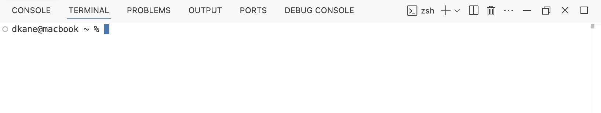
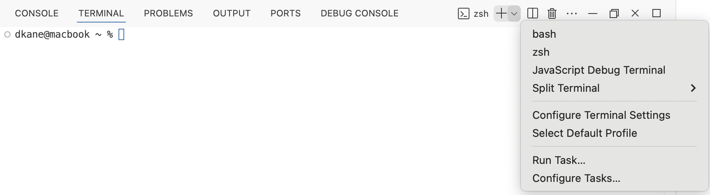
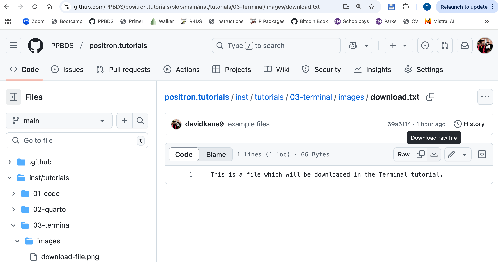

```{r setup, include = FALSE}
library(learnr)
library(tutorial.helpers)
library(tidyverse)
library(knitr)

library(pkgbuild)

knitr::opts_chunk$set(echo = FALSE)
knitr::opts_chunk$set(out.width = '90%')
options(tutorial.exercise.timelimit = 60, 
        tutorial.storage = "local") 
```

```{r copy-code-chunk, child = system.file("child_documents/copy_button.Rmd", package = "tutorial.helpers")}
```

```{r info-section, child = system.file("child_documents/info_section.Rmd", package = "tutorial.helpers")}
```

<!-- Do we need the Windows translation now that we are forcing (?) the use of a Unix-like? -->

<!-- Won't just about everyone doing this tutorial be in their projects directory? So I should be too! -->

<!-- The second time we use echo, we act like we haven't explained it before. -->

<!-- Might be useful to add a test which confirms that those files exist, before we ask students to download them. Of course, that will only work if we have web access. -->

<!-- Add a brief discussion of environment variables? -->

<!-- Consider adding a third files download exercise and/or making the current one more like the actual work that students do on this topic, which generally involves an R project, making data/ directory, putting a new file there and so on. -->

<!-- Consider adding a bunch more images. Might be very useful in the paths section, especially taking images from the Explorer and showing how they correspond to the commands. -->

<!-- Could have test cases which confirm that these commands match what I think they should, I think. -->

## Introduction
### 

This tutorial introduces the structure and uses of the Terminal from within Positron. The older, more general term for the Terminal is the "command line." All modern operating systems provide a command line, from which sophisticated users can modify files and directories, using commands like `pwd`, `ls`, `echo`, `mkdir`, `mv`, `rm`, and `cd`. We also discuss regular expressions as well as some of the metacharacters (like, `*`, `^` and `$`) from which they are constructed. Some material is from [*R for Data Science (2e)*](https://r4ds.hadley.nz/) by Hadley Wickham, Mine Çetinkaya-Rundel, and Garrett Grolemund.

###

Windows users should use a Unix-like shell rather than the default PowerShell. With luck, this will be automatic because you have already done three things.

First, you installed [Git for Windows](https://gitforwindows.org/), including Git Bash, which will provide the shell we need.

Second, from the Console, you have run:

````
tutorial.helpers::set_positron_settings(
  positron_settings = 
   list("terminal.integrated.defaultProfile.windows" = 
        "Git Bash"))
````

Third, you have restarted Positron. 

###

When you first click on "Terminal," you should see something like this:

```{r}

```

Because I am using a Mac, the shell being used is already a "Unix-like." If you are on Windows, and are lucky, then the set up work you have already done will also, by default, give you a Unix-like shell. You can test this by entering `pwd` and hitting `Enter`. A Unix-like shell will give you something like:

````
dkane@macbook ~ % pwd
/Users/dkane
dkane@macbook ~ % 
````

PowerShell, the default Williams shell (in modern systems), will give you an error. If so, you should be able to access a Unix-like shell by clicking the downward arrow next to the `+` on the Terminal menu. When you do, Positron should provide you with a list of shells to choose from. Look for something called "Git Bash" or "bash" or, really, anything other than PowerShell. 

```{r}

```

Once that is pulled up, see if `pwd` works. If it does, you are all set. If not, ask AI to help you. To complete this tutorial, you should be using a Unix-like shell.

### 

If, for whatever reason, you are a Windows user still using PowerShell, then keep the following in mind.

For the most part, Windows works like Mac/Unix. There are three main exceptions which are important for this tutorial:

* Environment variables look like `$PATH` on Mac/Unix and `%PATH%` on Windows. That is, in both cases, we are using the `PATH` environment variable. We just access this variable differently depending on the operating system. Mac/Unix prefaces environment variables with `$` while Windows surrounds them with `%`. 

* The names of some environment variables differ across operating systems. For example, `$HOME` (Mac/Linux) and `%USERPROFILE%` (Windows) are both environment variables which refer to the user's home directory.

* Directory separators are forward slashes -- `/` -- on Max/Unix and backward slashes -- `\` -- on Windows.

###

The tutorial defaults to Mac/Unix nomenclature. If you are using Windows, you may need to translate, for example:

```
ls $HOME/Desktop
```

into

```
ls %USERPROFILE%\Desktop
```

## Terminal
### 

The Terminal tab is next to the Console tab within the Panel in the lower left portion of the Positron window.  We use the Console tab to talk to R. We use the Terminal tab to talk directly with the computer. Sadly, the Console and the Terminal speak different languages.

### Exercise 1

Hit the `Enter` key (the `Return` key on Mac) two times in the Terminal to see what happens. The Terminal has a string of characters called the **prompt**. After a command has been executed, a prompt will be generated on a new line to let you know that Terminal is ready for a new command. Copy and paste the three (blank) lines from the Terminal as your answer below. We do a lot of **c**opy/**p**asting of **c**ommands/**r**esponses, so we abbreviate those instructions as CP/CR.

```{r terminal-1}
question_text(NULL,
    answer(NULL, correct = TRUE),
    allow_retry = TRUE,
    try_again_button = "Edit Answer",
    incorrect = NULL,
    rows = 3)
```

### 

Your answer should look something like:

````
Davids-MacBook-Pro-2:averages dkane$ 
Davids-MacBook-Pro-2:averages dkane$ 
Davids-MacBook-Pro-2:averages dkane$ 
````

Your answer will look different from mine. Default prompts vary from computer to computer. In my case, the first part of the prompt is the name of my computer: `Davids-MacBook-Pro-2`. The second part, separated with a colon, is the name of the directory, `averages`, in which I am running the tutorial. The third part, separated by a space, is `dkane`, my username. The dollar sign indicates the end of the prompt.

### 

My prompt acts as a quick way to tell you where in the computer you are. The Terminal is sensitive to which folder location you are in, just like the Console is.

### Exercise 2

Let's figure out the location of the folder in which we currently are. (Note that the terms "folder" and "directory" mean the same thing.) To see your current location within your computer, type the command `pwd` (**p**resent **w**orking **d**irectory) in the Terminal. Hit the `Enter` (Windows) or `Return` (Mac) key to run the command. 

Going forward, we will instruct you to "run" a given command. You do this by typing the command at the prompt and then hitting the `Enter` or `Return` key.

CP/CR.

```{r terminal-2}
question_text(NULL,
    answer(NULL, correct = TRUE),
    allow_retry = TRUE,
    try_again_button = "Edit Answer",
    incorrect = NULL,
    rows = 3)
```

### 

Your answer should look something like mine:

````
Davids-MacBook-Pro-2:averages dkane$ pwd
/Users/dkane/Desktop/projects/averages
Davids-MacBook-Pro-2:averages dkane$ 
````

Notice how the last directory (folder) in the path is included in the my prompt. But, again, prompts vary, so yours may behave differently.

### Exercise 3

Let's see a **l**i**s**t of what is where we are, i.e. in our working directory. Run `ls`. Note that this is the letter "L" and the letter "S", both in lowercase. It is not the number "1". CP/CR.

```{r terminal-3}
question_text(NULL,
    answer(NULL, correct = TRUE),
    allow_retry = TRUE,
    try_again_button = "Edit Answer",
    incorrect = NULL,
    rows = 3)
```

###

If you do not give it any more information, `ls` assumes that you want a list of what is in your current working directory.

### Exercise 4

Let's **m**a**k**e a **dir**ectory called `example`. Run `mkdir example`. Run `ls` to confirm that the new directory exists inside of the current working directory. CP/CR.

```{r terminal-4}
question_text(NULL,
    answer(NULL, correct = TRUE),
    allow_retry = TRUE,
    try_again_button = "Edit Answer",
    incorrect = NULL,
    rows = 3)
```

### 

`mkdir` creates an empty directory. We --- and most other people --- use the terms "folder" and "directory" interchangeably.

### Exercise 5

Move into the `example` directory by running `cd example`. Run `pwd`. CP/CR.


```{r terminal-5}
question_text(NULL,
	answer(NULL, correct = TRUE),
	allow_retry = TRUE,
	try_again_button = "Edit Answer",
	incorrect = NULL,
	rows = 3)
```

### 

Your answer should look like:

````
Davids-MacBook-Pro-2:averages dkane$ cd example
Davids-MacBook-Pro-2:example dkane$ pwd
/Users/dkane/Desktop/projects/averages/example
Davids-MacBook-Pro-2:example dkane$ 
````

The `example` directory is one level below the directory in which you started.

### Exercise 6

Let's create a file called `my.txt`. Run `echo "" > my.txt`. 

Run `ls` to confirm that the new file exists inside the current directory. CP/CR.

```{r terminal-6}
question_text(NULL,
    answer(NULL, correct = TRUE),
    allow_retry = TRUE,
    try_again_button = "Edit Answer",
    incorrect = NULL,
    rows = 3)
```

### 

````
Davids-MacBook-Pro-2:example dkane$ echo "" > my.txt
Davids-MacBook-Pro-2:example dkane$ ls
my.txt
Davids-MacBook-Pro-2:example dkane$ 
````

`echo "" > my.txt` creates an empty file. `echo` just repeats whatever follows, which is an empty quote in this case. `>`, which we will discuss more later, "pipes" whatever comes before it into whatever comes after.


### Exercise 7

Make a copy of `my.txt` called `my_2.txt` by using the `cp` command. That is, run `cp my.txt my_2.txt`. Confirm that this worked by running `ls`. CP/CR.

```{r terminal-7}
question_text(NULL,
	answer(NULL, correct = TRUE),
	allow_retry = TRUE,
	try_again_button = "Edit Answer",
	incorrect = NULL,
	rows = 3)
```

### 

Your answer should look like:

````
Davids-MacBook-Pro-2:example dkane$ cp my.txt my_2.text
Davids-MacBook-Pro-2:example dkane$ ls
my.txt          my_2.text
Davids-MacBook-Pro-2:example dkane$ 
````

### Exercise 8

We rename files with the `mv` command, which is derived from **m**o**v**e. The first argument is the file we want to rename, the second argument is the new name

Rename `my.txt` to `fake.txt` by running `mv my.txt fake.txt`. Run `ls` to confirm. CP/CR.

```{r terminal-8}
question_text(NULL,
    answer(NULL, correct = TRUE),
    allow_retry = TRUE,
    try_again_button = "Edit Answer",
    incorrect = NULL,
    rows = 3)
```

### 

Your answer should look like:

````
Davids-MacBook-Pro-2:example dkane$ mv my.txt fake.txt
Davids-MacBook-Pro-2:example dkane$ ls
fake.txt          my_2.text
Davids-MacBook-Pro-2:example dkane$ 
````

### 

From the computer's point of view, **renaming** a file is the same thing as **moving** a file. In fact, moving is more general since it allows us to change both the name *and* the location of a file.

### Exercise 9

Let's **r**e**m**ove the file `fake.txt`. Run `rm fake.txt`. Run `ls` to confirm. CP/CR.

```{r terminal-9}
question_text(NULL,
    answer(NULL, correct = TRUE),
    allow_retry = TRUE,
    try_again_button = "Edit Answer",
    incorrect = NULL,
    rows = 3)
```

### 

Your answer should look like:

````
Davids-MacBook-Pro-2:example dkane$ rm fake.txt
Davids-MacBook-Pro-2:example dkane$ ls
my_2.text
Davids-MacBook-Pro-2:example dkane$ 
````

Be careful with the `rm` command in the Terminal. Unlike moving files to Trash on your computer, it is (usually) irreversible.

### Exercise 10

We want to remove the `example` directory. But we can't do that while we are "located" in that directory. That is, the computer is aware that our Terminal process --- the entity which is executing our commands like `ls` and `cp` --- is currently working from the `example` directory. 

Run `cd ..`. The "dot-dot" symbol --- `..` --- references the directory which contains the current directory. Run `pwd` to confirm. CP/CR.

```{r terminal-10}
question_text(NULL,
	answer(NULL, correct = TRUE),
	allow_retry = TRUE,
	try_again_button = "Edit Answer",
	incorrect = NULL,
	rows = 3)
```

### 

Your answer should look like:

````
Davids-MacBook-Pro-2:example dkane$ cd ..
Davids-MacBook-Pro-2:averages dkane$ pwd
/Users/dkane/Desktop/projects/averages
Davids-MacBook-Pro-2:averages dkane$ 
````

Again, note how the prompt changed because we moved directories. The `..` symbol --- two periods --- always indicates the directory one level up, i.e., the directory in which `example` is located.

### Exercise 11

Run `rm -r example` to remove the directory `example`. CP/CR.

```{r terminal-11}
question_text(NULL,
    answer(NULL, correct = TRUE),
    allow_retry = TRUE,
    try_again_button = "Edit Answer",
    incorrect = NULL,
    rows = 3)
```

`-r` is an **option** that allows us to delete a directory. The `r` stands for **r**ecursive because, in order to delete a directory, you must also (recursively) delete every directory and file within that directory.

It is good to clean up. Don't leave junk files lying around.

## Paths
### 

You will practice using paths both inside and outside the current working directory. You will learn a few shortcuts to make this easier.

### Exercise 1

By default, the Terminal in Positron starts with a working directory which is the same as the folder you created for the project. That is, both the Console and the Terminal *start* in the same place.

Run `pwd` to show your current working directory. CP/CR.

```{r paths-1}
question_text(NULL,
    answer(NULL, correct = TRUE),
    allow_retry = TRUE,
    try_again_button = "Edit Answer",
    incorrect = NULL,
    rows = 3)
```

### 

The Actvity Bar (left side, colored blue) in Positron includes several buttons. When you click on of these buttons, a "pane" of some sort is opened next to the Activty Bar. (Pressing the button again closes the pane.)

The top button is the Explorer. Pressing it opens the Explorer pane, also called Project Explorer. This functions like the Mac Finder or the Windows Explorer. 

### Exercise 2

Use `mkdir` to make a directory named `paths` inside your current working directory. CP/CR.

```{r paths-2}
question_text(NULL,
    answer(NULL, correct = TRUE),
    allow_retry = TRUE,
    try_again_button = "Edit Answer",
    incorrect = NULL,
    rows = 3)
```

### 

The new directory is created directly inside the working directory.

### Exercise 3

Let's **c**hange the working **d**irectory to `paths`. Run `cd paths`. Run `pwd` to confirm that you have changed the working directory. CP/CR.

```{r paths-3}
question_text(NULL,
    answer(NULL, correct = TRUE),
    allow_retry = TRUE,
    try_again_button = "Edit Answer",
    incorrect = NULL,
    rows = 3)
```

### 

Your answer should look something like:

````
Davids-MacBook-Pro-2:averages dkane$ cd paths
Davids-MacBook-Pro-2:paths dkane$ pwd
/Users/dkane/Desktop/projects/averages/paths
Davids-MacBook-Pro-2:paths dkane$ 
````

Note how the prompt changed after I ran the `cd paths` command. Before, the prompt included `averages` because that was the name of the current working directory. Using `cd` changed the current working directory to `paths`, causing the prompt to change as well.

### Exercise 4

Use `mkdir` to make a directory called `lessons` inside `paths` by running `mkdir lessons`. Confirm that this worked by running `ls`. CP/CR.

```{r paths-4}
question_text(NULL,
    answer(NULL, correct = TRUE),
    allow_retry = TRUE,
    try_again_button = "Edit Answer",
    incorrect = NULL,
    rows = 3)
```

### 

````
Davids-MacBook-Pro-2:paths dkane$ mkdir lessons
Davids-MacBook-Pro-2:paths dkane$ ls
lessons
Davids-MacBook-Pro-2:paths dkane$ 
````

Because we have changed working directories, the `lessons` directory is created inside the `paths` directory. It is the only object in the `paths` directory.

### Exercise 5

<!-- DK: Is this correct? -->

Make a directory within `lessons` called `fruits` by running `mkdir lessons/fruits`. In Windows, this would be `mkdir lessons\fruits`. The only difference between the Mac/Linux command and the Windows command is that the former uses a forward slash, `/`, to separate out directories while the latter uses a back slash, `\`.

Run `ls lessons` to check to see if `fruits` exists inside the `lessons` directory. CP/CR.

```{r paths-5}
question_text(NULL,
    answer(NULL, correct = TRUE),
    allow_retry = TRUE,
    try_again_button = "Edit Answer",
    incorrect = NULL,
    rows = 3)
```

### 

````
Davids-MacBook-Pro-2:paths dkane$ mkdir lessons/fruits
Davids-MacBook-Pro-2:paths dkane$ ls lessons/
fruits
Davids-MacBook-Pro-2:paths dkane$ 
````

### 

We could not, as before, simply give `fruits` as an argument to `mkdir` because then the directory would be created directly inside `paths`, the current working directory, rather than within `lessons`. To refer to a location other than the working directory, we need to use a **path**, which describes the location directory by directory. The path above is called a **relative path** because it assumes the working directory as its starting point.

### Exercise 6

Let's change our working directory to `fruits`. Run `cd lessons/fruits`. In Windows, `cd lessons\fruits`.

As you are typing this command, type only the `f` in `fruits` and then press the tab key (twice may be necessary on some computers). Pressing tab autocompletes the name of a file or directory. 

CP/CR.

```{r paths-6}
question_text(NULL,
    answer(NULL, correct = TRUE),
    allow_retry = TRUE,
    try_again_button = "Edit Answer",
    incorrect = NULL,
    rows = 3)
```

### 

Get in the practice of using the tab key. Avoid typing whenever possible. Be lazy!

### Exercise 7

Use `echo "" >` to make a text file inside `fruits`, named `pineapple.txt`. Recall that your current location --- i.e., your working directory --- is now `fruits`. So, to make a new file within `fruits`, you just need `echo "" > pineapple.txt`. Run `ls` to confirm. CP/CR.

### 

```{r paths-7}
question_text(NULL,
    answer(NULL, correct = TRUE),
    allow_retry = TRUE,
    try_again_button = "Edit Answer",
    incorrect = NULL,
    rows = 3)
```

###

````
Davids-MacBook-Pro-2:fruits dkane$ echo "" > pineapple.txt
Davids-MacBook-Pro-2:fruits dkane$ ls
pineapple.txt
Davids-MacBook-Pro-2:fruits dkane$ 
````
### 

`pineapple.txt` is still a relative path, but since the location is directly inside the assumed starting point, i.e. the working directory, the name of the file is all we need. If we had used `lessons/fruits/apple.txt`, as we would have had to do if our working directory were `paths`, we would have gotten an error because those directories would not be recognized within our actual starting point of `fruits`.

Read this paragraph again. No skimming!

### Exercise 8

Use `echo` to make two more text files inside `fruits`, named `pear.txt` and `does-not-belong`. That is, run `echo "" > pear.txt & echo "" > does-not-belong`. Confirm by running `ls`. CP/CR.

### 

```{r paths-8}
question_text(NULL,
    answer(NULL, correct = TRUE),
    allow_retry = TRUE,
    try_again_button = "Edit Answer",
    incorrect = NULL,
    rows = 3)
```

###

````
Davids-MacBook-Pro-2:fruits dkane$ echo "" > pear.txt & echo "" > does-not-belong
Davids-MacBook-Pro-2:fruits dkane$ ls
does-not-belong pear.txt        pineapple.txt
Davids-MacBook-Pro-2:fruits dkane$ 
````

The `&` symbol simply tells the operating system to do both the command which came before it and the command which comes after.

### Exercise 9

Let's change our working directory to `lessons`. Run `cd ..` to go to the folder immediately above the working directory. Use `pwd` to confirm that you are in the right directory. CP/CR.

```{r paths-9}
question_text(NULL,
    answer(NULL, correct = TRUE),
    allow_retry = TRUE,
    try_again_button = "Edit Answer",
    incorrect = NULL,
    rows = 3)
```

Your answer should look like this:

````
Davids-MacBook-Pro-2:fruits dkane$ cd ..
Davids-MacBook-Pro-2:lessons dkane$ pwd
/Users/dkane/Desktop/projects/averages/paths/lessons
Davids-MacBook-Pro-2:lessons dkane$ 
````

### 

`..` is shorthand for the directory immediately above the current working directory. The phrase "current working directory" is a bit redundant. You don't need the word "current."

### Exercise 10

Use `mkdir` to make a directory within `lessons`, named `tbd`. Run `ls` to confirm. CP/CR.

```{r paths-10}
question_text(NULL,
    answer(NULL, correct = TRUE),
    allow_retry = TRUE,
    try_again_button = "Edit Answer",
    incorrect = NULL,
    rows = 3)
```

### 

````
Davids-MacBook-Pro-2:lessons dkane$ mkdir tbd
Davids-MacBook-Pro-2:lessons dkane$ ls
fruits  tbd
Davids-MacBook-Pro-2:lessons dkane$ 
````

In the same way that `..` refers to the directory above the current directory, `.` --- a single period --- refers to the current directory, the one in which we are currently located.

### Exercise 11

Use `mv` to **m**o**v**e the file `does-not-belong` from the `fruits` directory to the `tbd` directory by running `mv fruits/does-not-belong tbd`. Run `ls tbd` to confirm. 

CP/CR.

```{r paths-11}
question_text(NULL,
	answer(NULL, correct = TRUE),
	allow_retry = TRUE,
	try_again_button = "Edit Answer",
	incorrect = NULL,
	rows = 3)
```

### 

````
Davids-MacBook-Pro-2:lessons dkane$ mv fruits/does-not-belong tbd
Davids-MacBook-Pro-2:lessons dkane$ ls tbd
does-not-belong
Davids-MacBook-Pro-2:lessons dkane$ 
````

### 

We can act on files which are not in the working directory as long as we provide a path --- either relative, as here, or absolute --- to those files. In this case, neither `mv` nor `ls` are acting on the current directory. Instead, they are acting on lower directories: `fruits` and `tbd`.

### Exercise 12

Use `cd` to change the working directory up to `paths` by running `cd ..`. Confirm with `pwd`. Use `mv` and the `.` shorthand to move the directory `tbd` directly inside of `paths` by running `mv lessons/tbd .`. Confirm with `ls`. CP/CR.

```{r paths-12}
question_text(NULL,
    answer(NULL, correct = TRUE),
    allow_retry = TRUE,
    try_again_button = "Edit Answer",
    incorrect = NULL,
    rows = 3)
```

### 

````
Davids-MacBook-Pro-2:lessons dkane$ cd ..
Davids-MacBook-Pro-2:paths dkane$ pwd
/Users/dkane/Desktop/projects/averages/paths
Davids-MacBook-Pro-2:paths dkane$ mv lessons/tbd .
Davids-MacBook-Pro-2:paths dkane$ ls
lessons tbd
Davids-MacBook-Pro-2:paths dkane$ 
````

When using `mv`, there is no difference between moving a directory and moving a file. A command like `mv lessons/tbd .` seems like a bit of witchcraft. But, all that it is really say is to move (`mv`) the `tbd` directory (which is located in the `lessons` directory) to here (`.`), meaning to the current directory.

### Exercise 13

Move up one more directory, back to the original working directory, by running `cd ..`. Confirm with `pwd`. Run `rm -r paths` to remove all the directories and files with which we have been working. CP/CR.

```{r paths-13}
question_text(NULL,
    answer(NULL, correct = TRUE),
    allow_retry = TRUE,
    try_again_button = "Edit Answer",
    incorrect = NULL,
    rows = 3)
```

###

````
Davids-MacBook-Pro-2:paths dkane$ cd ..
Davids-MacBook-Pro-2:averages dkane$ pwd
/Users/dkane/Desktop/projects/averages
Davids-MacBook-Pro-2:averages dkane$ rm -r paths
Davids-MacBook-Pro-2:averages dkane$ 
````

### 

In olden times, professional programmers would spend a lot of time learning the various options to commands like `rm`. Now, we just ask ChatGPT or a similar tool.

<!-- Could have them ask ChatGPT to do something and then do it. -->

## Important symbols
### 

We have seen two important symbols --- `..` and `.` --- already. This section will explore those along with `~`.  The most common English terms for these symbols are "dot" for `.`, "dot dot" for `..`, and "tilde" for `~`. The `.` symbol indicates the current directory. The `..` symbol is for the directory one above the current directory. The `~` symbol is for your "home" directory.

### Exercise 1

Use `mkdir symbols` to create a new directory called `symbols`. `cd` into that directory by running `cd symbols`. Confirm the change with `pwd`. Confirm that the directory is empty by running `ls`.

CP/CR.

```{r important-symbols-1}
question_text(NULL,
	answer(NULL, correct = TRUE),
	allow_retry = TRUE,
	try_again_button = "Edit Answer",
	incorrect = NULL,
	rows = 3)
```

### 

````
Davids-MacBook-Pro-2:averages dkane$ mkdir symbols
Davids-MacBook-Pro-2:averages dkane$ cd symbols
Davids-MacBook-Pro-2:symbols dkane$ pwd
/Users/dkane/Desktop/projects/averages/symbols
Davids-MacBook-Pro-2:symbols dkane$ ls
Davids-MacBook-Pro-2:symbols dkane$ 
````

The more practice we get with command line commands --- often called "shell" commands --- the easier it is to string together several of them in a row.

### Exercise 2

But is the `symbols` directory really empty? Run `ls -a` to check. The `-` indicates an "option" to the `ls` command. The `a` option tells `ls` to return *a*ll the members of the directory.

CP/CR.

```{r important-symbols-2}
question_text(NULL,
	answer(NULL, correct = TRUE),
	allow_retry = TRUE,
	try_again_button = "Edit Answer",
	incorrect = NULL,
	rows = 3)
```

### 

Your answer should look like:

````
Davids-MacBook-Pro-2:symbols dkane$ ls -a
.       ..
Davids-MacBook-Pro-2:symbols dkane$ 
````

Every directory, even an "empty" one includes `.` and `..`. The `.` is link to the current directory, i.e., to the `symbols` directory in which we are currently located. The `..` is a link to the directory one level up, which is the `averages` directory in my case.

### Exercise 3

Run `ls ..` to examine the contents of the directory one level above the current directory. CP/CR.

```{r important-symbols-3}
question_text(NULL,
	answer(NULL, correct = TRUE),
	allow_retry = TRUE,
	try_again_button = "Edit Answer",
	incorrect = NULL,
	rows = 3)
```

### 

My answer looks like this:

````
Davids-MacBook-Pro-2:symbols dkane$ ls ..
R               averages.Rproj  theory.html     theory_files
README.md       symbols         theory.qmd
Davids-MacBook-Pro-2:symbols dkane$ 
````

Your answer will look different because you started this tutorial in a different directory, with different contents, than I did.

### Exercise 4

Run `ls ../..` to examine the contents of the directory two levels above the current directory. CP/CR.

```{r important-symbols-4}
question_text(NULL,
	answer(NULL, correct = TRUE),
	allow_retry = TRUE,
	try_again_button = "Edit Answer",
	incorrect = NULL,
	rows = 3)
```

### 

My answer looks like this:

````
Davids-MacBook-Pro-2:symbols dkane$ ls ../..
GBBO-Analysis                   mtc                             simmons
averages                        ncf                             soccer_player_birth_months
bootcamp                        numerai                         syllabi
boston-college                  organization                    tidycensus.tutorials
coordination                    primer                          tidymodels.tutorials
...
Davids-MacBook-Pro-2:symbols dkane$ 
````

I cut off the long list of directories in my `projects` directory. The `symbols` directory, in which we are current located, is in that longer list.

Your answer will look different because you have a different collection of projects, presumably many fewer.

### Exercise 5

Run `pwd` again. This returns the current working directory. Note that the return value is an **absolute path**. It tells you exactly where you --- meaning your Terminal session or instance --- are located on your computer.

```{r important-symbols-5}
question_text(NULL,
	answer(NULL, correct = TRUE),
	allow_retry = TRUE,
	try_again_button = "Edit Answer",
	incorrect = NULL,
	rows = 3)
```

### 

My answer looks like this:

````
Davids-MacBook-Pro-2:symbols dkane$ pwd
/Users/dkane/Desktop/projects/averages/symbols
Davids-MacBook-Pro-2:symbols dkane$ 
````

The absolute path for my current location, meaning my current working directory, contains these locations. 

* The starting `/` --- which would usually be a `C:\` in Windows --- indicates the root, or origin of the file systems. There is no directory higher than the root directory.

* `Users` followed by my user name, `dkane`. Most Mac/Linux machines follow this organization. 

* The next four directories are `Desktop`, followed by `projects`, which is where I store all my R projects. Then comes `averages`, which just happens to be the name of the directory in which I started this tutorial, and, finally, `symbols`, which is the directory we just created.

### Exercise 6

Run `cd` without any argument. Doing so changes your current directory to your home directory because that is the default behavior for `cd`. Run `pwd` to confirm where you are. CP/CR.

```{r important-symbols-6}
question_text(NULL,
    answer(NULL, correct = TRUE),
    allow_retry = TRUE,
    try_again_button = "Edit Answer",
    incorrect = NULL,
    rows = 3)
```

My answer looks like this:

````
Davids-MacBook-Pro-2:symbols dkane$ cd
Davids-MacBook-Pro-2:~ dkane$ pwd
/Users/dkane
Davids-MacBook-Pro-2:~ dkane$ 
````

In Mac/Linux, the most common location for a user's home directory is within the `Users` directory. Note how, after we run `cd`, the prompt changes to report `~` as the current working directory. `~` is the symbol for the current user's home directory.

<!-- DK: What happens for Windows? -->

### Exercise 7

Use `cd`, along with the full path to the `symbols` directory which you determined above, to change the the working directory back to the `symbols` directory. Run `pwd` to confirm. CP/CR.

```{r important-symbols-7}
question_text(NULL,
    answer(NULL, correct = TRUE),
    allow_retry = TRUE,
    try_again_button = "Edit Answer",
    incorrect = NULL,
    rows = 3)
```

### 

````
Davids-MacBook-Pro-2:~ dkane$ cd /Users/dkane/Desktop/projects/averages/symbols
Davids-MacBook-Pro-2:symbols dkane$ pwd
/Users/dkane/Desktop/projects/averages/symbols
Davids-MacBook-Pro-2:symbols dkane$ 
````

This is an example of using a "absolute" path to change locations.

### Exercise 8

Run `ls ~`. The list should be identical to the list you generated above in the home directory. Because the home directory is used in the absolute path of so many files, its path --- generally something like `/Users/your-user-name-here` on a Mac --- can be written with the shorthand `~`, which is a tilde, pronounced TIL-D. CP/CR.


```{r important-symbols-8}
question_text(NULL,
    answer(NULL, correct = TRUE),
    allow_retry = TRUE,
    try_again_button = "Edit Answer",
    incorrect = NULL,
    rows = 3)
```

### 

The shorthands we have learned so far, `.`, `..`, `~`, stand for the text of the paths for the corresponding directory. They are not specific to any function and can be used in any situation where the text of the relevant path could be used.

### Exercise 9

Confirm that you are currently located in the `symbols` directory by running `pwd`. Run `cd ..` to move one directory up, out of the `symbols` directory. Delete the `symbols` directory with `rm -rf symbols`. CP/CR.

```{r important-symbols-9}
question_text(NULL,
	answer(NULL, correct = TRUE),
	allow_retry = TRUE,
	try_again_button = "Edit Answer",
	incorrect = NULL,
	rows = 3)
```

### 

Your answer should look like:

````
Davids-MacBook-Pro-2:symbols dkane$ pwd
/Users/dkane/Desktop/projects/averages/symbols
Davids-MacBook-Pro-2:symbols dkane$ cd ..
Davids-MacBook-Pro-2:averages dkane$ rm -rf symbols
Davids-MacBook-Pro-2:averages dkane$ 
````

Note that `rm -rf symbols` and `rm -rf symbols/`, with the trailing slash, have the same effect. Except in unusual circumstances, including (or not including) the trailing slash in the name of a directory does not matter.

## Options
### 

Options modify the behavior of command line functions like `ls`, as we saw with `ls -a` above.

### Exercise 1

Use `pwd` to confirm that you are in your default working directory. Make a directory directly inside the working directory, named `options`, by running `mkdir options`. `cd` into `options`. Run `ls` to confirm that it is empty. CP/CR.


```{r options-1}
question_text(NULL,
    answer(NULL, correct = TRUE),
    allow_retry = TRUE,
    try_again_button = "Edit Answer",
    incorrect = NULL,
    rows = 3)
```

### 

````
Davids-MacBook-Pro-2:averages dkane$ pwd
/Users/dkane/Desktop/projects/averages
Davids-MacBook-Pro-2:averages dkane$ mkdir options
Davids-MacBook-Pro-2:averages dkane$ cd options/
Davids-MacBook-Pro-2:options dkane$ ls
Davids-MacBook-Pro-2:options dkane$ 
````

Note how easy it is to string together several commands in order to accomplish our goals.

### Exercise 2

Add a text file to the `options` directory, named `.my-hidden.txt` --- make sure to include the `.` at the front of the file name --- by running `echo "" > .my-hidden.txt`.  CP/CR.

```{r options-2}
question_text(NULL,
    answer(NULL, correct = TRUE),
    allow_retry = TRUE,
    try_again_button = "Edit Answer",
    incorrect = NULL,
    rows = 3)
```

### 

Other than `.`, avoid using special characters or spaces anywhere in file names. These are difficult to work with in the Terminal.

### Exercise 3

Run `ls` to look for the file you created. CP/CR.

```{r options-3}
question_text(NULL,
	answer(NULL, correct = TRUE),
	allow_retry = TRUE,
	try_again_button = "Edit Answer",
	incorrect = NULL,
	rows = 3)
```

### 

Your answer should be something like:

````
Davids-MacBook-Pro-2:options dkane$ ls
Davids-MacBook-Pro-2:options dkane$ 
````

If you did the previous exercise correctly, you should **not** see the new file. This is because we prefixed the name with `.`, which hides the file from normal view. Files whose name begins with a `.` are called "hidden" files for this reason.

### Exercise 4

Run `ls -a`. Using the **option** `-a`, you should be able to see **a**ll the files in the directory.  CP/CR.


```{r options-4}
question_text(NULL,
    answer(NULL, correct = TRUE),
    allow_retry = TRUE,
    try_again_button = "Edit Answer",
    incorrect = NULL,
    rows = 3)
```

### 

Options are preceded by a `-` and come before the argument. Your answer should look like:

````
Davids-MacBook-Pro-2:options dkane$ ls -a
.               ..              .my-hidden.txt
Davids-MacBook-Pro-2:options dkane$ 
````

The `.` file refers to the `options` directory itself. The `..` refers to the directory in which the options directory is located. Every directory has both a `.` and a `..` file inside of it, but we only see those files if we use the `-a` option.

### 

Hidden files live all over your computer. 

### Exercise 5

The **environmental variable** `HOME` represents the path to your home directory. Type and enter `echo $HOME` alone to make sure we are telling you the truth. 

Recall that, on Windows, we accomplish the same goal with `echo %USERPROFILE%`. Windows does not usually have an `HOME` environmental value.

CP/CR.

```{r options-5}
question_text(NULL,
    answer(NULL, correct = TRUE),
    allow_retry = TRUE,
    try_again_button = "Edit Answer",
    incorrect = NULL,
    rows = 3)
```

### 

Your answer (on a Mac) should look like:

````
Davids-MacBook-Pro-2:options dkane$ echo $HOME
/Users/dkane
Davids-MacBook-Pro-2:options dkane$ 
````

Note how the prompt has changed because I am now in the `options` directory.

### Exercise 6

Run `ls $HOME`. This should generate a list of the items in your home directory. 

If you are on Windows, use `ls %USERPROFILE%`. 

CP/CR.


```{r options-6}
question_text(NULL,
    answer(NULL, correct = TRUE),
    allow_retry = TRUE,
    try_again_button = "Edit Answer",
    incorrect = NULL,
    rows = 3)
```

### 

There are many different environmental variables. You can also make your own. My answer looks like:

````
Davids-MacBook-Pro-2:options dkane$ ls $HOME
AppData         Desktop         Downloads       Movies          Pictures        miniconda3
Applications    Documents       Library         Music           Public          temp
Davids-MacBook-Pro-2:options dkane$ 
````

Don't worry about the details of these files. Our main point is that environmental variables are very handy because they make it easy to refer to a specific location on a computer, like where R is installed, even though the absolute path to this location is different on every person's computer.

### Exercise 7

In the Terminal, run `ls -l $HOME`, so that we can see more information in a **l**ong list.  If you are on Windows, use `ls -l %USERPROFILE%`. 

CP/CR.

```{r options-7}
question_text(NULL,
    answer(NULL, correct = TRUE),
    allow_retry = TRUE,
    try_again_button = "Edit Answer",
    incorrect = NULL,
    rows = 3)
```

### 

My answer looks like this:

````
Davids-MacBook-Pro-2:options dkane$ ls -l $HOME
total 0
drwxr-xr-x@   3 dkane  staff    96 Feb 25 11:05 AppData
drwx------@   4 dkane  staff   128 Sep  9 10:14 Applications
drwx------@  11 dkane  staff   352 Mar  8 15:46 Desktop
drwx------+  23 dkane  staff   736 Feb 23 18:20 Documents
drwx------@ 125 dkane  staff  4000 Mar  4 16:45 Downloads
drwx------@ 103 dkane  staff  3296 May 14  2024 Library
drwx------    6 dkane  staff   192 May 17  2022 Movies
drwx------+   4 dkane  staff   128 Aug 19  2023 Music
drwx------+   4 dkane  staff   128 Dec  6  2021 Pictures
drwxr-xr-x+   4 dkane  staff   128 Dec  6  2021 Public
drwxr-xr-x   18 dkane  staff   576 Mar  7 16:02 miniconda3
drwxr-xr-x    2 dkane  staff    64 Aug 30  2022 temp
Davids-MacBook-Pro-2:options dkane$ 
````

In a long list, names are in the last column and file type is in the first: if the string in the first column begins with `d` it is a **d**irectory; if it begins with `-` it is a file; if it begins with `l` it is a **l**ink to another file or directory on the computer. The middle columns give, from left to right, the number of files, author, permission, file size (in bytes), and the date/time last modified.

### Exercise 8

Let's download a copy of the `AUTHORS` document from the R source code. It is available at:

````
https://github.com/wch/r-source/blob/trunk/doc/AUTHORS
````

Press the "Download raw file" button. This should place a copy of the file in your `Downloads` directory. At the Terminal, run `ls ~/Downloads/A*`. If you are on Windows (and this command does not work), try to figure out a command which does.

CP/CR.

```{r options-8}
question_text(NULL,
    answer(NULL, correct = TRUE),
    allow_retry = TRUE,
    try_again_button = "Edit Answer",
    incorrect = NULL,
    rows = 3)
```

My answer looks like this:

````
Davids-MacBook-Pro-2:options dkane$ ls ~/Downloads/A*
/Users/dkane/Downloads/AUTHORS.txt
Davids-MacBook-Pro-2:options dkane$ 
````

Note how my computer has added a `.txt` suffix to the file. Your computer might or might not do the same. Many operating systems think that every file should have a suffix which describes what it is, and so they add one if it is not present.

### Exercise 9

Move the `AUTHORS` file to the current directory, which is `options`, using `mv`. Check with `ls` to confirm that it has worked. CP/CR.

For me, this looks like:

````
Davids-MacBook-Pro-2:options dkane$ mv /Users/dkane/Downloads/AUTHORS.txt .
Davids-MacBook-Pro-2:options dkane$ ls
AUTHORS.txt
Davids-MacBook-Pro-2:options dkane$ 
````

```{r options-9}
question_text(NULL,
	answer(NULL, correct = TRUE),
	allow_retry = TRUE,
	try_again_button = "Edit Answer",
	incorrect = NULL,
	rows = 3)
```

###

Like `mv`, `cp` can change a file name. Like `mv`, if the destination file name is omitted, `cp` will retain the same name by default.

### Exercise 10

Let's view just the initial lines of the `AUTHORS.txt`. Run `head AUTHORS`.  CP/CR.

```{r options-10}
question_text(NULL,
    answer(NULL, correct = TRUE),
    allow_retry = TRUE,
    try_again_button = "Edit Answer",
    incorrect = NULL,
    rows = 3)
```

### 

Now you know how R got its name. If your operating system did not add `.txt` as a suffix, then you should just use `AUTHORS` in this command and those that follow.

### Exercise 11

Let's view more than just the initial 10 lines. The option `-n` allows you to specify the number of initial lines you want to see. Run `head -n 18 AUTHORS.txt`.  CP/CR.

```{r options-11}
question_text(NULL,
    answer(NULL, correct = TRUE),
    allow_retry = TRUE,
    try_again_button = "Edit Answer",
    incorrect = NULL,
    rows = 20)
```

### 

The option `-n` takes an argument which allows head to display any number of initial lines.

### Exercise 12

Use the command `tail` and the same `-n` option to view the last 15 lines by running `tail -n 15 AUTHORS.txt`.  CP/CR.


```{r options-12}
question_text(NULL,
    answer(NULL, correct = TRUE),
    allow_retry = TRUE,
    try_again_button = "Edit Answer",
    incorrect = NULL,
    rows = 20)
```

### 

If the argument of `-n`is greater than the number of lines in the file, `head` or `tail` will just print the whole file.

### Exercise 13

Let's view the whole file at once. Run `cat AUTHORS.txt`.  CP/CR.

```{r options-13}
question_text(NULL,
    answer(NULL, correct = TRUE),
    allow_retry = TRUE,
    try_again_button = "Edit Answer",
    incorrect = NULL,
    rows = 25)
```

### 

`cat` stands for con**cat**enate, which means "to chain together." While it is often used on a single text file, the command can take two arguments and print the files together.

### Exercise 14

Run `cat -n AUTHORS.txt`. Notice that `-n` has no argument.  CP/CR.


```{r options-14}
question_text(NULL,
    answer(NULL, correct = TRUE),
    allow_retry = TRUE,
    try_again_button = "Edit Answer",
    incorrect = NULL,
    rows = 20)
```

### 

`cat -n` prints the text file with line numbers. 

### Exercise 15

Let's make our own text file. Start by running `echo` which takes a quoted string, for example, "Your First and Last Name Here" as its argument. This "echoes" the argument by printing it in the next line of the terminal.  CP/CR.

```{r options-15}
question_text(NULL,
    answer(NULL, correct = TRUE),
    allow_retry = TRUE,
    try_again_button = "Edit Answer",
    incorrect = NULL,
    rows = 3)
```

### 

For me, this looks like:

````
Davids-MacBook-Pro-2:options dkane$ echo "David Kane"
David Kane
Davids-MacBook-Pro-2:options dkane$ 
````

`echo` can also take a string that is not in quotes as its argument.

### Exercise 16

We can change the place that we `echo` to, from the Terminal to a text file, using `>` to redirect the output Run `echo "Your First and Last Name Here" > test.txt`. Then use `ls` to see if the file `test.txt` exists within your working directory. Then use `cat` to read this file. After you have confirmed that the file contains your name, use `rm` to remove `test.txt`.  CP/CR.

```{r options-16}
question_text(NULL,
    answer(NULL, correct = TRUE),
    allow_retry = TRUE,
    try_again_button = "Edit Answer",
    incorrect = NULL,
    rows = 8)
```

### 

That is a lot of steps! An important goal of this tutorial is teach you to be *comfortable* at the command line. My answer looks like:

````
Davids-MacBook-Pro-2:options dkane$  options % echo "David Kane" > test.txt
Davids-MacBook-Pro-2:options dkane$  options % ls
AUTHORS.txt     test.txt
Davids-MacBook-Pro-2:options dkane$  options % cat test.txt 
David Kane
Davids-MacBook-Pro-2:options dkane$  options % rm test.txt 
Davids-MacBook-Pro-2:options dkane$  options % 
````

### Exercise 17

`>` can be used to redirect the output of any command, not just `echo`. Let's try to make a new text file in `options` with just the first 25 lines of `AUTHORS.txt` called `AUTHORS-fake`. Run `head -n 25 AUTHORS.txt > AUTHORS-fake`. Run `ls` to confirm that it worked. CP/CR.


```{r options-17}
question_text(NULL,
    answer(NULL, correct = TRUE),
    allow_retry = TRUE,
    try_again_button = "Edit Answer",
    incorrect = NULL,
    rows = 3)
```

### 

````
Davids-MacBook-Pro-2:options dkane$ head -n 25 AUTHORS.txt > AUTHORS-fake
Davids-MacBook-Pro-2:options dkane$ ls
AUTHORS-fake    AUTHORS.txt
Davids-MacBook-Pro-2:options dkane$ 
````

### Exercise 18

Using `>>`, a command whose syntax is the same as `>`, we can append output to an existing document. Use `echo` and `>>` to append your name to the list of `AUTHORS-fake`. That is, run (with your name in place of mine):

````
echo "David Kane" >> AUTHORS-fake
````

Confirm by running `tail AUTHORS-fake`. CP/CR.


```{r options-18}
question_text(NULL,
    answer(NULL, correct = TRUE),
    allow_retry = TRUE,
    try_again_button = "Edit Answer",
    incorrect = NULL,
    rows = 10)
```

### 

My answer looks like:

````
Davids-MacBook-Pro-2:options dkane$ echo "David Kane" >> AUTHORS-fake
Davids-MacBook-Pro-2:options dkane$ tail AUTHORS-fake 
Thomas Lumley
Martin Maechler
Sebastian Meyer
Paul Murrell
Martyn Plummer
Brian Ripley
Deepayan Sarkar
Duncan Temple Lang
Luke Tierney
David Kane
Davids-MacBook-Pro-2:options dkane$ 
````

Like `>`, `>>` is not limited to `echo`, but can be used to append the output of any command.


### Exercise 19

Run `cd ..` to change your directory to the directory in which you started the tutorial. Run `rm -r options` to remove the `options` directory. CP/CR.

```{r options-19}
question_text(NULL,
    answer(NULL, correct = TRUE),
    allow_retry = TRUE,
    try_again_button = "Edit Answer",
    incorrect = NULL,
    rows = 3)
```

### 

Your answer should look like:

````
Davids-MacBook-Pro-2:options dkane$ cd ..
Davids-MacBook-Pro-2:averages dkane$ rm -r options
Davids-MacBook-Pro-2:averages dkane$ 
````

As usual, note how the prompt changes from `Davids-MacBook-Pro-2:options dkane$` to `Davids-MacBook-Pro-2:averages dkane$` as we move from the `options` directory to directory from which we started this tutorial, which is the `averages` directory in my case.


## Wildcards
### 

You will learn how to search for files by using **wildcards** to form **regular expressions**.

### Exercise 1

Use `pwd` to confirm that you are in your default working directory. Use `mkdir` to create a directory named `wildcards`. CP/CR.

```{r wildcards-1}
question_text(NULL,
    answer(NULL, correct = TRUE),
    allow_retry = TRUE,
    try_again_button = "Edit Answer",
    incorrect = NULL,
    rows = 3)
```

### 

````
Davids-MacBook-Pro-2:averages dkane$ pwd
/Users/dkane/Desktop/projects/averages
Davids-MacBook-Pro-2:averages dkane$ mkdir wildcards
Davids-MacBook-Pro-2:averages dkane$ 
````

The `mkdir` command does not produce any output. To confirm that it had the desired effect, you could run `ls`. 

### Exercise 2

Change your working directory to `wildcards` using `cd`. Confirm the change with `pwd`. CP/CR.

```{r wildcards-2}
question_text(NULL,
	answer(NULL, correct = TRUE),
	allow_retry = TRUE,
	try_again_button = "Edit Answer",
	incorrect = NULL,
	rows = 3)
```

### 

````
Davids-MacBook-Pro-2:averages dkane$ cd wildcards/
Davids-MacBook-Pro-2:wildcards dkane$ pwd
/Users/dkane/Desktop/projects/averages/wildcards
Davids-MacBook-Pro-2:wildcards dkane$ 
````

Note how the prompt changed after we switched directories.

Keep track of your current location. There is a difference between being in the directory above `wildcards` and being inside of `wildcards`. Right now, you are inside `wildcards`.

### Exercise 3

Using `echo`, make three text files named `hat.txt`, `cat.txt`, and `ate.txt` by running: 

````
echo "" > hat.txt & echo "" > cat.txt & echo "" > ate.txt
````

Confirm that you have done so by running `ls`. (No worries if you make a mistake. Just fix it by removing the misnamed file.) 

CP/CR.

```{r wildcards-3}
question_text(NULL,
    answer(NULL, correct = TRUE),
    allow_retry = TRUE,
    try_again_button = "Edit Answer",
    incorrect = NULL,
    rows = 5)
```

### 

````
Davids-MacBook-Pro-2:wildcards dkane$ echo "" > hat.txt & echo "" > cat.txt & echo "" > ate.txt 
[1] 59474
[2] 59475
[1]  - done       echo "" > hat.txt                                                                                
[2]  + done       echo "" > cat.txt
Davids-MacBook-Pro-2:wildcards dkane$ ls
ate.txt cat.txt hat.txt
Davids-MacBook-Pro-2:wildcards dkane$ 
````

Output if you are on Windows will look different. If you are curious about how those commands work, ask your favorite AI. The more you interact with AI, the better.

### Exercise 4

Terminal commands allow the use of **wildcards**. A wildcard `*` represents zero or more of any character, and it is used to work with similarly named files as a grouping.

### 

Let's generate a list of all our files whose names contain the letter `a`. First simply try to run `ls a`. You will get an error message --- "No such file or directory" --- because there is no file named `a` in the working directory. CP/CR.

```{r wildcards-4}
question_text(NULL,
    answer(NULL, correct = TRUE),
    allow_retry = TRUE,
    try_again_button = "Edit Answer",
    incorrect = NULL,
    rows = 3)
```

### 

````
Davids-MacBook-Pro-2:wildcards dkane$ ls a
ls: a: No such file or directory
Davids-MacBook-Pro-2:wildcards dkane$ 
````

Though we have been using `ls` to return all the content of a directory, `ls` can also take a name as an argument, as above.

### Exercise 5

Let's try again. Run `ls a*`. The only return will be `ate.txt`. Because you put `*` after `a`, `ls` returns only files that began with `a`. The "star" wildcard --- `*` --- matches anything. CP/CR.

```{r wildcards-5}
question_text(NULL,
    answer(NULL, correct = TRUE),
    allow_retry = TRUE,
    try_again_button = "Edit Answer",
    incorrect = NULL,
    rows = 3)
```

### 

````
Davids-MacBook-Pro-2:wildcards dkane$ ls a*
ate.txt
Davids-MacBook-Pro-2:wildcards dkane$ 
````

Though `*` will match strings of any length, its positioning matters. `a*` is not the same thing as `*a`. The first matches any string (i.e., any filename) which starts with `a`. The second matches any filename which ends with `a`.

### Exercise 6

Now run `ls *a*`. This should return all three files. CP/CR.

```{r wildcards-6}
question_text(NULL,
    answer(NULL, correct = TRUE),
    allow_retry = TRUE,
    try_again_button = "Edit Answer",
    incorrect = NULL,
    rows = 3)
```

###

````
Davids-MacBook-Pro-2:wildcards dkane$ ls *a*
ate.txt cat.txt hat.txt
Davids-MacBook-Pro-2:wildcards dkane$ 
````

Note that these **regular expressions** are case-sensitive. A regular expression is a "pattern" which you can use for many purposes, including as a search criteria.

### Exercise 7

Make a list of all the files with names, before the suffix, which end in `t` by running `ls *t.*` CP/CR.

```{r wildcards-7}
question_text(NULL,
    answer(NULL, correct = TRUE),
    allow_retry = TRUE,
    try_again_button = "Edit Answer",
    incorrect = NULL,
    rows = 3)
```

### 

````
Davids-MacBook-Pro-2:wildcards dkane$ ls *t.*
cat.txt hat.txt
Davids-MacBook-Pro-2:wildcards dkane$ 
````

This should return `hat.txt` and `cat.txt`. Read this regular expression --- `*t.*` --- as matching any string which includes a `t` followed directly by a period, regardless of any characters which are also included, before or after. `ate.txt` is not matched because the `t` and the `.` are separated by `e`.

### Exercise 8

Save the output of our list of all the file names that contained `a` to a new file names `afiles.txt`. Keep pressing the **up** arrow key to navigate through your previous commands until you get to the command you used above: `ls *a*`. Then add `> afiles.txt` afterwards and run the command. That is, you are running `ls *a* > afiles.txt`.

Then, run `ls` to confirm that it worked. 

CP/CR.

```{r wildcards-8}
question_text(NULL,
    answer(NULL, correct = TRUE),
    allow_retry = TRUE,
    try_again_button = "Edit Answer",
    incorrect = NULL,
    rows = 3)
```

### 

````
Davids-MacBook-Pro-2:wildcards dkane$ ls *a* > afiles.txt
Davids-MacBook-Pro-2:wildcards dkane$ ls
afiles.txt      ate.txt         cat.txt         hat.txt
Davids-MacBook-Pro-2:wildcards dkane$ 
````

You can use your `up` and `down` arrow keys to navigate command history. The `>` symbol outputs the result of the lefthand side command into the righthand side location.

### Exercise 9

Wildcards can be used with more than `ls`. Let's move `hat.txt` and `cat.txt` together into one directory. 

First, make a new directory called `seuss` within the `wildcards` directory in which you are currently located. 

Run `ls` to confirm. CP/CR

```{r wildcards-9}
question_text(NULL,
    answer(NULL, correct = TRUE),
    allow_retry = TRUE,
    try_again_button = "Edit Answer",
    incorrect = NULL,
    rows = 3)
```

### 

You answer should look like:

````
Davids-MBP:wildcards dkane$ mkdir seuss
Davids-MBP:wildcards dkane$ ls
afiles.txt      ate.txt         cat.txt         hat.txt         seuss
Davids-MBP:wildcards dkane$ 
````

The `wildcards` directory, in which you are currently located, now includes 5 items, one of which is the `seuss` directory.

### Exercise 10

Run `ls -l`. CP/CR

```{r wildcards-10}
question_text(NULL,
	answer(NULL, correct = TRUE),
	allow_retry = TRUE,
	try_again_button = "Edit Answer",
	incorrect = NULL,
	rows = 3)
```

### 

````
Davids-MBP:wildcards dkane$ ls -l
total 32
-rw-r--r--@ 1 dkane  staff  24 May 26 20:20 afiles.txt
-rw-r--r--@ 1 dkane  staff   1 May 26 20:15 ate.txt
-rw-r--r--@ 1 dkane  staff   1 May 26 20:15 cat.txt
-rw-r--r--@ 1 dkane  staff   1 May 26 20:15 hat.txt
drwxr-xr-x@ 2 dkane  staff  64 May 26 20:22 seuss
Davids-MBP:wildcards dkane$ 
````

The `-l` option provides a **l**ong-format listing of the contents of the directory, including information about the type of content (file versus directory) and creation date/times. The leading `d` in the line for `seuss` indicates that it is a directory. 

<!-- Give a tour of what the different columns mean? Note this is the second time we have used ls -l. -->

### Exercise 11

Run `ls *t.*`. CP/CR.

```{r wildcards-11}
question_text(NULL,
	answer(NULL, correct = TRUE),
	allow_retry = TRUE,
	try_again_button = "Edit Answer",
	incorrect = NULL,
	rows = 3)
```

### 

````
Davids-MBP:wildcards dkane$ ls *t.*
cat.txt hat.txt
Davids-MBP:wildcards dkane$ 
````

Before moving or otherwise acting on a group of files, we often want to ensure that we have the correct grouping. Running `ls` with the appropriate regular expression is an easy way to test.

### Exercise 12

Use the previous command (since we have confirmed that it generates the list of files we want to move) but replace `ls` with `mv` and then add `seuss`, which indicates the location to which we want to move the files. In other words, run `mv *t.* seuss`. CP/CR.

```{r wildcards-12}
question_text(NULL,
	answer(NULL, correct = TRUE),
	allow_retry = TRUE,
	try_again_button = "Edit Answer",
	incorrect = NULL,
	rows = 3)
```

### 

````
Davids-MBP:wildcards dkane$ mv *t.* seuss
Davids-MBP:wildcards dkane$ 
````

The `mv` command, like `mkdir`, does not produce any output. You need to check by hand to ensure it has done what you wanted.

### Exercise 13

Run `ls -R`. CP/CR.

```{r wildcards-13}
question_text(NULL,
	answer(NULL, correct = TRUE),
	allow_retry = TRUE,
	try_again_button = "Edit Answer",
	incorrect = NULL,
	rows = 3)
```

### 

Your answer should look like:

````
Davids-MBP:wildcards dkane$ ls -R
afiles.txt      ate.txt         seuss

./seuss:
cat.txt hat.txt
Davids-MBP:wildcards dkane$ 
````

The `-R` option to the `ls` command stands for **r**ecursive. We see, not simply the contents of the current directory (two files and the `seuss` directory) but also the contents of the `seuss` directory itself.

### Exercise 14

Use `cd ..` to move out of the `wildcards` directory, one level up. Run `pwd`. CP/CR.

```{r wildcards-14}
question_text(NULL,
	answer(NULL, correct = TRUE),
	allow_retry = TRUE,
	try_again_button = "Edit Answer",
	incorrect = NULL,
	rows = 3)
```

### 

````
Davids-MBP:wildcards dkane$ cd ..
Davids-MBP:wildcards dkane$ pwd
/Users/dkane/Desktop/projects/averages
Davids-MBP:averages dkane$ 
````

In order to delete a directory, you can not be located within that directory. We want to delete (that is, "remove") the `wildcards` directory since we always want to --- at least for this tutorial --- clean up any temporary files/directories which we have created.

### Exercise 15

Run `rm wildcards`. That command will fail because "wildcards: is a directory". You can't just `rm` directories in the same way that you `rm` files. Instead, you need to use `rm -r`, where the `-r` indicates **r**ecursive. Run `rm -r wildcards`. CP/CR.

```{r wildcards-15}
question_text(NULL,
	answer(NULL, correct = TRUE),
	allow_retry = TRUE,
	try_again_button = "Edit Answer",
	incorrect = NULL,
	rows = 3)
```

### 

````
Davids-MBP:averages dkane$  rm wildcards 
rm: wildcards: is a directory
Davids-MBP:averages dkane$  rm -rf wildcards/
Davids-MBP:averages dkane$ 
````

Note that both `wildcards` and `wildcards/` refer to the same entity, the `wildcards` directory. The Terminal often "adds" a forward slash (`/`) --- or, on Windows, a backward slash (`\`) --- to the end of directory names to indicate that the object is a directory, not simply a file.

## Files
### 

Downloading files and moving them to a sensible location is a core skill for data scientists.

### Exercise 1

Confirm your location with `pwd`. Run `mkdir files` to create in a temporary directory in which to work. `cd` to that directory with `cd files`. Confirm that it is empty with `ls`. CP/CR.

```{r files-1}
question_text(NULL,
	answer(NULL, correct = TRUE),
	allow_retry = TRUE,
	try_again_button = "Edit Answer",
	incorrect = NULL,
	rows = 3)
```

### 

````
Davids-MacBook-Pro-2:averages dkane$ pwd
/Users/dkane/Desktop/projects/averages
Davids-MacBook-Pro-2:averages dkane$ mkdir files
Davids-MacBook-Pro-2:averages dkane$ cd files/
Davids-MacBook-Pro-2:files dkane$ ls
Davids-MacBook-Pro-2:files dkane$ 
````

We often, as here, move to the directory in which we will be working. But we could have stayed in the starting directory, which is `/Users/dkane/Desktop/projects/averages` for me, and then worked from there, using `files/` in the various commands to come.

### Exercise 2

Every computer has a default directory in which files are downloaded. The most common name for this directory is `Downloads` and its most common location is your home directory.

Run `ls ~/Downloads` to examine the most likely location for that directory. 

CP/CR.

If this command fails for you, then figure out where your default download location is and then adjust this command, and future commands, accordingly.

If, for some reason, you can't locate your `Downloads` directory, then just answer all the exercises in this section of the tutorial with "I could not find my Downloads directory."


```{r files-2}
question_text(NULL,
	answer(NULL, correct = TRUE),
	allow_retry = TRUE,
	try_again_button = "Edit Answer",
	incorrect = NULL,
	rows = 3)
```

### 

My answer looks like:

````
Davids-MacBook-Pro-2:files dkane$ ls ~/Downloads/
113-6439507-9501836.pdf
113-6441072-0767436.pdf
2024_11_06_10_29_42.pdf
223591000809.JPEG
Bassett.jpg
...
````

The `...` indicates that there are many more files in this directory. I am not as organized as I ought to be. Try not to have your `Downloads` directory overrun with old files.

### Exercise 3

In your browser, go to `https://github.com/PPBDS/positron.tutorials`. 

This is the location for the R package which contains this tutorial. Click on the `TODO.txt` file, which should bring you to this URL:

`https://github.com/PPBDS/positron.tutorials/blob/main/TODO.txt`. 

Click on the "Download raw file" symbol to download the `TODO.txt` file to your computer.  

```{r}
knitr:: 
```

Run `ls ~/Downloads/T*`. CP/CR.


```{r files-3}
question_text(NULL,
	answer(NULL, correct = TRUE),
	allow_retry = TRUE,
	try_again_button = "Edit Answer",
	incorrect = NULL,
	rows = 3)
```

### 

My answer looks like:

````
Davids-MacBook-Pro-2:files dkane$ ls ~/Downloads/T*
/Users/dkane/Downloads/TODO.txt         /Users/dkane/Downloads/Toronto.jpg
/Users/dkane/Downloads/TOM.pdf
Davids-MacBook-Pro-2:files dkane$ 
````

The `*` is a wildcard character, meaning that the `ls` command should return all the files which begin with a capital `T`. For me, there are three such files in the `Downloads` directory. 

### Exercise 4

Run `ls ~/Downloads/TODO.txt`. CP/CR.

```{r files-4}
question_text(NULL,
	answer(NULL, correct = TRUE),
	allow_retry = TRUE,
	try_again_button = "Edit Answer",
	incorrect = NULL,
	rows = 3)
```

### 

Your answer should look like:

````
Davids-MacBook-Pro-2:files dkane$ ls ~/Downloads/TODO.txt
/Users/dkane/Downloads/TODO.txt
Davids-MacBook-Pro-2:files dkane$
````

I often use `ls` to confirm that a file exists in the location in which I think it should. `ls` also returns the absolute path to the file.

### Exercise 5

Run ` mv /Users/dkane/Downloads/TODO.txt .`. Run `ls` to confirm that you have moved the `TODO.txt` file from the `Downloads` directory to the current working directory. CP/CR.

```{r files-5}
question_text(NULL,
	answer(NULL, correct = TRUE),
	allow_retry = TRUE,
	try_again_button = "Edit Answer",
	incorrect = NULL,
	rows = 3)
```

### 

Your answer should look like:

````
Davids-MacBook-Pro-2:files dkane$ mv /Users/dkane/Downloads/TODO.txt .
Davids-MacBook-Pro-2:files dkane$ ls
TODO.txt
Davids-MacBook-Pro-2:files dkane$ 
````

Recall that the `.` symbol indicates the current directory. Since we did not give a new name for the file, the old name is retained. We could have give the file a new name by running:

````
mv /Users/dkane/Downloads/TODO.txt TODO_2.txt
````

We also could have used `~` to avoid providing the absolute path by running:

````
mv ~/Downloads/TODO.txt .
````

<!-- Could use `cp` instead of `mv` and turn this into several questions. Start by copying the file to a new name. Then just use `.` to understand the default behavior.  -->

### Exercise 6

Delete the file by running `rm TODO.txt`. Go one level up with `cd ..`. Delete the `files` directory with `rm -r files`. CP/CR.

```{r files-6}
question_text(NULL,
	answer(NULL, correct = TRUE),
	allow_retry = TRUE,
	try_again_button = "Edit Answer",
	incorrect = NULL,
	rows = 3)
```

### 

Your answer should look like:

````
Davids-MacBook-Pro-2:files dkane$ rm TODO.txt 
Davids-MacBook-Pro-2:files dkane$ cd ..
Davids-MacBook-Pro-2:averages dkane$ rm -r files/
Davids-MacBook-Pro-2:averages dkane$ 
````


## grep
### 

In a previous section, we used **wildcards** to create **regular expressions** in order to generate lists of file names which matched a specific pattern. In this section, we will use `grep` to look for words *inside* of files. Fortunately, wildcards and regular expressions work the same with `grep`.

### Exercise 1

Make a directory called `grepping` using `mkdir`. Run `ls`. CP/CR.

```{r grep-1}
question_text(NULL,
    answer(NULL, correct = TRUE),
    allow_retry = TRUE,
    try_again_button = "Edit Answer",
    incorrect = NULL,
    rows = 3)
```

### 

We call this folder `grepping` rather than `grep` because you should not use a command, like `grep`, as the name of a file or a directory. It is possible to do this, just like it is possible to jump off a bridge. But, in both cases, you will probably regret it.

### Exercise 2

`cd` into the `grepping` directory. Run this command:

```
echo hat.txt > files.txt & echo cat.txt >> files.txt & echo ate.txt >> files.txt & echo "" >> files.txt
```

The trick with this command is the `>` pipes the results into a file, deleting anything already in the file, while `>>` appends to an already existing file. So, we are creating `files.txt` line-by-line.

Run `cat files.txt`. CP/CR.

```{r grep-2}
question_text(NULL,
	answer(NULL, correct = TRUE),
	allow_retry = TRUE,
	try_again_button = "Edit Answer",
	incorrect = NULL,
	rows = 3)
```

### 

When I run this, I see:

````
Davids-MacBook-Pro-2:averages dkane$ cd grepping
Davids-MacBook-Pro-2:grepping dkane$ echo hat.txt > files.txt & echo cat.txt >> files.txt & echo ate.txt >> files.txt & echo "" >> files.txt
[1] 98048
[2] 98049
[3] 98050
[1]    done       echo hat.txt > files.txt
[3]  + done       echo ate.txt >> files.txt                                                                      
[2]  + done       echo cat.txt >> files.txt
Davids-MacBook-Pro-2:grepping dkane$ cat files.txt 
hat.txt
cat.txt
ate.txt
Davids-MacBook-Pro-2:grepping dkane$
````

This is showing how three different commands are run, one after the other.

The extra `""` toward the end of the command ensures that there is a blank line at the end of the file, which is always a good idea when working with text files. 

### Exercise 3

Let's search the text file for lines containing the letter "a". Run `grep a files.txt`. CP/CR.

```{r grep-3}
question_text(NULL,
    answer(NULL, correct = TRUE),
    allow_retry = TRUE,
    try_again_button = "Edit Answer",
    incorrect = NULL,
    rows = 3)
```

### 

````
Davids-MacBook-Pro-2:grepping dkane$ grep a files.txt
hat.txt
cat.txt
ate.txt
Davids-MacBook-Pro-2:grepping dkane$
````

Remember to use the *tab* key to take advantage of auto-completion. Don't type! Tab complete!

This should return all three lines from the file, which are the names of the three files we created earlier in the tutorial. The blank line is not returned because it does not include an "a".

`grep` is used to search for a string of characters within a text file. When it finds a match, it prints the line. You can put the regular expression, in this case `a`, in quotes but that is not required.

### Exercise 4

Let's search through `files.txt` for lines that begin with the letter "a". Run `grep ^a files.txt`. CP/CR.

```{r grep-4}
question_text(NULL,
    answer(NULL, correct = TRUE),
    allow_retry = TRUE,
    try_again_button = "Edit Answer",
    incorrect = NULL,
    rows = 3)
```

### 

````
Davids-MacBook-Pro-2:grepping dkane$ grep ^a files.txt
ate.txt
Davids-MacBook-Pro-2:grepping dkane$
````

`^` is put at the beginning of a regular expression to indicate that the expression must occur at the beginning of a line. A dollar sign --- `$` --- at the end of a regular expression indicates that the expression must occur at the end of the line.

### Exercise 5

Download this file and move it from your `Downloads` file to your current directory, which is `grepping`. 

````
https://github.com/PPBDS/positron.tutorials/blob/main/inst/tutorials/03-terminal/images/grepping.txt
````

Run `ls` to confirm.

CP/CR.

```{r grep-5}
question_text(NULL,
	answer(NULL, correct = TRUE),
	allow_retry = TRUE,
	try_again_button = "Edit Answer",
	incorrect = NULL,
	rows = 3)
```

### 

My answer looks like:

````
Davids-MacBook-Pro-2:grepping dkane$ mv ~/Downloads/grepping.txt .
Davids-MacBook-Pro-2:grepping dkane$ ls
files.txt       grepping.txt
Davids-MacBook-Pro-2:grepping dkane$ 
````

There are now two files in `grepping`: `files.txt` and `grepping.txt`.

### Exercise 6

Run `wc grepping.txt`. The `wc` command stands for **w**ord **c**ount. CP/CR.

```{r grep-6}
question_text(NULL,
	answer(NULL, correct = TRUE),
	allow_retry = TRUE,
	try_again_button = "Edit Answer",
	incorrect = NULL,
	rows = 3)
```

### 

````
Davids-MacBook-Pro-2:grepping dkane$ 
       7       7      38 grepping.txt
Davids-MacBook-Pro-2:grepping dkane$ 
````

The first number returned by `wc` is the number of lines in the file. The second is the total number of words. The third is the number of characters. In this case, the number of lines is the same as the number of words.

### Exercise 7

Use `grep` to search `grepping.txt` for lines that contain `R`. That is, run:

`grep R grepping.txt`

CP/CR.

```{r grep-7}
question_text(NULL,
    answer(NULL, correct = TRUE),
    allow_retry = TRUE,
    try_again_button = "Edit Answer",
    incorrect = NULL,
    rows = 3)
```

### 

````
Davids-MacBook-Pro-2:grepping dkane$ grep R grepping.txt
R
Robert
aRe
Davids-MacBook-Pro-2:grepping dkane$ 
````

`aRe` is included because the pattern `R` matches any line which includes an `R`, regardless of where that `R` is on the line.

### Exercise 8

Use `grep` and `^` to search `RHOME.txt` for lines that **begin** with `R`. That is, run:

`grep ^R grepping.txt`

CP/CR.

```{r grep-8}
question_text(NULL,
    answer(NULL, correct = TRUE),
    allow_retry = TRUE,
    try_again_button = "Edit Answer",
    incorrect = NULL,
    rows = 3)
```

### 

````
Davids-MacBook-Pro-2:grepping dkane$ grep ^R grepping.txt
R
Robert
Davids-MacBook-Pro-2:grepping dkane$ 
````

`^` and `$` are called metacharacters. It is often useful to put quotes around a regular expression which includes metacharacters.

### Exercise 9

Use `grep` and `$` to search `grepping.txt` for lines that end with `e`. That is, run:

`grep e$ grepping.txt`

CP/CR.

```{r grep-9}
question_text(NULL,
    answer(NULL, correct = TRUE),
    allow_retry = TRUE,
    try_again_button = "Edit Answer",
    incorrect = NULL,
    rows = 3)
```

### 

````
Davids-MacBook-Pro-2:grepping dkane$ grep e$ grepping.txt
whose
these
aRe
Davids-MacBook-Pro-2:grepping dkane$ 
````

`egrep` is an even more powerful version of `grep`.  Learning more about `egrep` is beyond the scope of this tutorial.

### Exercise 10

Use `cd ..` to change the working directory to the directory which is one level above your current location. This should be the default working directory from which we started. Run `pwd`. CP/CR.

```{r grep-10}
question_text(NULL,
    answer(NULL, correct = TRUE),
    allow_retry = TRUE,
    try_again_button = "Edit Answer",
    incorrect = NULL,
    rows = 3)
```

### 

````
Davids-MacBook-Pro-2:grepping dkane$ cd ..
/Users/dkane/Desktop/projects/averages
Davids-MacBook-Pro-2:averages dkane$ 
````

If you keep your R projects in the same place on your computer, only the last directory in the path for the default working directory will change between projects.

### Exercise 11

Use `rm -r` to remove `grepping`. CP/CR.

```{r grep-11}
question_text(NULL,
    answer(NULL, correct = TRUE),
    allow_retry = TRUE,
    try_again_button = "Edit Answer",
    incorrect = NULL,
    rows = 3)
```

### 

````
Davids-MacBook-Pro-2:grepping dkane$ rm -r grepping
Davids-MacBook-Pro-2:grepping dkane$ 
````

It is always a good idea to clean up after yourself. As the sign says when taking a hike in the forest: "Take only photos. Leave only footprints."

## Summary
### 

This tutorial introduced the structure and uses of the Terminal from within Positron. The older, more general term for the terminal is the "command line." All modern operating systems provide a command line, from which sophisticated users can modify files and directories, using commands like `pwd`, `ls`, `echo`, `mkdir`, `mv`, `rm`, and `cd`. We also discuss regular expressions as well as some of the metacharacters (like, `*`, `^` and `$`) from which they are constructed. Some material is from [*R for Data Science (2e)*](https://r4ds.hadley.nz/) by Hadley Wickham, Mine Çetinkaya-Rundel, and Garrett Grolemund.

Learn more about the command line and related topics by reading [*The Unix Workbench*](https://seankross.com/the-unix-workbench/) by Sean Kross.

```{r download-answers, child = system.file("child_documents/download_answers.Rmd", package = "tutorial.helpers")}
```
