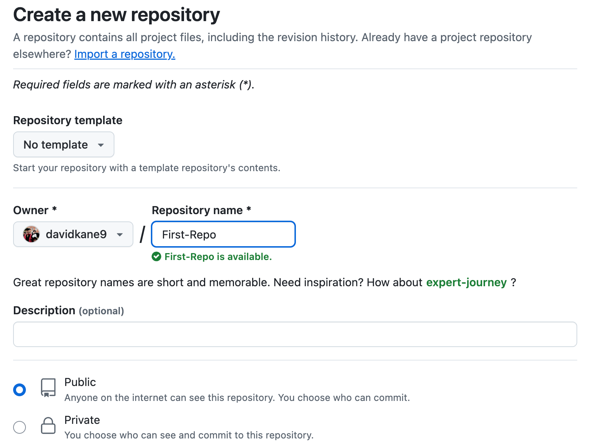
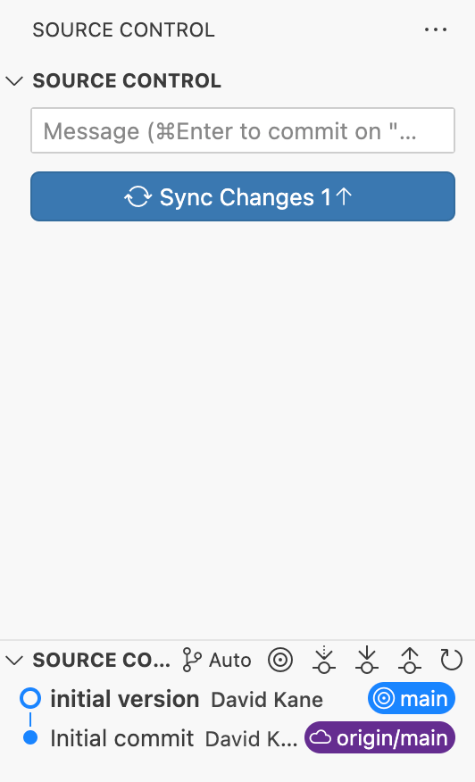

```{r setup, include = FALSE}
library(learnr)
library(tutorial.helpers)
library(knitr)

library(tidyverse)
library(usethis)
library(gitcreds)

knitr::opts_chunk$set(echo = FALSE)
knitr::opts_chunk$set(out.width = '90%')
options(tutorial.exercise.timelimit = 60, 
        tutorial.storage = "local")
```

```{r copy-code-chunk, child = system.file("child_documents/copy_button.Rmd", package = "tutorial.helpers")}
```

```{r info-section, child = system.file("child_documents/info_section.Rmd", package = "tutorial.helpers")}
```

<!-- Couple of DK comments below which indicate how to expand a couple of questions. -->

<!-- Stop being afraid of the command line. Use lots of git commands.  -->

<!-- Maybe delete gitcreds and usethis, and then use the command line? -->

<!-- Can we add some tests? Maybe set up a test environment of some type, perhaps by setting up all sets of scaffolding for testthat? -->

<!-- Consider switching to lower case names for repos. But then we would probably need to redo lots of the images . . . -->

## Introduction
### 

This tutorial covers [Git](https://git-scm.com/), a program for keeping track of changes in your code, and [GitHub](https://github.com/), the leading company for storing your code in the cloud. Some material is from [*R for Data Science (2e)*](https://r4ds.hadley.nz/) by Hadley Wickham, Mine Çetinkaya-Rundel, and Garrett Grolemund.

The most useful reference for Git/GitHub is [*Happy Git and GitHub for the useR*](https://happygitwithr.com/). Refer to that book whenever you have a problem.

## Terminal Overview
### 

The Positron [Terminal](https://docs.posit.co/ide/user/ide/guide/tools/terminal.html) is how you directly communicate with the computer using commands, whereas the Positron [Console](https://docs.posit.co/ide/user/ide/guide/code/console.html) is how you talk to R.

This section will help introduce you to the Terminal so that you'll be up to speed for the commands needed later.

### Exercise 1

Start by clicking on the Terminal tab in Positron. This is next to the Console tab in the bottom Panel.

You should see some text, which is a portion of the path to the current working directory, followed by a prompt such as a dollar sign. Copy (by highlighting, then right clicking and selecting the "copy" option) and paste the entire prompt into the box below.

We abbreviate the instructions **c**opy/**p**aste the **c**ommand/**r**esponse as CP/CR throughout this tutorial.

```{r terminal-overview-1}
question_text(NULL,
    answer(NULL, correct = TRUE),
    allow_retry = TRUE,
    try_again_button = "Edit Answer",
    incorrect = NULL,
    rows = 2)
```

### 

Your answer might be something like:

```         
Davids-MBP:projects dkane$ 
```

Or like:

```
dkane@MacBookPro projects %
```

Paths differ. They often include the username, which is `dkane` for me. They also usually specify the current directory, which is `projects` in this case. They usually end with a character like `$` or `%`. 

### Exercise 2

Type the command `pwd` in your Terminal and hit return. CP/CR.

```{r terminal-overview-2}
question_text(NULL,
    answer(NULL, correct = TRUE),
    allow_retry = TRUE,
    try_again_button = "Edit Answer",
    incorrect = NULL,
    rows = 2)
```

### 

Your answer should look like:

```         
dkane@MacBookPro projects % pwd
/Users/dkane/Desktop/projects
dkane@MacBookPro projects % 
```

Your answer will be different, not least because your username is unlikely to be `dkane`. This result of `pwd` is the location on your computer in which the R program started up when you opened Positron.

Going forward, make sure to pay special attention to whether given commands are supposed to be run in the *Console* or the *Terminal*.

<!-- DK: Add a guide to the window, including the Source Control button? -->

## Setting up Git
### 

Professionals store their work on GitHub, or a similar "source control" tool. If your computer blows up, you don't want to lose your work. GitHub is like Google Drive --- both live in the cloud --- but for your computational work rather than your documents.

GitHub is an online drive for all your R code and projects. In the professional world, what you have on your GitHub account is more important than what you have on your resume. It is a verifiable demonstration of your abilities.

### Exercise 1

Install [Git](https://git-scm.com/) by following the instructions of the [Install Git](https://happygitwithr.com/install-git.html) chapter in [*Happy Git and GitHub for the useR*](https://happygitwithr.com/).

### 

After you install Git, you should quit and then restart Positron so that it has a chance to "recognize" that Git is installed. (Note that restarting Positron is **not** the same as restarting your R session **within** your Positron instance. To quit Positron you need to go to the `Positron -> Quit Positron` menu item.)

After restarting Positron, click on the Terminal tab. Run `git --version` in the Terminal to make sure that Git is installed and accessible. CP/CR.

```{r setting-up-git-1}
question_text(NULL,
    answer(NULL, correct = TRUE),
    allow_retry = TRUE,
    try_again_button = "Edit Answer",
    incorrect = NULL,
    rows = 2)
```

### 

Your answer should look like:

```         
dkane@MacBookPro projects % git --version
git version 2.39.3 (Apple Git-146)
dkane@MacBookPro projects % 
```

The details will differ. Don't worry if you have a different version of Git installed.

[*Pro Git*](https://git-scm.com/book/en/v2) is the best reference book for Git and GitHub.

### Exercise 2

The next step is to create a GitHub account by following the instructions at the [GitHub homepage](https://github.com/). 

**Follow [this advice](https://happygitwithr.com/github-acct.html#username-advice) when choosing your username.** 

We recommend using a permanent email address for this account, not one which you lose access to when, for example, you change schools or jobs.

Copy your GitHub account URL in the field below.

```{r setting-up-git-2}
question_text(NULL,
    answer(NULL, correct = TRUE),
    allow_retry = TRUE,
    try_again_button = "Edit Answer",
    incorrect = NULL,
    rows = 2)
```

### 

Your answer should look like this:

```         
https://github.com/your-username
```

[Git](https://en.wikipedia.org/wiki/Git) is "software for tracking changes in any set of files, usually used for coordinating work among programmers collaboratively developing source code during software development."

### Exercise 3

Now that you have your GitHub account, you need to connect it to Positron. The first step of doing this is to give Positron your GitHub account user name and email.

### 

<!-- Ran into an issue here where `usethis::use_git_config(user.name = "your-username", user.email = "your@email.org")` would produce an error if you had multiple `user.name`s or `user.email`s saved (this can be checked using `usethis::git_sitrep()`). To fix this, I first used the terminal command `git config --global --replace-all user.name "newname"`. However, there seemed to be an issue where the terminal would say it is replaced but it wasn't being recognized. In the end, I was able to locate the actual global Git config file under `C:/User/username/` and edit it directly. In the file, there were fields formatted like `name = ...` and `email = ...`. Deleting these lines completely seemed to work correctly. Afterwards (Good to restart R session here), running `usethis::git_sitrep()` will show that the fields are not set and you should now be able to run `usethis::use_git_config(user.name = "your-username", user.email = "your@email.org")` without error. -->

In the Console, run this command, substituting the email and user name you used for your GitHub account:

```         
usethis::use_git_config(user.name = "your-username", user.email = "your@email.org")
```

Note that this will not return anything. As long as you don't get an error message, it (probably) worked.

### 

Run `git config --global user.name` in the *Terminal* to make sure your computer remembers your GitHub username. CP/CR.

```{r setting-up-git-3}
question_text(NULL,
    answer(NULL, correct = TRUE),
    allow_retry = TRUE,
    try_again_button = "Edit Answer",
    incorrect = NULL,
    rows = 2)
```

### 

You answer should look like this:

```         
dkane@MacBookPro projects % git config --global user.name
David Kane
dkane@MacBookPro projects % 
```

Of course, it should be your username, not mine!

### Exercise 4

Run `git config --global user.email` in the *Terminal* to make sure your GitHub email is stored too. CP/CR.

```{r setting-up-git-4}
question_text(NULL,
    answer(NULL, correct = TRUE),
    allow_retry = TRUE,
    try_again_button = "Edit Answer",
    incorrect = NULL,
    rows = 3)
```

### 

Your answer should look like:

```         
dkane@MacBookPro projects % git config --global user.email
dave.kane@gmail.com
dkane@MacBookPro projects % 
```

Now, your GitHub username and email are stored so that your computer can automate a lot of the tedious steps required to communicate with GitHub.

### Exercise 5

**Note:** Make sure you received the expected outputs of the name and email associated with your GitHub account in the previous two exercises.

If, in our metaphor, GitHub is your Google Drive, then GitHub repositories, or "repos," are the Google folders, the location in which we store our work. Let's make a practice repo!

To begin, sign into GitHub and go to the homepage: `www.github.com`. Click the green "New" button on the upper left side of the page.


```{r}
include_graphics("images/github_new_repo.png")
```

Name your repository `First-Repo`. Then, select the "public" option for your repo.

```{r}

```

Then, check the box saying "Add a README file". [README](https://en.wikipedia.org/wiki/README) is a document where programmers explain details of their project. When in doubt follow [these instructions](https://happygitwithr.com/push-pull-github.html#make-a-repo-on-github).


```{r}

```

After you've done that, go ahead and click "Create repository" to create your first repo!

### 

GitHub should have directed you to a page called the project page after creating the repo. Copy and paste the URL of the project page below.

```{r setting-up-git-5}
question_text(NULL,
    answer(NULL, correct = TRUE),
    allow_retry = TRUE,
    try_again_button = "Edit Answer",
    incorrect = NULL,
    rows = 2)
```

### 

Your answer should look like:

```         
github.com/davidkane9/First-Repo
```

The "public" option means that anyone will be able to view the repository. But only you can edit it. You might have noticed "Add .gitignore" as another option, but we will never check this box because Positron will automatically create a `.gitignore` file for us when we connect the GitHub repo to an R project on our computer.

### Exercise 6

The next step will be to create the exact same project on your local computer through the process of **cloning**. By having a local and a GitHub version, you can edit your project on your computer and then send all the changes you've made to GitHub. This process ensures that the GitHub version is synced up with your local version.

To clone the repo, click on the green button that says "Code". Then, copy the link shown. You can use the clipboard button on the right to automatically copy it.

```{r}

```

Paste the link below.

```{r setting-up-git-6}
question_text(NULL,
    answer(NULL, correct = TRUE),
    allow_retry = TRUE,
    try_again_button = "Edit Answer",
    incorrect = NULL,
    rows = 2)
```

### 

It should look something like:

```         
https://github.com/davidkane9/First-Repo.git
```

This link points to your project folder on GitHub. It is slightly different from the URL of the project page because the `.git` suffix tells you that it's a special GitHub object, not a webpage.

### Exercise 7

Read through all these steps before starting the process of connecting your repo to a project on your computer.

-   Click the `New` menu dropdown item from top left of the Positron window.

```{r}

```

-   Select `New Folder from Git ...`.

-   Paste in your GitHub URL to the  "Git repository URL" box. Ensure that the "Create folder ..." box specifies your `projects` folder. Click the "Open in new window" box.

```{r}
include_graphics("images/new-from-git.png")
```

-   Click "OK."

This will open the `First-Repo` project in a new Positron window. 


### Exercise 8

**All further questions in this tutorial should be completed in the `First-Repo` project, not in the Positron window in which this tutorial is running.**

The new Positron window will look something like:

```{r}
include_graphics("images/new-git-window.png")
```

Note the message that "There is no interpreter running." Note the "Start Interpreter" dropdown menu. When you create a new project from GitHub, Positron does not know what programming language you intend to work with at the start. Choosing an "interpreter" is, more or less, choosing a programming language.

Select the latest R version from the menu. (If you have more than one R version installed, you ought to delete the older ones. You may also have Python as an option.) Or, if one version of R is the only interpreter that Positron can find, it might just start R for you.

Either way, R should start in the Console. Copy/paste everything in the Console from "Type 'demo()'" through the prompt.

```{r setting-up-git-8}
question_text(NULL,
	answer(NULL, correct = TRUE),
	allow_retry = TRUE,
	try_again_button = "Edit Answer",
	incorrect = NULL,
	rows = 5)
```

###

My answer looks like:

````
Type 'demo()' for some demos, 'help()' for on-line help, or
'help.start()' for an HTML browser interface to help.
Type 'q()' to quit R.

>
````

### Exercise 9

Confirm that your setup is correct. In the Terminal (not the Console), run `git remote -v`. CP/CR.

```{r setting-up-git-9}
question_text(NULL,
    answer(NULL, correct = TRUE),
    allow_retry = TRUE,
    try_again_button = "Edit Answer",
    incorrect = NULL,
    rows = 2)
```

Your answer should look something like:

```         
dkane@MacBookPro First-Repo % git remote -v
origin  https://github.com/davidkane9/First-Repo.git (fetch)
origin  https://github.com/davidkane9/First-Repo.git (push)
dkane@MacBookPro First-Repo % 
```
Note how my prompt has changed so that it ends with `First-Repo` because this new window opened with `First-Repo` as the current working directory.

Don't worry too much about the details of "origin," "fetch," and "push." You've successfully linked a repo to an Positron Project!

### Exercise 10

<!-- DK: Revisit this to confirm it works. Update images. -->

You have linked your GitHub repo to your R project, but you haven't proven that you are someone with editing access to the project. If we just let anyone with the GitHub link edit our repo, that's obviously going to lead to problems. This is why we use something called a **p**ersonal **a**ccess **t**oken, or a **PAT**.

### 

A PAT is just a special computer-generated password between your computer and GitHub that lets GitHub connect your GitHub account and your computer. If you want to learn more, see "[Personal access token for HTTPS](https://happygitwithr.com/https-pat.html)" from [*Happy Git and GitHub for the useR*](https://happygitwithr.com/)

### 

Create a PAT by using the `usethis::create_github_token()` function in the Console. This should redirect you to a GitHub page about creating a PAT.

### 

Set the "Note" field to "My First PAT" and keep the scopes the same as the **default**. It should look something like the picture below (Doesn't have to be exact).

```{r}
include_graphics("images/pat.png")
```

### 

Press "Generate Token" at the bottom of the page to finalize your PAT. If you have trouble, the function `usethis::gh_token_help()` may be helpful.

### Exercise 11

Now that you have created your PAT, you should first temporarily copy it somewhere you have easy access to. We will need to store it somewhere so that Positron can "see" it.

Run `gitcreds::gitcreds_set()` in the Console and follow the prompts, providing your token when asked.

### 

Restart your R session with `Cmd/Ctrl + Shift + 0`. (This is not the same thing as restarting Positron.) You could also use `Cmd/Ctrl + Shift + 0` to restart R. On Windows, this would be `Ctrl + Shift + F10`.

Run `usethis::git_sitrep()` in the Console. CP/CR.

```{r setting-up-git-11}
question_text(NULL,
    answer(NULL, correct = TRUE),
    allow_retry = TRUE,
    try_again_button = "Edit Answer",
    incorrect = NULL,
    rows = 12)
```

### 

The key "GitHub user" section should look something like:

```         
── GitHub user 
• Default GitHub host: 'https://github.com'
• Personal access token for 'https://github.com': '<discovered>'
• GitHub user: 'davidkane9'
```

See "[Managing Git(Hub) Credentials](https://usethis.r-lib.org/articles/git-credentials.html)" for more details.


## Using Git
### 

Having set up git, we can now practice using it.

### Exercise 1

At the Terminal, run `pwd`. CP/CR.

```{r using-git-1}
question_text(NULL,
	answer(NULL, correct = TRUE),
	allow_retry = TRUE,
	try_again_button = "Edit Answer",
	incorrect = NULL,
	rows = 3)
```

###

Your answer should look like:

````
dkane@MacBookPro First-Repo % pwd
/Users/dkane/Desktop/projects/First-Repo
dkane@MacBookPro First-Repo % 
````

You should be in a directory named `First-Repo`. By default, the "New Folder from Git" process places you in the directory of the project which you have just created. The prompt, assuming that you have a reasonable one, should show your current working directory, as mine does.

### Exercise 2

At the Terminal, run `ls`. CP/CR.

```{r using-git-2}
question_text(NULL,
	answer(NULL, correct = TRUE),
	allow_retry = TRUE,
	try_again_button = "Edit Answer",
	incorrect = NULL,
	rows = 3)
```

###

Your answer should look like:

````
dkane@MacBookPro First-Repo % ls
README.md
dkane@MacBookPro First-Repo % 
````
There is only one (non-hidden) file in the directory, `README.md`. It was created when we initially started the repo. Recall how we checked the box saying "Add a README file". If we had not done so, there would not be any files in the directory. 

### Exercise 3

At the Terminal, run `ls -a`. The `a` option tells `ls` to show all directories/files, including ones that are hidden, i.e., which start with a dot, meaning a`.`. CP/CR.

```{r using-git-3}
question_text(NULL,
	answer(NULL, correct = TRUE),
	allow_retry = TRUE,
	try_again_button = "Edit Answer",
	incorrect = NULL,
	rows = 3)
```

###

Your answer should look like:

````
dkane@MacBookPro First-Repo % ls -a
.               ..              .git            README.md
dkane@MacBookPro First-Repo % 
````

`.` refers to the current directory. `..` stands for the parent directory. These two links are present in (almost) every directory on your computer. `.git` is a hidden directory used by the program Git to keep track of all the files in your project. 

Unless you have a good reason, you should never mess with the contents of a hidden directory like `.git`.

### Exercise 4

At the Terminal, run `cat README.md`. CP/CR.

```{r using-git-4}
question_text(NULL,
	answer(NULL, correct = TRUE),
	allow_retry = TRUE,
	try_again_button = "Edit Answer",
	incorrect = NULL,
	rows = 3)
```

###

Your answer should look like:

````
dkane@MacBookPro First-Repo % cat README.md 
# First-Repo%                                                                                   
dkane@MacBookPro First-Repo % 
````

The `README.md` file is a markdown file with only one line, a header with the name of the repo. It, unfortunately, lacks an empty line at the end of the file, thereby causing my prompt to "wrap" around in the print out above.

### Exercise 5

Open `README.md` in the Editor. The easiest way to do so is to click the Explorer button in the Activity Bar on the lefthand side of the Positron Window. This opens the File pane, in which you can see the files in the current directory.

```{r}

```

Edit the `README.md` by skipping a line after the header and adding this sentence: "David Kane is a data maestro!" Replace my name with yours, obviously. Add a blank line after your sentence. Save the file.

At the Terminal, run `cat README.md`. CP/CR.

```{r using-git-5}
question_text(NULL,
	answer(NULL, correct = TRUE),
	allow_retry = TRUE,
	try_again_button = "Edit Answer",
	incorrect = NULL,
	rows = 3)
```

###

Your answer should look like:

````
dkane@MacBookPro First-Repo % cat README.md
# First-Repo

David Kane is a data maestro!
dkane@MacBookPro First-Repo % 
````

You can close the Files pane by clicking the Explorer button again. Each of the buttons in the Activity Bar opens up a different pane.

### Exercise 6

Click the Source Control button in the Activity Bar. This opens the Source Control pane, which is an interface to using Git and GitHub.

```{r}

```

The top part of the pane shows the files that have been added/modified. This is Git telling you what it thinks has changed. In this case, the "M" next to the end of the line for `README.md` indicates that Git thinks that we have **M**odified the file, which is, in fact, what we have done.

Render `README.md` by either typing `Cmd/Cntrl + Shift + K` or by clicking the "Preview" button in the upper right of the Editor.

The Terminal tab is filled with a bunch of commands. Copy/paste the last few lines.

```{r using-git-6}
question_text(NULL,
	answer(NULL, correct = TRUE),
	allow_retry = TRUE,
	try_again_button = "Edit Answer",
	incorrect = NULL,
	rows = 6)
```

###

Your answer should look like:

````
metadata
  document-css: false
  link-citations: true
  date-format: long
  lang: en
  
Output created: README.html

Watching files for changes
Browse at http://localhost:7383/
````

Rendering `README.md` is like rendering a Quarto document. Positron, in the Viewer tab, shows you the resulting HTML. Quarto, via the Terminal, continues to monitor `README.md`. If you change it again, Quarto will automatically update the HTML.

### Exercise 7

The Positron window has changed quite a bit. The Viewer tab has appeared, showing the HTML. The Source Control pane now includes many new files. The Terminal tab is not showing us a prompt.

```{r}

```

We can stop the monitoring of `README.md` by using `Cntrl-C`.  Once we do, the Viewer tab is empty, so we can close the entire Secondary Activity Bar.

From the Terminal, run `ls`. CP/CR.

```{r using-git-7}
question_text(NULL,
	answer(NULL, correct = TRUE),
	allow_retry = TRUE,
	try_again_button = "Edit Answer",
	incorrect = NULL,
	rows = 6)
```

###

Your answer should look like:

````
dkane@MacBookPro First-Repo % ls
README.html     README.md       README_files
dkane@MacBookPro First-Repo % 
````

The bottom part of the Source Control pane shows the history of changes in this repo.

### Exercise 8

Look more closely at the Source Control pane:

```{r}

```

We have `README.md`, which has been modified by us, hence the "M" indicator. We have a new file, `README.html`, created when we rendered `README.md`. It has a "U" indicator because, according to git, it is **U**ntracked. We also have many weird, confusing files. It turns out that all these files live in the `README_files` directory.

From the Terminal, run `ls -R README_files`. The `-R` option means **r**ecursive. CP/CR.


```{r using-git-8}
question_text(NULL,
	answer(NULL, correct = TRUE),
	allow_retry = TRUE,
	try_again_button = "Edit Answer",
	incorrect = NULL,
	rows = 3)
```

###

Your answer should look like:

````
dkane@MacBookPro First-Repo % ls -R README_files
libs

README_files/libs:
bootstrap       clipboard       quarto-html

README_files/libs/bootstrap:
bootstrap-973236bd072d72a04ee9cd82dcc9cb29.min.css
bootstrap-icons.css
bootstrap-icons.woff
bootstrap.min.js

README_files/libs/clipboard:
clipboard.min.js

README_files/libs/quarto-html:
anchor.min.js
popper.min.js
quarto-syntax-highlighting-e26003cea8cd680ca0c55a263523d882.css
quarto.js
tippy.css
tippy.umd.min.js
dkane@MacBookPro First-Repo % 
````

Whenever you render a document using Quarto, it creates a directory called `base-name-of-your-file_files`. Since the base name of `README.md` is `README`, the new directory created is `README_files`. This directory is filled with the programs/information/etc which helped to turn `README.md` into `README.html`. That file is filled with confusing stuff that we should ignore. In fact, we usually don't even want it monitored by Git or stored on GitHub.


### Exercise 9

From the main Positron menu, `File -> New Text File`. (You can accomplish the same thing from the File bar menu item `New -> New File... -> Text File`.) Save this new file as `.gitignore`. (Don't forget the leading period.) 

From the Terminal, run `ls -a`. CP/CR.

```{r using-git-9}
question_text(NULL,
	answer(NULL, correct = TRUE),
	allow_retry = TRUE,
	try_again_button = "Edit Answer",
	incorrect = NULL,
	rows = 3)
```

###

Your answer should look like:

````
dkane@MacBookPro First-Repo % ls -a
.               .git            README.html     README_files
..              .gitignore      README.md
dkane@MacBookPro First-Repo % 
````

Because `.gitignore` begins with a `.`, it is a hidden file. It would not appear if we just used `ls`. Note that the Source Control pane now shows a new file, `.gitignore` with an associated "U", meaning it is also untracked.

### Exercise 10

The purpose of the `.gitignore` file is to specify those files/directories which **git** should **ignore**. Add a new line to the fle, `README_file`, followed by an empty line. Save your changes.

From the Terminal, run `cat .gitignore`. CP/CR.

```{r using-git-10}
question_text(NULL,
	answer(NULL, correct = TRUE),
	allow_retry = TRUE,
	try_again_button = "Edit Answer",
	incorrect = NULL,
	rows = 3)
```

###

Your answer should look like:

````
dkane@MacBookPro First-Repo % cat .gitignore 
README_files
dkane@MacBookPro First-Repo % 
````

The `README_files` line in `.gitignore` tells Git to ignore the `README_files` directory and everything in it.

Note the change in the Source Control pane!

```{r}

```

Now, according to git, there have been only three changes to the repo. (Of course, there have been more changes, but we are ignoring anything which resides in `README_files`.) One file, `README.md`, has been modified (M). Two files, `README.html` and `.gitigore`, are untracked (U).

### Exercise 11

Within the Source Control pane, press the "Open File" button for `README.md`, which is the first of four symbols to the right of the file name. 

```{r}

```

This does two things. First, it brings the `README.md` file to the focus of the Editor. Second, it changes the format of the file so that you can see how it has been modified. The vertical green line to left side of lines 2 through 4 indicate that those lines are new. If any lines had been deleted, they would be highlighted in red.

Hold your cursor over the symbol (a curved arrow) next to the "Open File" button. What is the name for this button?

```{r using-git-11}
question_text(NULL,
	message = "Discard Changes",
	answer(NULL, correct = TRUE),
	allow_retry = FALSE,
	incorrect = NULL,
	rows = 6)
```

###

Clicking this button gets rid of your changes since the last time you told Git to save them. 


### Exercise 12

Hold your cursor over the symbol (a plus sign) next to the "Discard Changes" button. What is the name for this button?

```{r using-git-12}
question_text(NULL,
	message = "Stage Changes",
	answer(NULL, correct = TRUE),
	allow_retry = FALSE,
	incorrect = NULL,
	rows = 2)
```

###

Saving changes in Git is, in theory, a two-step process. The first step is to "stage" the changes. The second step is to "commit" the changes. For the most part, we don't stage. We just "commit," which incorporates the staging process automatically.

### Exercise 13

The letters at the end of the line for the file names indicate that `.gitignore` and `README.html` are **U**ntracked and that `README.md` is **M**odified. We can "commit" these files by hitting the Commit buttom. Before doing so, hold your cursor over the button. What does it say?

```{r using-git-13}
question_text(NULL,
	message = 'Commit Changes on "main"',
	answer(NULL, correct = TRUE),
	allow_retry = FALSE,
	incorrect = NULL,
	rows = 2)
```

The word `main` references the "branch" of your repo that you are currently working on. We won't worry about branches for a while yet, but they are an important part of using git.

### Exercise 14

In the box above the "Commit" button, add "initial version" as your commit comment. Press the "Commit" button. You will see a dialogue box like this:

```{r}

```

Press "Yes". In the future, you might click on "Always" so that this dialogue stops appearing. It will be months, at least, before you make active use of staging in your Git workflow.

From the Terminal, run `git log`. CP/CR.

```{r using-git-14}
question_text(NULL,
	answer(NULL, correct = TRUE),
	allow_retry = TRUE,
	try_again_button = "Edit Answer",
	incorrect = NULL,
	rows = 5)
```

###

Your answer should look like this:

````
dkane@MacBookPro First-Repo % git log
commit 61722f1b6a67d4e297eeff4ba77675ea3dae77ba (HEAD -> main)
Author: David Kane <dave.kane@gmail.com>
Date:   Tue Mar 11 11:27:15 2025 -0400

    initial version

commit 969819f5c16d3776254121570a4853da45f174ba (origin/main, origin/HEAD)
Author: David Kane <dave.kane@gmail.com>
Date:   Sun Mar 9 15:46:04 2025 -0400

    Initial commit
dkane@MacBookPro First-Repo % 
````

`git log` generates a log of all the Git actions we have taken. In this case, you can see that we have committed changes twice. The first changes involved the initial acceptance of `README.md`. This was done behind the scenes when we created the project by connecting to GitHub. The second change is the commit which we just pushed, the one which adds `.gitignore` and `README.html`, and also modifies `README.md`. 


### Exercise 15

The Source Control pane now looks like this:

```{r}

```

Although you have commited your changes to Git --- i.e., the changes have been made locally --- you still need to "push" the changes to GitHub.  Hover your cursor over the "Sync Changes" button. What does the pop-up say?


```{r using-git-15}
question_text(NULL,
	message = "Push 1 commits to origin/main",
	answer(NULL, correct = TRUE),
	allow_retry = FALSE,
	incorrect = NULL,
	rows = 6)
```

###

The term "origin/main" refers to the "main" branch on the "origin" repo, which is the GitHub repo. 

Note how the bottom portion of the pane, the Source Control Graph now has two items. Before you committed, it had just one. The Source Control Graph shows a Git history of this repo.

### Exercise 16

Press the "Sync Changes" button. Doing so, brings up this dialogue box:

```{r}

```

Click "OK." Eventually, you might select "OK. Don't Show Again," since you almost always want to just push your changes whenever you click the "Sync Changes" button. Settings like this are saved in the Positron `settings.json` file.

From the Terminal, run `git log` again. CP/CR.

```{r using-git-16}
question_text(NULL,
	answer(NULL, correct = TRUE),
	allow_retry = TRUE,
	try_again_button = "Edit Answer",
	incorrect = NULL,
	rows = 7)
```

###

Your answer should look like:

````
dkane@MacBookPro First-Repo % git log
commit 61722f1b6a67d4e297eeff4ba77675ea3dae77ba (HEAD -> main, origin/main, origin/HEAD)
Author: David Kane <dave.kane@gmail.com>
Date:   Tue Mar 11 11:27:15 2025 -0400

    initial version

commit 969819f5c16d3776254121570a4853da45f174ba
Author: David Kane <dave.kane@gmail.com>
Date:   Sun Mar 9 15:46:04 2025 -0400

    Initial commit
dkane@MacBookPro First-Repo % 
````

This looks the same as before, except that "(HEAD -> main)" in the top line has changed to "(HEAD -> main, origin/main, origin/HEAD)".  This tells us that our changes have been pushed to GitHub, and not simply committed locally. We will save a discussion of what `"HEAD" means for later.

A term like "commit 969819f5c16d3776254121570a4853da45f174ba" gives us the address of that commit. We can revert to the code base as it looked after that commit by using that string.

If you look at the GitHub page for `First-Repo`, you will see that the changes have been pushed to GitHub. If your computer blows up, you won't lose any of your work.


## Publishing with GitHub Pages
### 

Let's create a new GitHub repo, connect it our computer, create a Quarto document, publish it to the internet using [GitHub Pages](https://pages.github.com/), and then ensure our work is backed up to GitHub. 


### Exercise 1

On your GitHub account, create a new repo named `repo-2`. Make sure it is public. Make sure to check the box for a README file. After clicking "Create," copy the URL after clicking the "Code" button.

What is the URL for the project?

```{r publishing-with-github-pages-1}
question_text(NULL,
	answer(NULL, correct = TRUE),
	allow_retry = TRUE,
	try_again_button = "Edit Answer",
	incorrect = NULL,
	rows = 3)
```

###

My answer:

````
https://github.com/davidkane9/repo-2.git
````

No worries if you did not include the `.git` ending. The URL you go to when you want to look at the repo does not include `.git`, obviously. But, for connecting the repo to your computer, you need `.git`.

### Exercise 2

In Positron, `File -> New Folder from Git...`. Use the project URL (with `.git`) to create a new project in your `projects` directory. Make sure to click the "Open in New Window" box.

Close the Positron welcome screen, if any.

Start latest version of R as your interpreter, if necessary.

From the Console, run `getwd()`. CP/CR.

```{r publishing-with-github-pages-2}
question_text(NULL,
	answer(NULL, correct = TRUE),
	allow_retry = TRUE,
	try_again_button = "Edit Answer",
	incorrect = NULL,
	rows = 3)
```

###

````
> getwd()
[1] "/Users/dkane/Desktop/projects/repo-2"
````

Going forward, we will just write "Start a new project named `X`," with the understanding that this always means to follow the above steps.

### Exercise 3

Click on the Source Control button to pull up the Source Control pane. 

```{r}

```

No files are listed in the top half because you have not done anything yet. In the Source Control Graph in the lower panel, we have just the first commit, completed by Positron itself when we created the project.

From the Terminal, run `git log`. CP/CR.

```{r publishing-with-github-pages-3}
question_text(NULL,
	answer(NULL, correct = TRUE),
	allow_retry = TRUE,
	try_again_button = "Edit Answer",
	incorrect = NULL,
	rows = 3)
```

###

````
dkane@macbook repo-2 % git log
commit a3f605b1e44bccc834ebd569c982040855c0cab9 (HEAD -> main, origin/main, origin/HEAD)
Author: David Kane <dave.kane@gmail.com>
Date:   Tue Mar 11 16:45:52 2025 -0400

    Initial commit
dkane@macbook repo-2 % 
````

This is an individual commit message. As [*Pro Git*](https://git-scm.com/book/en/v2) [explains](https://git-scm.com/book/en/v2/Getting-Started-What-is-Git%3F), the weird string `a3f605b1e44bccc834ebd569c982040855c0cab9` is a hash which identifies this specific commit. Every change in a repo has an associated hash.

### Exercise 4

From the Positron menu, `File -> New File... -> Quarto Document`. 

```{r}

```

The black dot next to "Untitled-1" indicates that there are unsaved changes in this file. Save the file, naming it `analysis.qmd`.

At the Console, run `list.files()`. CP/CR.

```{r publishing-with-github-pages-4}
question_text(NULL,
	answer(NULL, correct = TRUE),
	allow_retry = TRUE,
	try_again_button = "Edit Answer",
	incorrect = NULL,
	rows = 3)
```

###

````
> list.files()
[1] "analysis.qmd" "README.md"   
>
````

Many Terminal commands, like `ls`, have R command counterparts, like `list.files()`.

### Exercise 5

Click the Source Control button to bring up the Source Control pane. The only file listed is `analysis.qmd`, which is **U**ntracked.  

```{r}

```

Look in the far upper right of the image. Those icons turn off-and-on various portions of the Positron. Try them out!

In the Terminal run `ls -a`. CP/CR.

```{r publishing-with-github-pages-5}
question_text(NULL,
	answer(NULL, correct = TRUE),
	allow_retry = TRUE,
	try_again_button = "Edit Answer",
	incorrect = NULL,
	rows = 3)
```

###

````
dkane@macbook repo-2 % ls -a
.               ..              .git            README.md       analysis.qmd
dkane@macbook repo-2 % 
````

The `-a` flag shows us **a**ll files/directories, including the hidden ones like `.git`. 


### Exercise 6

Render `analysis.qmd` with `Cmd/Cntrl + Shift + K`, or by clicking the "Preview" button.

```{r}

```

The rendered document `analysis.html` appears in the Viewer tab. It is empty except for the title, which is "Untitled." The title of the document and the name of the file have no necessary connection with each other.

In the Terminal, run `ls`. CP/CR.

```{r publishing-with-github-pages-6}
question_text(NULL,
	answer(NULL, correct = TRUE),
	allow_retry = TRUE,
	try_again_button = "Edit Answer",
	incorrect = NULL,
	rows = 3)
```

###

````
dkane@macbook repo-2 % ls   
README.md       analysis.html   analysis.qmd    analysis_files
dkane@macbook repo-2 % 
````

All the junk files that we don't really care about, and which are cluttering up the Source Control pane, are located in the `analysis_files` directory.

### Exercise 7

Quarto is "Watching files for changes" at the Terminal. If you change and then render `analysis.qmd`, Quarto will automatically display the updated HTML in the Viewer. It is watching `analysis.html`. You can't use this Terminal until you stop this process.

```{r}

```

We want to "free up" the Terminal so that we can issue some commands. So, when in the Terminal, use `Ctrl-C` to exit Quarto watching mode. CP/CR, but include the few lines above the `Ctrl-C` as well.

```{r publishing-with-github-pages-7}
question_text(NULL,
	answer(NULL, correct = TRUE),
	allow_retry = TRUE,
	try_again_button = "Edit Answer",
	incorrect = NULL,
	rows = 5)
```

###

````
Output created: analysis.html

Watching files for changes
Browse at http://localhost:3859/
^C%                                               
dkane@macbook repo-2 % 
````

The `http` location of `analysis.html` does not refer to a web address. `localhost` is your local machine. The number, which will different for you, is arbitrary.

### Exercise 8

There are 13 files now listed under "Changes" in the top half of the Source Control page. You can see the same number (13) in red on the Source Control button. This allows you to know how many files have changes even if the entire Source Control pane is not visible.

```{r}

```

From the Terminal, run `ls -R analysis_files`. CP/CR.

```{r publishing-with-github-pages-8}
question_text(NULL,
	answer(NULL, correct = TRUE),
	allow_retry = TRUE,
	try_again_button = "Edit Answer",
	incorrect = NULL,
	rows = 10)
```

###

````
dkane@macbook repo-2 % ls -R analysis_files
libs

analysis_files/libs:
bootstrap       clipboard       quarto-html

analysis_files/libs/bootstrap:
bootstrap-973236bd072d72a04ee9cd82dcc9cb29.min.css
bootstrap-icons.css
bootstrap-icons.woff
bootstrap.min.js

analysis_files/libs/clipboard:
clipboard.min.js

analysis_files/libs/quarto-html:
anchor.min.js
popper.min.js
quarto-syntax-highlighting-e26003cea8cd680ca0c55a263523d882.css
quarto.js
tippy.css
tippy.umd.min.js
dkane@macbook repo-2 % 
````

If you know something about webpages, you will recognize some of these files. But we won't worry about those details.

### Exercise 9

Use `File -> New Text File` to create a new `.gitignore`. Add `analysis_files` and an empty line to the file. Save it in the highest level of the project, i.e., in the same location as `analysis.qmd`.

```{r}

```

There are now only three changed files: `analysis.qmd`, `analysis.html`, and `.gitgnore`.

From the Terminal, run `cat .gitignore`. CP/CR.

```{r publishing-with-github-pages-9}
question_text(NULL,
	answer(NULL, correct = TRUE),
	allow_retry = TRUE,
	try_again_button = "Edit Answer",
	incorrect = NULL,
	rows = 3)
```

###

````
dkane@macbook repo-2 % cat .gitignore
analysis_files
dkane@macbook repo-2 % 
````

One of the biggest changes in coding caused by generative AI is that writing code becomes less important but understanding all the individual parts of a project --- files like `.gitignore` --- becomes more important.

### Exercise 10

Add a commit message like "first version" and press the "Commit" button on the Source Control pane.

```{r}

```

Note how the Source Control pane has changed. There are no "Changes" listed because you have committed them all. The Source Control Graph in the lower half shows the second commit, along with its comment. But, the "Sync Changes 1" button indicates that we have not pushed the changes to GitHub yet.

From the Terminal, run `git log -n 1`. CP/CR.

```{r publishing-with-github-pages-10}
question_text(NULL,
	answer(NULL, correct = TRUE),
	allow_retry = TRUE,
	try_again_button = "Edit Answer",
	incorrect = NULL,
	rows = 3)
```

###

````
dkane@macbook repo-2 % git log -n 1
commit 85ff22c4f4c31deadbd893f2c7d4af358faf12cd (HEAD -> main)
Author: David Kane <dave.kane@gmail.com>
Date:   Thu Mar 13 14:31:30 2025 -0400

    first version
dkane@macbook repo-2 % 
````

The `n` argument allows us to specify how many commit messages we want to see. Using `1` gives us just the most recent message. The "Author" and "Date" for the commit message should, obviously, match you and the time when you are doing the tutorial. It is OK if your commit message is different from mine. You should always have a commit message, but it can be quite concise. You don't even need a complete sentence.

### Exercise 11

Press the "Sync Changes 1" button. This pushes your changes to GitHub. By default, the main repo is refered to as the "origin" repo, whether or not it happens to be on GitHub.

The Source Control Graph now looks like this:

```{r}

```

The change between this image and the previous one is subtle: the "origin/main" cloud symbol has moved from the first commit to the second. That shows that the two repos are now in sync.

From the Terminal, run `git log -n 1`. CP/CR.

```{r publishing-with-github-pages-11}
question_text(NULL,
	answer(NULL, correct = TRUE),
	allow_retry = TRUE,
	try_again_button = "Edit Answer",
	incorrect = NULL,
	rows = 3)
```

###

````
dkane@macbook repo-2 % git log -n 1
commit 85ff22c4f4c31deadbd893f2c7d4af358faf12cd (HEAD -> main, origin/main, origin/HEAD)
Author: David Kane <dave.kane@gmail.com>
Date:   Thu Mar 13 14:31:30 2025 -0400

    first version
dkane@macbook repo-2 % 
````

The commit itself has not changed. It has the same date/author/comment as before. But the "header" information has changed from `HEAD -> main` to `HEAD -> main, origin/main, origin/HEAD`. `HEAD` is a special reference that points to the current position in your repository --- essentially, it represents "where you are" in your Git history. By pushing, we ensure that `HEAD` is pointing to the same place on our computer as it is in GitHub, i.e., at the "origin."

### Exercise 12

Add an R code chunk with `Cmd/Ctrl + option + i` to `analysis.qmd`. (Recall that "code chunk" and "code cell" mean the same thing.) In that chunk, put `library(tidyverse)`. `Cmd/Ctrl + Shift + K` to render the the document. Your Positron window should look like:

```{r}

```

As usual, the HTML file is displayed in the Viewer tab and, in the Panel, the focus switches to the Terminal, in which Quarto is "Watching files for changes."

In the Console, run `tutorial.helpers::show_file("analysis.qmd", chunk = "Last")`. CP/CR.

```{r publishing-with-github-pages-12}
question_text(NULL,
	answer(NULL, correct = TRUE),
	allow_retry = TRUE,
	try_again_button = "Edit Answer",
	incorrect = NULL,
	rows = 7)
```

###

````
> tutorial.helpers::show_file("analysis.qmd", chunk = "Last")
library(tidyverse)
>
````

The HTML shows both our code and some annoying messages. No viewer wants to see that!

### Exercise 13

Change the title of the document to "A Beautiful Graphic". Add your name as the author by adding `author: Your Name` to the YAML header, along with:

````
execute:
  echo: false
  warning: false
````

Make sure to use spaces (not tabs) in YAML headers.

`Cmd/Ctrl + Shift + K` to render the the document. The HTML should now be clean.

In the Console, run `tutorial.helpers::show_file("analysis.qmd", end = 8)`. CP/CR.

```{r publishing-with-github-pages-13}
question_text(NULL,
	answer(NULL, correct = TRUE),
	allow_retry = TRUE,
	try_again_button = "Edit Answer",
	incorrect = NULL,
	rows = 8)
```

###

````
> tutorial.helpers::show_file("analysis.qmd", end = 8)
---
title: "A Beautiful Graphic"
author: David Kane
format: html
execute:
  echo: false
  warning: false
---
>
````

Turning off warnings with `warning: false` is dangerous. In general, if this needs to be done, it should just be done in the code chunk in which it is needed, not in the YAML header.

It is better to figure out the cause of any warnings and then address that cause directly. Simply closing your eyes and pretending that the warnings aren't there is a bad strategy. 

### Exercise 14

Ask your favorite AI how to make the warnings from using `library(tidyverse)` in a code chunk in a Quarto document disappear. Copy/paste the key part of the answer you receive here:

```{r publishing-with-github-pages-14}
question_text(NULL,
	answer(NULL, correct = TRUE),
	allow_retry = TRUE,
	try_again_button = "Edit Answer",
	incorrect = NULL,
	rows = 8)
```

###

From [Grok](https://grok.com/chat/d17d86c4-1740-4ff4-94a4-bd4aafd50be0):

````
Wrap the library(tidyverse) call with suppressPackageStartupMessages() to silence the startup messages. This keeps your output clean while still loading the package.
````

### Exercise 15

Edit `analysis.qmd` so that `library(tidyverse)` is replaced by `suppressPackageStartupMessages(library(tidyverse))`. Remove `warning: false` from the YAML header. `Cmd/Ctrl + Shift + K`.

Copy/paste whatever appears in your HTML below:

```{r publishing-with-github-pages-15}
question_text(NULL,
	answer(NULL, correct = TRUE),
	allow_retry = TRUE,
	try_again_button = "Edit Answer",
	incorrect = NULL,
	rows = 6)
```

###

````
A Beautiful Graphic
Author
David Kane
````

Don't worry about formatting when you copy/paste from an HTML. Your screen should look something like:

```{r}

```


### Exercise 16

Create a new R code chunk with `Cmd/Ctrl + option + i`. Ask [Grok](https://grok.com/) (or a generative AI of your choice) this question:

> I have loaded the tidyverse package. Give me some R code which uses ggplot and a built-in data set to create a beautiful graphic.

Paste that code into the new code chunk. `Cmd/Ctrl + shift + K` to render. If there is an error, or if the graphic is ugly, iterate with your AI until you have a graphic of which you are proud.

In the Console, run `tutorial.helpers::show_file("analysis.qmd", chunk = "Last")`. CP/CR.

```{r publishing-with-github-pages-16}
question_text(NULL,
	answer(NULL, correct = TRUE),
	allow_retry = TRUE,
	try_again_button = "Edit Answer",
	incorrect = NULL,
	rows = 12)
```

###

````
> tutorial.helpers::show_file("analysis.qmd", chunk = "Last")
ggplot(mpg, aes(x = displ, y = hwy, color = class)) +
  geom_point(alpha = 0.7) +
  scale_color_brewer(palette = "Set2") +
  scale_size_continuous(range = c(2, 8)) +
  labs(
    title = "Highway MPG vs Engine Displacement by Vehicle Class",
    subtitle = "Larger points indicate higher city MPG",
    x = "Engine Displacement (L)",
    y = "Highway MPG",
    color = "Vehicle Class",
    size = "City MPG"
  ) +
  theme_minimal() +
  theme(
    plot.title = element_text(size = 16, face = "bold", hjust = 0.5),
    plot.subtitle = element_text(size = 12, hjust = 0.5),
    legend.position = "right",
    legend.box = "vertical",
    panel.grid.major = element_line(color = "grey90"),
    panel.grid.minor = element_blank()
  )
>
````

My image looks like:

```{r}
ggplot(mpg, aes(x = displ, y = hwy, color = class)) +
  geom_point(alpha = 0.7) +
  scale_color_brewer(palette = "Set2") +
  scale_size_continuous(range = c(2, 8)) +
  labs(
    title = "Highway MPG vs Engine Displacement by Vehicle Class",
    subtitle = "Larger points indicate higher city MPG",
    x = "Engine Displacement (L)",
    y = "Highway MPG",
    color = "Vehicle Class",
    size = "City MPG"
  ) +
  theme_minimal() +
  theme(
    plot.title = element_text(size = 16, face = "bold", hjust = 0.5),
    plot.subtitle = element_text(size = 12, hjust = 0.5),
    legend.position = "right",
    legend.box = "vertical",
    panel.grid.major = element_line(color = "grey90"),
    panel.grid.minor = element_blank()
  )
```

Generative AI is the future of coding. You need to practice more.

<!-- DK: Maybe we should publish first and then do the final commit. -->

### Exercise 17

If you click the Soure Control button, your Postitron window should look something like this:

```{r}

```

Commit your files and push them to GitHub. Don't forget the commit message. Don't forget that "push" means the same thing as "sync."

Using `Ctrl-C` to stop the Quarto watching process. From the Terminal, run `git log -n 1`. CP/CR.

```{r publishing-with-github-pages-17}
question_text(NULL,
	answer(NULL, correct = TRUE),
	allow_retry = TRUE,
	try_again_button = "Edit Answer",
	incorrect = NULL,
	rows = 3)
```

###

````
dkane@macbook repo-2 % git log -n 1
commit e92f83c6b62fffb235d47361880cb13e9bed8b17 (HEAD -> main, origin/main, origin/HEAD)
Author: David Kane <dave.kane@gmail.com>
Date:   Fri Mar 14 07:49:45 2025 -0400

    add a graphic
dkane@macbook repo-2 % 
````

We are being a little sloppy to equate "pushing" with "syncing." Strictly speaking, "syncing" does two things: it "pushes" your changes to GitHun *and* it "pulls" any changes made on GitHub to your local computer. But, in this case, because no one else but you can change the GitHub repo, there is nothing to "pull." 

### Exercise 18

Let's publish our results to [GitHub Pages](https://pages.github.com/). Before we do, go the GitHub repo for `repo-2`, click on the "Settings" top menu item and, after that, click on the "Pages" side menu item.

```{r}

```

We won't modify these options by hand. But it is useful to know where the details are located.

From the Terminal, run `quarto publish gh-pages analysis.qmd`. Respond with "Y" when it checks that you want to (This might take a minute to run.) 

CP/CR just the first 10 or so lines of what results.


```{r publishing-with-github-pages-18-ex}
question_text(NULL,
	answer(NULL, correct = TRUE),
	allow_retry = TRUE,
	try_again_button = "Edit Answer",
	incorrect = NULL,
	rows = 12)
```

###

Here is what I see, broken up to allow for comments:

````
kane@macbook repo-2 % quarto publish gh-pages analysis.qmd
? Publish site to https://davidkane9.github.io/repo-2/ using gh-pages? (Y/n) › Yes
````

There are settings which will cause this question to not be asked every time we update the website. Otherwise, Quarto will check each time.

````
Switched to a new branch 'gh-pages'
[gh-pages (root-commit) 7750037] Initializing gh-pages branch
remote: 
remote: Create a pull request for 'gh-pages' on GitHub by visiting:        
remote:      https://github.com/davidkane9/repo-2/pull/new/gh-pages        
remote: 
To https://github.com/davidkane9/repo-2.git
 * [new branch]      HEAD -> gh-pages
 ````

By default, `quarto publish` follows the standard GitHub Pages approach of creating a new Git "branch" called `gh-pages`. Branches are lightweight pointers to specific commits, allowing you to isolate work in progress, experiment with new features, and collaborate effectively without affecting the main codebase. 

 ````
Switched to branch 'main'
Your branch is up to date with 'origin/main'.
From https://github.com/davidkane9/repo-2
 * branch            gh-pages   -> FETCH_HEAD
Rendering for publish:

processing file: analysis.qmd
1/4                  
2/4 [unnamed-chunk-1]
3/4                  
4/4 [unnamed-chunk-2]
output file: analysis.knit.md
````

`quarto publish` processes `analysis.qmd` in the same way that `quarto preview` or `quarto render` does.

### Exercise 19

Go to your `repo-2` page on GitHub. Refresh the page. `quarto publish` has changed some of the items. Copy/paste all the text in the "Visit site" box.


```{r publishing-with-github-pages-19-ex}
question_text(NULL,
	answer(NULL, correct = TRUE),
	allow_retry = TRUE,
	try_again_button = "Edit Answer",
	incorrect = NULL,
	rows = 3)
```

###

````
Your site is live at https://davidkane9.github.io/repo-2/
Last deployed by @davidkane9 davidkane9 6 minutes ago
````

Here is my whole page:

```{r}

```

We could have made these changes "by hand" but it is much easier to just let `quarto publish` handle things.

Publishing to GitHub Pages has not changed any of the files in our repo, so the "Source Control" button does not show any changes for us to deal with. Our local repo matches our `repo-2` on GitHub. We are done!


## Summary
### 

This tutorial covered [git](https://git-scm.com/), a program for keeping track of changes in your code, and [GitHub](https://github.com/), the leading company for storing your code in the cloud. Some material is from [*R for Data Science (2e)*](https://r4ds.hadley.nz/) by Hadley Wickham, Mine Çetinkaya-Rundel, and Garrett Grolemund.

The most useful reference for Git/GitHub is [*Happy Git and GitHub for the useR*](https://happygitwithr.com/). Refer to that book whenever you have a problem.

```{r download-answers, child = system.file("child_documents/download_answers.Rmd", package = "tutorial.helpers")}
```
