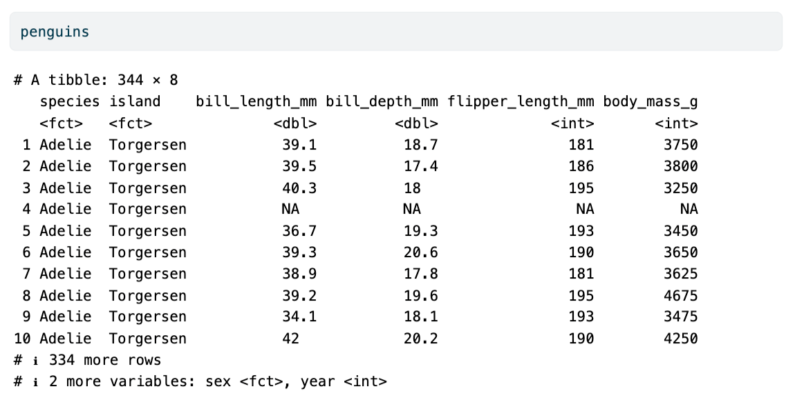

```{r setup, include = FALSE}
library(learnr)
library(tutorial.helpers)
library(knitr)

library(tidyverse)
library(palmerpenguins)

knitr::opts_chunk$set(echo = FALSE)
knitr::opts_chunk$set(out.width = '90%')
options(tutorial.exercise.timelimit = 60, 
        tutorial.storage = "local")
```

```{r copy-code-chunk, child = system.file("child_documents/copy_button.Rmd", package = "tutorial.helpers")}
```

```{r info-section, child = system.file("child_documents/info_section.Rmd", package = "tutorial.helpers")}
```

<!-- Ought to use #| in the first tutorial and tricks like suppress() and execute in the second. -->

<!-- Add more about Console/QMD world in the first example. It works well in the second already. Really ought to just switch the first example with the second! -->

<!-- Should there be more projects, each moving more quickly during the creation phase, the core coding is done with AI? Only if this current tutorial only takes 45 minutes. -->

<!-- Project 1 should be slightly less sophisticated and project 2 should be slightly more. Project 1 should only use code chunk options. It should not use execute or suppressPackage. Project 2 should be the reverse. Project 3 should do what Project 2 does, but without explicit instructions. Project 4 should fork. Or maybe 3 forks? Should any project use the GitHub created .gitignore and discuss stuff there. -->

<!-- More explicit emphasis on QMD world versus Console world. -->

<!-- Consider getting rid of palmerpenguins. -->

## Introduction
### 

This tutorial covers more details about [Git](https://git-scm.com/) and [GitHub](https://github.com/). Some material is from [*R for Data Science (2e)*](https://r4ds.hadley.nz/) by Hadley Wickham, Mine Çetinkaya-Rundel, and Garrett Grolemund.

The most useful reference for Git/GitHub is [*Happy Git and GitHub for the useR*](https://happygitwithr.com/). Refer to that book whenever you have a problem.

### 

Start a new window with `File -> New Window`. This new window is the location in which you will do all the work for the tutorial, including the creation of new projects. The current window, the one in which you are reading these words, is just used to run this tutorial. 

## Project 1
### 

This first project will simply review the steps which we have already learned. Making the data science work cycle second nature requires practice.

We don't need to set up Git and Github again, having already done so. In this project, our goal is to publish a nice graphic about penguins.

### Exercise 1

Create a Github repo (called `project-1`). Make sure to click the "Add a README file" check box. Copy/paste the URL for its Github location.

```{r project-1-1}
question_text(NULL,
	answer(NULL, correct = TRUE),
	allow_retry = TRUE,
	try_again_button = "Edit Answer",
	incorrect = NULL,
	rows = 3)
```

### 

```         
https://github.com/davidkane9/project-1
```

As a reminder, we often provide our answer to a question right after asking you for your answer, as we do above. In many cases, our answer will be different because, as here, we have a different user name on GitHub.

Always start a new data science project with a new Github repo.

### Exercise 2

Connect the `project-1` Github repo to a project on your computer using the other Positron window, not the one in which you are reading these words. Recall the steps:

- `File -> New Folder from Git ...`

- Paste the repo URL (ending in `.git`) into the "Git repository URL" box.

- Click "OK"

From the Console in the new Positron window, run `list.files()`. (You might need to select R for the interpreter first.) CP/CR.

```{r project-1-2}
question_text(NULL,
	answer(NULL, correct = TRUE),
	allow_retry = TRUE,
	try_again_button = "Edit Answer",
	incorrect = NULL,
	rows = 3)
```

### 

```         
> list.files()
[1] "README.md"
>
```

The default README has an "md" suffix to indicate that it is a **M**ark**d**own document.

Positron has automatically placed you within the `project-1` project. The `project-1` directory should be in the location in which you store your all your projects.

### Exercise 3

Go to `File -> New File ...-> Quarto Document`. Title it "Quarto 1". You are the author. Save it with the name `quarto-1.qmd`. 

From the Console, run `list.files()`. CP/CR.

```{r project-1-3}
question_text(NULL,
	answer(NULL, correct = TRUE),
	allow_retry = TRUE,
	try_again_button = "Edit Answer",
	incorrect = NULL,
	rows = 6)
```

### 

Your answer should look like this:

```         
> list.files()
[1] "quarto-1.qmd" "README.md"   
>  
```

Titles should be in title case, obviously. File names are usually all lower case. Spaces in titles are fine, but there should never be spaces (or other weird characters --- other than underlines, `_`, and, less commonly, dashes, `-`) in file names.

### Exercise 4

Click the “Preview” button or, better, press `Cmd/Ctrl + Shift + K`.

This will create an HTML file and display it in the Viewer tab in the Secondary Activity Bar.

Look at the Terminal. Copy-and-paste the lines which resulted from rendering `quarto-1.qmd`.

```{r project-1-4}
question_text(NULL,
	answer(NULL, correct = TRUE),
	allow_retry = TRUE,
	try_again_button = "Edit Answer",
	incorrect = NULL,
	rows = 10)
```

### 

```         
dkane@macbook project-1 % quarto preview /Users/dkane/Desktop/projects/project-1/quarto-1.qmd --no-bro
wser --no-watch-inputs
pandoc 
  to: html
  output-file: quarto-1.html
  standalone: true
  section-divs: true
  html-math-method: mathjax
  wrap: none
  default-image-extension: png
  
metadata
  document-css: false
  link-citations: true
  date-format: long
  lang: en
  title: Quarto 1
  author: David Kane
  
Output created: quarto-1.html

Watching files for changes
Browse at http://localhost:4817/
```

<!-- Is the below true? -->

Clicking the "Preview" button runs, behind the scenes on the Terminal, the `quarto preview` command. This command does two things. First, it "renders" `quarto-1.qmd`, taking this QMD file as input and producing `quarto-1.html` as output. Second, it "watches" the QMD file. If something changes in that file, Positron will render it and then show the new HTML in the Viewer tab.

### Exercise 5

The `pandoc` and `metadata` portions of the previous output give more details on the process. Positron itself is not doing the main work. That is Quarto's job. Instead, Positron is managing Quarto and other processes.

At the Terminal, use `Ctrl + c` to stop the watching process. Then, run `ls`. CP/CR.

```{r project-1-5}
question_text(NULL,
	answer(NULL, correct = TRUE),
	allow_retry = TRUE,
	try_again_button = "Edit Answer",
	incorrect = NULL,
	rows = 3)
```

###

````
Watching files for changes
Browse at http://localhost:4817/
^C%                                                                                                   
dkane@macbook project-1 % ls
README.md       quarto-1.html   quarto-1.qmd    quarto-1_files
dkane@macbook project-1 % 
````

Note that `^C` symbol, which is how `Ctrl + c` is recorded.

The `quarto-1.html` is our rendered file, as expected. The `quarto-1_files` directory contains a variety of files which were involved in the transformation of `quarto-1.qmd` into `quarto-1.html`. None of the files in `quarto-1_files` are worth understanding, at least at this point in your data science education.

### Exercise 6

Create a `.gitignore` file with two lines: `quarto-1_files` and a blank line. Save the file. Make sure to save it at the top of the project, **not inside of the `quarto-1_files` directory**.

In the Terminal, run `cat .gitignore`. CP/CR.

```{r project-1-6}
question_text(NULL,
	answer(NULL, correct = TRUE),
	allow_retry = TRUE,
	try_again_button = "Edit Answer",
	incorrect = NULL,
	rows = 3)
```

### 

```         
dkane@macbook project-1 % cat .gitignore
quarto-1_files
dkane@macbook project-1 % 
```

Every time that you render a Quarto document, Quarto creates a directory in which it places the supporting files which we used in that rendering. The name of that directory is `name-of-your-file-without-the-suffx` plus `_files`. The material in this directory is not worth backing up on GitHub. They are neither the original source material (`quarto-1.qmd`) which we will edit to make changes nor the final product (`quarto-1.html`) which we will show to others. 

**However**, we need to ensure that the HTML file looks how we want it to look when we publish it on the web.

### Exercise 7

Press the Source Control button. Commit all the files --- `.gitignore`, `quarto-1.qmd` and `quarto-1.html` --- which have not been committed yet. Your commit message should be something like "Initial version." Sync all the files.

From the Terminal, run `git log`. CP/CR.

```{r project-1-7}
question_text(NULL,
	answer(NULL, correct = TRUE),
	allow_retry = TRUE,
	try_again_button = "Edit Answer",
	incorrect = NULL,
	rows = 8)
```

### 

````
dkane@macbook project-1 % git log
commit 71e6d06fd555096d79719e267412d51856a0e515 (HEAD -> main, origin/main, origin/HEAD)
Author: David Kane <dave.kane@gmail.com>
Date:   Fri Mar 14 15:20:50 2025 -0400

    initial version

commit 6fcbf60866ba728132c94f0c0496f3770006fd42
Author: David Kane <dave.kane@gmail.com>
Date:   Fri Mar 14 13:18:01 2025 -0400

    Initial commit
dkane@macbook project-1 % 
````

You should see your commit message in the top (most recent) commit.


### Exercise 8

Add a code chunk within your document which includes `library(tidyverse)`. Render the document to ensure that everything works. (Fix any errors if it doesn't.)

In the Console, run:

```         
tutorial.helpers::show_file("quarto-1.qmd", chunk = "Last")
```

CP/CR.

```{r project-1-8}
question_text(NULL,
	answer(NULL, correct = TRUE),
	allow_retry = TRUE,
	try_again_button = "Edit Answer",
	incorrect = NULL,
	rows = 3)
```

###

````
> tutorial.helpers::show_file("quarto-1.qmd", chunk = "Last")
library(tidyverse)
>
````

Anytime you use `show_file()` without having a blank line at the end of the file, you will get a warning message.

Recall that you can add a code chunk by using the shortcut key combination: `Cmd/Ctrl + Shift + I`.

You could also manually type the chunk delimiters ```` ```{r} ```` and ```` ``` ````, but, obviously, that is an annoying option.

### Exercise 9

Add `library(palmerpenguins)` to the code chunk. Render the document to ensure that everything works. (Fix any errors if it doesn't.)

In the Console, run:

```         
tutorial.helpers::show_file("quarto-1.qmd", chunk = "Last")
```

CP/CR.

```{r project-1-9}
question_text(NULL,
	answer(NULL, correct = TRUE),
	allow_retry = TRUE,
	try_again_button = "Edit Answer",
	incorrect = NULL,
	rows = 8)
```

### 

Your answer should look like:


````
> tutorial.helpers::show_file("quarto-1.qmd", chunk = "Last")
library(tidyverse)
library(palmerpenguins)
````

### 

When you render the document, Quarto sends the QMD file to **knitr**, which executes all of the code chunks and creates a new Markdown (`.md`) document which includes the code and its output. The Markdown file generated by **knitr** is then processed by [pandoc](https://pandoc.org/), which is responsible for creating the finished HTML file.

### Exercise 10

Add a new code chunk, which just includes `penguins`. Render the document. Copy the displayed bottom contents of `quarto-1.html` below, starting with `penguins`.

We often ask you to "copy" from the HTML. It is OK if what your copy looks ugly, has lost its formatting and so on. We just want to make sure that your HTML includes, more or less, the information that it should.

```{r project-1-10}
question_text(NULL,
	answer(NULL, correct = TRUE),
	allow_retry = TRUE,
	try_again_button = "Edit Answer",
	incorrect = NULL,
	rows = 15)
```

### 

Your HTML should look like this. Of course, your copy/paste job will be a mess.

```{r}

```

Because the code is just the name of the tibble, R prints out the first 10 rows of the tibble, along with some other information, just like it would if you typed `penguins` at the Console.

### Exercise 11

We don't want our R code to be echoed in the HTML. So, to the YAML header, add:

````
execute: 
  echo: false
````

Also, we don't want those warnings from loading the **tidyverse** package to be included in the HTML, so replace `library(tidyverse)` with `suppressPackageStartupMessages(library(tidyverse))`. 

`Cmd/Ctrl + Shift + K` to confirm that everything looks good. The only thing that should appear in the HTML, other than title and author, is the `penguins` data set.

In the Console, run `tutorial.helpers::show_file("quarto-1.qmd")`. CP/CR.

```{r project-1-11}
question_text(NULL,
	answer(NULL, correct = TRUE),
	allow_retry = TRUE,
	try_again_button = "Edit Answer",
	incorrect = NULL,
	rows = 12)
```

###

```{r file = "images/quarto-1-1.txt", echo = TRUE, eval = FALSE}
```


### Exercise 12

Ask your favorite AI to create a beautiful graphic using the `penguins` data. Phrase the question however you like. I [asked](https://chatgpt.com/c/67d4e9fb-48cc-8002-abe5-dc29fba775e7) [chatGPT](https://chatgpt.com/):

> Using R and the tidyverse package, create a beautiful graphic using the penguins data from the palmerpenguins package.

Replace `penguins` in the second code chunk with the graphics code generated by the AI. (I had to make three changes in the code I got in order to get rid of some annoying messages and warnings. I could also have just asked the AI to do so for me.) My graphic:

```{r}
theme_custom <- theme_minimal(base_size = 14) +
  theme(
    plot.title = element_text(face = "bold", size = 16, hjust = 0.5),
    plot.subtitle = element_text(size = 12, hjust = 0.5),
    legend.position = "right",
    panel.grid.major = element_line(color = "grey80"),
    panel.grid.minor = element_blank()
  )

penguins |> 
    drop_na() |> 
    ggplot(aes(x = flipper_length_mm, 
               y = body_mass_g, 
               color = species)) +
    geom_point(alpha = 0.8, size = 3) +
    geom_smooth(method = "lm", 
                formula = y ~ x,    
                se = FALSE, 
                linetype = "dashed") +
    scale_color_brewer(palette = "Dark2") +
    labs(
      title = "Penguin Flipper Length vs Body Mass",
      subtitle = "Species comparison from Palmer Station, Antarctica",
      x = "Flipper Length (mm)",
      y = "Body Mass (g)",
      color = "Species",
      caption = "Data from the palmerpenguins package"
    ) +
  theme_custom
```

Render `quarto-1.qmd`, either by hitting the "Preview" button or by using `Cmd/Ctrl + Shift + K`.

From the Console, run `tutorial.helpers::show_file("quarto-1.qmd", chunk = "Last")`. CP/CR.

```{r project-1-12}
question_text(NULL,
	answer(NULL, correct = TRUE),
	allow_retry = TRUE,
	try_again_button = "Edit Answer",
	incorrect = NULL,
	rows = 3)
```

### 

My answer looks like this, but yours will be different, of course.

````
> tutorial.helpers::show_file("quarto-1.qmd", chunk = "Last")
theme_custom <- theme_minimal(base_size = 14) +
  theme(
    plot.title = element_text(face = "bold", size = 16, hjust = 0.5),
    plot.subtitle = element_text(size = 12, hjust = 0.5),
    legend.position = "right",
    panel.grid.major = element_line(color = "grey80"),
    panel.grid.minor = element_blank()
  )

penguins |> 
    drop_na() |> 
    ggplot(aes(x = flipper_length_mm, 
               y = body_mass_g, 
               color = species)) +
    geom_point(alpha = 0.8, size = 3) +
    geom_smooth(method = "lm", 
                formula = y ~ x,    
                se = FALSE, 
                linetype = "dashed") +
    scale_color_brewer(palette = "Dark2") +
    labs(
      title = "Penguin Flipper Length vs Body Mass",
      subtitle = "Species comparison from Palmer Station, Antarctica",
      x = "Flipper Length (mm)",
      y = "Body Mass (g)",
      color = "Species",
      caption = "Data from the palmerpenguins package"
    ) +
  theme_custom
>
````

Generative AI is the biggest change in the day-to-day work of data scientists in the last 30 years. Use it every chance you get.

### Exercise 13

Our plot looks nice! Let's share it with the world!

From the Terminal, run `quarto publish gh-pages quarto-1.qmd`. CP/CR.

```{r project-1-13}
question_text(NULL,
	answer(NULL, correct = TRUE),
	allow_retry = TRUE,
	try_again_button = "Edit Answer",
	incorrect = NULL,
	rows = 20)
```

###

That command generates a lot of text. Let me highlight some key parts:

<!-- This looks a little ugly in that you can't easily see what is the original output and what is my comments. Not sure why we can't just use four backticks. The text includes neither a hash mark nor triple backticks, the usual culprits.  -->

```{r file = "images/quarto-1-2.txt", echo = TRUE, eval = FALSE}
```

Quarto keeps you informed as it completes the work.

<!-- Could add some screen shots from GitHub Pages site to help understand what is going on. -->

### Exercise 14

Commit and sync all the files in the project. Report the URL for the new webpage.

```{r project-1-14}
question_text(NULL,
	answer(NULL, correct = TRUE),
	allow_retry = TRUE,
	try_again_button = "Edit Answer",
	incorrect = NULL,
	rows = 3)
```

###

Your URL should look like this:

````
https://davidkane9.github.io/project-1/
````

Note that the name of the file, `quarto-1.html`, plays no part in the URL. We told Quarto that we wanted a website with just one page, not a collection of pages. So, it could simplify by making `quarto-1.html` the default page for the `project-1` directory.

## Project 2
### 

With `project-1`, we went through all the steps of a data science project: start with GitHub repo; connect to project on local computer; use a Quarto document for analysis; publish to GitHub Pages; push final changes to the repo.

Let's do it all again, albeit a bit more quickly.

Restart the R session in the other Positron window with `Cmd/Ctrl + Shift + 0`.

### Exercise 1

Create a Github repo called `project-2`. Make sure to click the "Add a README file" check box. Copy/paste the URL for its Github location.

```{r project-2-1}
question_text(NULL,
	answer(NULL, correct = TRUE),
	allow_retry = TRUE,
	try_again_button = "Edit Answer",
	incorrect = NULL,
	rows = 3)
```

### 

Your answer should look something like:

```         
https://github.com/davidkane9/project-2
```

### 

Note that Github looks different depending on which page you go to, whether it is the main page (`github.com`), your account page (`github.com/your-user-name`) or the repository tab on your account page `github.com/your-user-name?tab=repositories`. The green button to create a new repo only appears on the main page (upper left) and on the repository tab on your account page (upper right).

### Exercise 2

Connect the `project-2` Github repo to a project on your computer. Name the project `project-2` also. Keeping the names of repos/projects aligned makes organization simpler.

In the Console, run:

````
list.files()
````

CP/CR.


```{r project-2-2}
question_text(NULL,
	answer(NULL, correct = TRUE),
	allow_retry = TRUE,
	try_again_button = "Edit Answer",
	incorrect = NULL,
	rows = 3)
```

### 

Your answer should be `README.md`.

Positron will automatically restart and place you within the `project-2` project. 

### Exercise 3

Select `File -> New File -> Quarto Document`. Provide a title ("Quarto 2") and an author (you). Save the document as `quarto-2.qmd`. `Cmd/Ctrl + Shift + K`.

In the Console, run:

````
list.files(all.files = TRUE)
````

CP/CR.

The `all.files = TRUE` argument for `list.files()` generates all the files/directories, including the "hidden" ones whose names begin with a period, `.`. 

```{r project-2-3}
question_text(NULL,
	answer(NULL, correct = TRUE),
	allow_retry = TRUE,
	try_again_button = "Edit Answer",
	incorrect = NULL,
	rows = 6)
```

### 

Your answer should look like this:

```         
> list.files(all.files = TRUE)
 [1] "."               ".."              ".git"            
 [4] "quarto-2_files"  "quarto-2.html"   "quarto-2.qmd"    "README.md"      
> 
```

The single `.` refers to this directory while `..` refers to the directory above, which is `/Users/dkane/Desktop/projects` for me.  `.git` is a directory meant solely for the use of Git. The only other directory is `quarto-2_files`, a junk directory, created for the use of Quarto. 

### Exercise 4

Create a `.gitignore` with `*_files` and a blank line.

In the Console, run:

````
tutorial.helpers::show_file(".gitignore")
````

CP/CR.


```{r project-2-4}
question_text(NULL,
	answer(NULL, correct = TRUE),
	allow_retry = TRUE,
	try_again_button = "Edit Answer",
	incorrect = NULL,
	rows = 6)
```

### 

Your answer should look like this:

```         
> tutorial.helpers::show_file(".gitignore")
*_files
>
```

We could have specified the file/directory to ignore more precisely by using its exact name: `quarto-2_files`. Doing so would avoid any weird complications if we end up adding other files to the project which, by coincidence, happen to have names which end with `_files`.

But that never (?) happens! And it is just easier to use the `*` version. Note that `*` is a "regular expression" which matches any characters. So, Git will ignore any files or directories which end with `_files`, including `quarto-2_files`.

### Exercise 5

Commit and sync `.gitignore`, `quarto-2.qmd`, and `quarto-2.html`. Use a sensible commit message.

From the Terminal, run `git log`. CP/CR.

```{r project-2-5}
question_text(NULL,
	answer(NULL, correct = TRUE),
	allow_retry = TRUE,
	try_again_button = "Edit Answer",
	incorrect = NULL,
	rows = 3)
```

### 

Your answer should look like this:

```         
Davids-MBP:project-2 dkane$ git log
commit 8f414d418c039a79364b6fbe4c6de32acb1e6235 (HEAD -> main, origin/main, origin/HEAD)
Author: davidkane9 <dave.kane@gmail.com>
Date:   Tue Feb 20 14:38:54 2024 -0500

    initial version

commit 4abced5c8c5b3dcd3a26d9efdce126031d8a0a0b
Author: David Kane <dave.kane@gmail.com>
Date:   Tue Feb 20 14:26:05 2024 -0500

    Initial commit
Davids-MBP:project-2 dkane$ 
```

There have been two commits in this repo. The first was generated automatically when we created the repo. The second was the one we just committed by hand, along with the commit message "initial version." Note how, next to the word "commit," there is a 40 character string of letters and numbers. This is the "hash" by which Git identifies each commit. The hash is always unique.

### Exercise 6

<!-- Do some new AI stuff here. -->

Add these code chunks to `quarto-2.qmd`.

```{r file = "images/quarto-2-1.txt", echo = TRUE, eval = FALSE}
```

Render the document. Copy-and-paste the "Warning" message which appears in `quarto-2.html`.

```{r project-2-6}
question_text(NULL,
	answer(NULL, correct = TRUE),
	allow_retry = TRUE,
	try_again_button = "Edit Answer",
	incorrect = NULL,
	rows = 3)
```

### 

Your answer should look like this:

```         
Warning: Removed 2 rows containing missing values (`geom_point()`).
```

### 

There are at least three problems with `quarto-2.html`:

First, it displays the R code. Very few readers understand R code and even fewer want it to clutter up our pretty plot.

Second, it shows the startup message printed by the **tidyverse** package. This is never useful to our viewers. They care about our data and graphics.

Third, there is a warning message. We need to handle this sensibly, lest readers think that our results are suspect.

### Exercise 7

We need to make it so that we do not see this code or the output in the render `quarto-2.html` document. To do this, we will put `#| echo: false` and `#| message: false` before `library(tidyverse)` in the first code chunk. Render.

In the Console, run:

````
tutorial.helpers::show_file("quarto-2.qmd")
````

CP/CR.

```{r project-2-7}
question_text(NULL,
	answer(NULL, correct = TRUE),
	allow_retry = TRUE,
	try_again_button = "Edit Answer",
	incorrect = NULL,
	rows = 8)
```

### 

`#| echo: false` makes it so that the code in the code chunk does not appear in the rendered HTML file. `#| message: false` prevents the display of any R messages, in this case ones generated by loading the **tiydverse** package. So, the previous code makes the whole code chunk with the libraries in it not visible in `quarto-2.html`.

### Exercise 8

Unfortunately, `quarto-2.html` still shows the code which creates the plot. So, before `penguins` in the second code chunk, add `#| echo: false`. Render the document.

In the Console, run:

````
tutorial.helpers::show_file("quarto-2.qmd")
````

CP/CR.


```{r project-2-8}
question_text(NULL,
	answer(NULL, correct = TRUE),
	allow_retry = TRUE,
	try_again_button = "Edit Answer",
	incorrect = NULL,
	rows = 3)
```

### 

The `#| echo: false` makes it so that the code in the code chunk --- in this case, the code which create our plot --- does not appear in the rendered HTML. Except for the Warning, `quarto-2.html` is starting to look professional.

### Exercise 9

It is annoying to have to include `#| echo: false` in multiple code chunks. So, Quarto allows us to include a command in the YAML which will then be applied in every code chunk.

Delete `#| echo: false` from the two code chunks. In the YAML header, add

```         
execute: 
  echo: false
```

In the Console, run:

````
tutorial.helpers::show_file("quarto-2.qmd")
````

CP/CR.


```{r project-2-9}
question_text(NULL,
	answer(NULL, correct = TRUE),
	allow_retry = TRUE,
	try_again_button = "Edit Answer",
	incorrect = NULL,
	rows = 8)
```

### 

Your answer should look like:

```{r file = "images/quarto-2-2.txt", echo = TRUE, eval = FALSE}
```

Render `quarto-2.qmd` to make sure everything still works. Fix anything which doesn't.

### Exercise 10

We still have the Warning to deal with. From the Console, type `penguins` and hit Enter. (This will probably produce an error.) CP/CR.

```{r project-2-10}
question_text(NULL,
	answer(NULL, correct = TRUE),
	allow_retry = TRUE,
	try_again_button = "Edit Answer",
	incorrect = NULL,
	rows = 3)
```

### 

Here is what I got:

```         
> penguins
Error: object 'penguins' not found
> 
```

Recall the distinction between QMD World and Console World. In the QMD World, we have loaded the **tidyverse** and **palmerpenguins** packages. The latter contains the `penguins` tibble and the former includes the functions for printing tibbles nicely.

But in Console world, we haven't done those things. We restarted R at the beginning of this section. We need to explicitly `library()` those two packages.

### Exercise 11

Put your cursor in `quarto-2.qmd` on the `library(tidyverse)` line. Hit `Cmd/Ctrl + Enter`. Note how the code is pasted down in the Console and then run there. Your cursor automatically moves down one line in `quarto-2.qmd` to the `library(palmerpenguins)` line. Hit `Cmd/Ctrl + Enter` again.

From the Console, run `search()`. CP/CR.

```{r project-2-11}
question_text(NULL,
	answer(NULL, correct = TRUE),
	allow_retry = TRUE,
	try_again_button = "Edit Answer",
	incorrect = NULL,
	rows = 3)
```

### 

The return value from `search()` should include `"package:palmerpenguins"` along with all the packages which make up the *Tidyverse*, like **lubridate** and **forcats**.

The key lesson is that the Console does not know about the QMD file and the QMD file does not know about the Console. You need to keep them in sync.


### Exercise 12

From the Console, run `summary(penguins$body_mass_g)`. CP/CR.

```{r project-2-12}
question_text(NULL,
	answer(NULL, correct = TRUE),
	allow_retry = TRUE,
	try_again_button = "Edit Answer",
	incorrect = NULL,
	rows = 3)
```

### 

Your answer should look like this:

```         
> summary(penguins$body_mass_g)
   Min. 1st Qu.  Median    Mean 3rd Qu.    Max.    NA's 
   2700    3550    4050    4202    4750    6300       2 
> 
```

Note the two missing values. This is what is causing the warning message.

### Exercise 13

There are two standard ways to get rid of a warning message. First, we can make deal with the substance of the issue, determine the problem with our code/data which is causing the warning and solve it. Second (and much easier) we can simply hide the warning, although in that case, we should really add a code comment explaining what is going on.

Because this section has gone on long enough, we take the second approach. To plotting code chunk, add `#| warning: false`. Render `quarto-2.qmd`.

In the Console, run:

````
tutorial.helpers::show_file("quarto-2.qmd", chunk = "Last")
````

CP/CR.


```{r project-2-13}
question_text(NULL,
	answer(NULL, correct = TRUE),
	allow_retry = TRUE,
	try_again_button = "Edit Answer",
	incorrect = NULL,
	rows = 3)
```

### 

If you turn off warnings, you ought to add some code comments explaining why. A better approach, in this case, would have been to add a command like `drop_na(body_mass_g)` to the pipe. This would have removed the two rows with missing data.

### Exercise 14

Let's publish our results to [GitHub Pages](https://pages.github.com/). 

From the Terminal, run `quarto publish gh-pages quarto-2.qmd`. Respond with "Y" when it checks that you want to. (This might take a minute to run.) 

CP/CR just the first 5 or so lines of what results.


```{r project-2-14}
question_text(NULL,
	answer(NULL, correct = TRUE),
	allow_retry = TRUE,
	try_again_button = "Edit Answer",
	incorrect = NULL,
	rows = 7)
```

###

`quarto publish` processes `quarto-2.qmd` in the same way that `quarto preview` or `quarto render` does.

### Exercise 15

Go to your `project-2` page on GitHub. Refresh the page. `quarto publish` has changed some of the items. Copy/paste all the text in the "Visit site" box.


```{r project-2-15}
question_text(NULL,
	answer(NULL, correct = TRUE),
	allow_retry = TRUE,
	try_again_button = "Edit Answer",
	incorrect = NULL,
	rows = 3)
```

###

````
Your site is live at https://davidkane9.github.io/project-2/
Last deployed by @davidkane9 davidkane9 6 minutes ago
````

Commit/sync all the files in your project so that your work is saved at GitHub.

## Summary
### 

This tutorial covered more details in the usage of [Git](https://git-scm.com/) and [GitHub](https://github.com/). Some material was from [*R for Data Science (2e)*](https://r4ds.hadley.nz/) by Hadley Wickham, Mine Çetinkaya-Rundel, and Garrett Grolemund.

The most useful reference for Git/GitHub is [*Happy Git and GitHub for the useR*](https://happygitwithr.com/). Refer to that book whenever you have a problem.

```{r download-answers, child = system.file("child_documents/download_answers.Rmd", package = "tutorial.helpers")}
```
