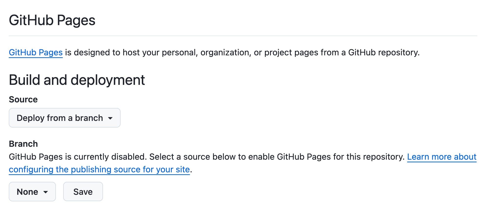

```{r setup, include = FALSE}
knitr::opts_chunk$set(echo = FALSE)
knitr::opts_chunk$set(out.width = '90%')
options(tutorial.exercise.timelimit = 240, 
        tutorial.storage = "local") 

library(learnr)
library(tutorial.helpers)
library(tidyverse)
```

```{r copy-code-chunk, child = system.file("child_documents/copy_button.Rmd", package = "tutorial.helpers")}
```

```{r info-section, child = system.file("child_documents/info_section.Rmd", package = "tutorial.helpers")}
```

<!-- Confirm that quarto publish gh-pages works on Windows. -->

<!-- Might be nice to have some actual testing, and some clean up of the files thereby created. -->

## Introduction
### 

This tutorial introduces the process of creating and organizing the [Quarto websites](https://quarto.org/docs/websites/) using the [Quarto CLI](https://quarto.org/docs/get-started/) (command line interface) and commands like `quarto create project`, `quarto render`, `quarto preview`, and `quarto publish`. Some material is from [*R for Data Science (2e)*](https://r4ds.hadley.nz/) by Hadley Wickham, Mine Çetinkaya-Rundel, and Garrett Grolemund.

## Creating files
### 

<!-- DK: Should I learn more about where Quarto is installed? Does it matter? I currently find it in at least two places on my computer:

/Applications/quarto/bin/quarto
/usr/local/bin/quarto

And I also think it is bundled with Positron somehow? -->

Let's make a [Quarto website](https://quarto.org/docs/websites/).

### Exercise 1

Run `quarto --version` from the Terminal inside of the Positron window. CP/CR.

```{r creating-files-1}
question_text(NULL,
	answer(NULL, correct = TRUE),
	allow_retry = TRUE,
	try_again_button = "Edit Answer",
	incorrect = NULL,
	rows = 3)
```

### 

A failure would look something like:

```
Davids-MBP:r4ds.tutorials dkane$ quarto --version
bash: quarto: command not found
```

If it works for you --- i.e., if this command returns a Quarto version number --- then don't worry.

### Exercise 2

If `quarto --version` failed in the previous Exercise, install [Quarto CLI](https://quarto.org/docs/get-started/) on your computer. Restart Positron after installing Quarto. Then, run `quarto --version` again from the Terminal. CP/CR.

```{r creating-files-2}
question_text(NULL,
	answer(NULL, correct = TRUE),
	allow_retry = TRUE,
	try_again_button = "Edit Answer",
	incorrect = NULL,
	rows = 3)
```

### 

```
dkane@macbook positron.tutorials % quarto --version
1.6.39
dkane@macbook positron.tutorials % 
```

As long as the version is at least 1.6, you are OK. 

### Exercise 3

On Github create a new public Github repo (called "first-website"). Make sure to click the "Add a README file" check box. Copy/paste the URL for its Github location.

```{r creating-files-3}
question_text(NULL,
	answer(NULL, correct = TRUE),
	allow_retry = TRUE,
	try_again_button = "Edit Answer",
	incorrect = NULL,
	rows = 3)
```

### 

Your answer should look something like:

```
https://github.com/davidkane9/first-website
```

Always start a new data science project with a new Github repo.


### Exercise 4

Connect the `first-website` Github repo to a project on your computer using the usual procedure: `File -> New Folder from Git...` and so on. Don't forget to check the "Open in a new window" box.  

If necessary, close the "Welcome" window and start an R interpreter.

From the Terminal (in the new Positron window), run `ls`. CP/CR.

```{r creating-files-4}
question_text(NULL,
	answer(NULL, correct = TRUE),
	allow_retry = TRUE,
	try_again_button = "Edit Answer",
	incorrect = NULL,
	rows = 3)
```

### 

```
dkane@macbook first-website % ls
README.md
dkane@macbook first-website % 
```

This [video](https://www.youtube.com/watch?v=uimdXPZc40I) provides an overview of creating Quarto websites using GitHub Pages, which is what we will do in this tutorial.

### Exercise 5

In the Terminal, run `quarto create project website .`.  Don't forget the `.` at the end of the command. This indicates that the new files should be placed in the current working directory. 

If you are asked for a "Title," use `A New Website`.

CP/CR.

```{r creating-files-5}
question_text(NULL,
	answer(NULL, correct = TRUE),
	allow_retry = TRUE,
	try_again_button = "Edit Answer",
	incorrect = NULL,
	rows = 8)
```

### 

Your answer should look like this:

````
dkane@macbook first-website % quarto create project website .
? Title (website) › A New Website
Creating project at /Users/dkane/Desktop/projects/first-website:
  - Created _quarto.yml
  - Created .gitignore
  - Created index.qmd
  - Created about.qmd
  - Created styles.css
dkane@macbook first-website % 
````

Quarto is telling you what it did: creating 5 new files and placing them in the *current* directory. Recall that, on the command line, a `.` refers to the current directory. 

### Exercise 6

In the Terminal, run `ls`. CP/CR.

```{r creating-files-6}
question_text(NULL,
	answer(NULL, correct = TRUE),
	allow_retry = TRUE,
	try_again_button = "Edit Answer",
	incorrect = NULL,
	rows = 3)
```

### 

````
dkane@macbook first-website % ls
README.md       _quarto.yml     about.qmd       index.qmd       styles.css
dkane@macbook first-website %     
````

The basic set of files necessary for making a Quarto website has been added to the current directory. But recall that `ls` does not show any "hidden" files, i.e., those beginning with a `.`.

### Exercise 7

In the Termina, run `ls -a`. CP/CR. 

```{r creating-files-7}
question_text(NULL,
	answer(NULL, correct = TRUE),
	allow_retry = TRUE,
	try_again_button = "Edit Answer",
	incorrect = NULL,
	rows = 5)
```

### 

````
dkane@macbook first-website % ls -a
.               .git            README.md       about.qmd       styles.css
..              .gitignore      _quarto.yml     index.qmd
dkane@macbook first-website % 
````

In general, we do not touch/manipulate "dot" directories, meaning directories whose names begin with a period. Such directories are meant to be used by the operating system and other programs. For example, the program Git uses the `.git` directory to store information about changes in all the files in the project.  Also, note that `quarto create` added a `.gitignore` file, which we did not see after issuing the simple `ls` command.


## Examining files
### 

Now that we have created the necessary files, it is useful to examine them one-by-one. The goal is to provide you with a good introduction to how websites are put together.

### Exercise 1

In the Console, run:

````
show_file("_quarto.yml")
````

CP/CR.

Did you get an error when you ran this? Something about 'could not find function "show_file"'? This is because you need run `library(tutorial.helpers)` in the Console to have direct acccess to `show_file()`, which is a function in the **tutorial.helpers** package. Of course, you could use the double colon notation --- `tutorial.helpers::show_file("_quarto.yml")` --- as we did in previous tutorials. But, at this stage in your R education, we want you to become more comfortable with packages, and knowing yourself when they need to be loaded.


```{r examining-files-1}
question_text(NULL,
	answer(NULL, correct = TRUE),
	allow_retry = TRUE,
	try_again_button = "Edit Answer",
	incorrect = NULL,
	rows = 10)
```

### 

YAML files are how [Quarto projects](https://quarto.org/docs/projects/quarto-projects.html) tell the world what they are. You can tell that `_quarto.yml` is a YAML file by both its `yml` file name suffix and by its content. The first two lines specify that this is a website.

````
project:                                   
  type: website
````

But other values for `type` are possible.

### Exercise 2

In the Console, run:

````
show_file("_quarto.yml", start = 4, end = 10)
````

CP/CR.

```{r examining-files-2}
question_text(NULL,
	answer(NULL, correct = TRUE),
	allow_retry = TRUE,
	try_again_button = "Edit Answer",
	incorrect = NULL,
	rows = 3)
```

### 

These lines provide meta-information about the website and its organization. 

````
website:
  title: "A New Website"
  navbar:
    left:
      - href: index.qmd
        text: Home
      - about.qmd
````

Indents and other whitespace matter in the interpretation of a YAML file.


### Exercise 3

In the Console, run:

````
show_file("_quarto.yml", start = 12, end = 16)
````

CP/CR.

```{r examining-files-3}
question_text(NULL,
	answer(NULL, correct = TRUE),
	allow_retry = TRUE,
	try_again_button = "Edit Answer",
	incorrect = NULL,
	rows = 5)
```

### 

These lines provide formatting information about the pages of the website. 

````
format:
  html:
    theme: cosmo
    css: styles.css
    toc: true
````

The `css` line tells Quarto to use the `styles.css` file, located in the same directory, for the "style" of the pages.

### Exercise 4

In the Console, run:

````
show_file("index.qmd")
````

CP/CR.


```{r examining-files-4}
question_text(NULL,
	answer(NULL, correct = TRUE),
	allow_retry = TRUE,
	try_again_button = "Edit Answer",
	incorrect = NULL,
	rows = 3)
```

### 

The answer should look like:

````
> show_file("index.qmd")
---
title: "A New Website"
---

This is a Quarto website.

To learn more about Quarto websites visit <https://quarto.org/docs/websites>.
>
````

Whenever a web browser goes to a directory on the internet, it looks for an `index.html` file. If found, that file is displayed. So, the `index.qmd` file, which we will soon render as `index.html`, is important.

### 

Note that the `title` (`"A New Website"`) in `_quarto.yml` has no necessary connection to the `title` (`"A New Website"`) in `index.qmd`. The former is the title for the entire website. The latter is the title for just the (yet-to-be-created) `index.html` page. They are set to the same values by default when we use `quarto create project website .` and answer the question about the title. 

If you do not answer the question or if you are using an old version of Quarto which does not ask the question, then the title will be `.` in both locations.

### Exercise 5

In the Console, run:

````
show_file(".gitignore")
````

CP/CR.


```{r examining-files-5}
question_text(NULL,
	answer(NULL, correct = TRUE),
	allow_retry = TRUE,
	try_again_button = "Edit Answer",
	incorrect = NULL,
	rows = 3)
```

### 

```
> show_file(".gitignore")
/.quarto/
>
```

The leading `/` in `/.quarto/` escapes the `.`. In other words, we need the leading `/` if we want to ignore the files in a dotted directory.

In fact, the `.quarto` directory does not yet exist. But the `quarto create project` command wanted to ensure that, once it does, Git would ignore it and its contents.


<!-- Good data scientists believe in transparency and reproducibility. We want people --- include "future" us --- to be able to reproduce our work. By default, almost every file belongs on Github. But settings for R projects are both not necessary for replication and often specific to each individual.  -->


### Exercise 6

Commit (with the commit message "initial version") and then sync all the files in the project. Run `git log -n 1` in the Terminal. CP/CR.

```{r examining-files-6}
question_text(NULL,
    answer(NULL, correct = TRUE),
    allow_retry = TRUE,
    try_again_button = "Edit Answer",
    incorrect = NULL,
    rows = 3)
```

### 

````
dkane@macbook first-website % git log -n 1
commit 658eedd63f2c3e2734484a2397935e854f5008f7 (HEAD -> main, origin/main, origin/HEAD)
Author: David Kane <dave.kane@gmail.com>
Date:   Sat Mar 15 22:41:22 2025 -0400

    initial version
dkane@macbook first-website % 
````

If you want to learn more about how to work with Git/Github and R, check out [Happy Git with R](https://happygitwithr.com/existing-github-last.html), a very useful resource.


## Rendering and previewing
### 

We now have the infrastructure for our website. We want to create (or "render") the webpages themselves and then "preview" them to see what they will look like when we place them on the web.

### Exercise 1

From the Terminal, run `quarto render`. CP/CR.

```{r rendering-and-previewing-1}
question_text(NULL,
	answer(NULL, correct = TRUE),
	allow_retry = TRUE,
	try_again_button = "Edit Answer",
	incorrect = NULL,
	rows = 6)
```

### 

````
kane@macbook first-website % quarto render
[1/2] index.qmd
[2/2] about.qmd

Output created: _site/index.html

dkane@macbook first-website % 
````

Quarto reports to us what it has done, working on our two QMD files and creating a new directory, `_site`, in which it has placed an `index.html` file. 

### 

If you look at the `_site` directory in the Explorer pane, you will see lots of new files, including `about.hmtl`. Quarto just tells you about the home page for the site, which is `index.html` by default, since that is the file that browsers like Google Chrome always look for.

### Exercise 2

From the Terminal, run `ls`. CP/CR.

```{r rendering-and-previewing-2}
question_text(NULL,
	answer(NULL, correct = TRUE),
	allow_retry = TRUE,
	try_again_button = "Edit Answer",
	incorrect = NULL,
	rows = 3)
```

###

````
dkane@macbook first-website % ls
README.md       _site           index.qmd
_quarto.yml     about.qmd       styles.css
dkane@macbook first-website % 
````

Note the addition of a `_site` directory. This is the location in which the HTML files that make up the website are located. The webpages which make up a website are often placed in a directory named either `_site` or `docs`, depending on the setup of your web hosting service.


### Exercise 3

From the Terminal, run `ls _site`. CP/CR.

```{r rendering-and-previewing-3}
question_text(NULL,
	answer(NULL, correct = TRUE),
	allow_retry = TRUE,
	try_again_button = "Edit Answer",
	incorrect = NULL,
	rows = 3)
```

### 

Your answer will probably look something like:

````
dkane@macbook first-website % ls _site 
about.html      index.html      search.json     site_libs       styles.css
dkane@macbook first-website % 
````

The `about.html` and `index.html` files are simply the rendered `about.qmd` and `index.qmd` input files. They are placed into the `_site` directory because the convention, when constructing websites and other large projects, is to separate out the outputs from the inputs.

### 

We won't discuss the `search.json` and `styles.css` files. The `site_libs` directory includes many files beyond the scope of this tutorial. The basic idea is that the entire `_site` directory is a functioning website, ready to be deployed.

### Exercise 4

Look the Source Control button. Note how many new files there are. Most of this is garbage which does not belong on GitHub.

Add `/_site` to the `.gitignore`. Don't forget that the last line of a `.gitignore` should always be blank. Save the file. 

In the Console, run:

````
show_file(".gitignore")
````

CP/CR.

```{r rendering-and-previewing-4}
question_text(NULL,
	answer(NULL, correct = TRUE),
	allow_retry = TRUE,
	try_again_button = "Edit Answer",
	incorrect = NULL,
	rows = 3)
```

### 

````
> show_file(".gitignore")
/.quarto/
/_site
>
````

This command is [convenient](https://quarto.org/docs/publishing/github-pages.html) because the `_site` directory contains of lot of weird files that change often enough to annoy us. We don't create any of them directly, so we don't really need to back them up. Moreover, they will still get published directly to the web from our computer.

### 

The initial backslash in `/_site` allows Git to interpret `_site` correctly. The `/` escapes the `_`, allowing it to be treated as a literal, rather than special, character. `_site` is a directory, so we could end the expression with a backslash, but Git, like most programs interpret `_site` and `_site/` to refer to the same thing, which they do.

### Exercise 5

From the Terminal, run `quarto preview`. CP/CR.

```{r rendering-and-previewing-5}
question_text(NULL,
	answer(NULL, correct = TRUE),
	allow_retry = TRUE,
	try_again_button = "Edit Answer",
	incorrect = NULL,
	rows = 6)
```

### 

````
dkane@macbook first-website % quarto preview
Preparing to preview

Watching files for changes
Browse at http://localhost:6872/
GET: /

````

The `quarto preview` command does two things. First, it renders the QMD files, just like `quarto render` does. Second, it sets up a viewer --- probably your default web browser but possibly the "Viewer" tab in the Secondary Activity Bar  --- so that you can see what the website looks like. Click around and check it out!

The message at the end indicates that Quarto is now "watching" your files to see if you make any changes. If you do, it will automatically update the website.

### Exercise 6

Look at your website in the browser. (You might need to enter the URL by hand. It is `http://localhost:7412/` in my case, but yours will be different.) Click on the "About" link. 

Go to the Terminal. Copy-and-paste everything from the previous invocation of `quarto preview`.

```{r rendering-and-previewing-6}
question_text(NULL,
	answer(NULL, correct = TRUE),
	allow_retry = TRUE,
	try_again_button = "Edit Answer",
	incorrect = NULL,
	rows = 3)
```

### 

````
dkane@macbook first-website % quarto preview
Preparing to preview

Watching files for changes
Browse at http://localhost:6872/
GET: /
GET: /about.html
````

Quarto is hanging out, still running in the background, monitoring your website. So, when you clicked the "About" link, it went to "GET" the `about.html` page to show to you.


### Exercise 7

Look again at your website in the browser. Click on the "Home" link and then copy/paste the entire HTML screen.


```{r rendering-and-previewing-7}
question_text(NULL,
	answer(NULL, correct = TRUE),
	allow_retry = TRUE,
	try_again_button = "Edit Answer",
	incorrect = NULL,
	rows = 6)
```

### 

````
A New Website

A New Website
This is a Quarto website.

To learn more about Quarto websites visit https://quarto.org/docs/websites.
````

The title of the entire project ("A New Website"), taken from the `_quarto.yml` file, appears in the upper left hand corner. The title of the main home page ("A New Website"), taken from the `index.qmd` file, appears at the top of the Home page, which, by default, is always the `index.html` file. 

(Depending on your browser and other settings, the copy/paste might also capture the "Home" and "About" links. No worry either way.)


### Exercise 8

Copy/paste the URL for your previewed website.

```{r rendering-and-previewing-8}
question_text(NULL,
	answer(NULL, correct = TRUE),
	allow_retry = TRUE,
	try_again_button = "Edit Answer",
	incorrect = NULL,
	rows = 3)
```

### 

Your answer should be something like:

````
http://localhost:7193/
````

The website is being "hosted" on your computer. That is what the word "localhost" refers to. It is not available on the web.


### Exercise 9

The advantage of using `quarto preview` is that the website is automatically updated whenever you edit and save the underlying QMD file. Try it by changing the `about.qmd` file, replacing "About this site" with your name. Save the file. 

At the Terminal, you should see a new message. Copy and paste it here.

```{r rendering-and-previewing-9}
question_text(NULL,
	answer(NULL, correct = TRUE),
	allow_retry = TRUE,
	try_again_button = "Edit Answer",
	incorrect = NULL,
	rows = 12)
```

### 

````
GET: /
pandoc 
  to: html
  output-file: about.html
  standalone: true
  title-prefix: A New Website
  section-divs: true
  html-math-method: mathjax
  wrap: none
  default-image-extension: png
  css:
    - styles.css
  toc: true
  
metadata
  document-css: false
  link-citations: true
  date-format: long
  lang: en
  theme: cosmo
  title: About
  
GET: /about.html
````

Quarto has noticed that you changed/saved the `about.qmd` file. It rendered the new version, creating a new `about.html` which it has now *gotten* and is displaying.

### Exercise 10

Copy/paste the About page from the Viewer pane or your browser. (We will just say "browser" going forward, but we mean wherever your website appears.)

```{r rendering-and-previewing-10}
question_text(NULL,
	answer(NULL, correct = TRUE),
	allow_retry = TRUE,
	try_again_button = "Edit Answer",
	incorrect = NULL,
	rows = 5)
```

### 

Your answer should look like this, except with your name instead of mine!

````
A New Website

About
David Kane
````

If you want to stop `quarto preview` you can cancel the command by `Ctrl + C`. This is always the command to use whenever you want the Terminal to stop doing whatever it is doing.

Run `Ctrl + C`.

## Publishing
### 

To make your website publicly visible, you need to "publish" it to the web. The Quarto documentation provides a [thorough discussion](https://quarto.org/docs/publishing/).  We will be using [GitHub Pages](https://quarto.org/docs/publishing/github-pages.html). 


### Exercise 1

Go to your `first-website` Github repository. 

Click on the "Settings" option on the right side of the top menu.

Click on the "Pages" option on the lefthand side menu.  

Copy/paste the resulting URL.

```{r publishing-1}
question_text(NULL,
	answer(NULL, correct = TRUE),
	allow_retry = TRUE,
	try_again_button = "Edit Answer",
	incorrect = NULL,
	rows = 3)
```

### 

Your answer should look like:

````
https://github.com/davidkane9/first-website/settings/pages
````

This page shows the settings which control the behavior of Github pages. It should look something like this:

```{r}

```

Sam Csik provides an [excellent overview](https://ucsb-meds.github.io/creating-quarto-websites/) of the entire process of creating Quarto websites. 


### Exercise 2

We won't edit the settings on the GitHub Pages page by hand. Instead, we will allow Quarto to make changes for us. The process for publishing an entire website is similar to the one for publishing a single document.

At the Terminal, run `quarto publish gh-pages`. 

You will then need to type "Yes" to accept the default settings. 

CP/CR the first 10 or lines of the output.


```{r publishing-2}
question_text(NULL,
	answer(NULL, correct = TRUE),
	allow_retry = TRUE,
	try_again_button = "Edit Answer",
	incorrect = NULL,
	rows = 10)
```

### 

````
dkane@macbook first-website % quarto publish gh-pages
? Publish site to https://davidkane9.github.io/first-website/ using gh-pages? (Y/n) › Yes
Saved working directory and index state WIP on main: 658eedd initial version
Switched to a new branch 'gh-pages'
[gh-pages (root-commit) c05d288] Initializing gh-pages branch
remote: 
remote: Create a pull request for 'gh-pages' on GitHub by visiting:        
remote:      https://github.com/davidkane9/first-website/pull/new/gh-pages        
remote: 
To https://github.com/davidkane9/first-website.git
 * [new branch]      HEAD -> gh-pages
 ...
````

[Git branches](https://git-scm.com/book/en/v2/Git-Branching-Branches-in-a-Nutshell) help us work with multiple people and/or on complex projects. "Git encourages workflows that branch and merge often, even multiple times in a day." Although it is not required, it is standard practice to use a branch named `gh-pages` for publishing with GitHub pages.

### Exercise 3

`quarto publish`, like `quarto preview`, renders all the files on the project. Note the phrase "Rendering for publish" in the middle of the output. 

Copy/paste the 5 or so lines of the output which include the phrase "Rendering for publish".

```{r publishing-3}
question_text(NULL,
	answer(NULL, correct = TRUE),
	allow_retry = TRUE,
	try_again_button = "Edit Answer",
	incorrect = NULL,
	rows = 5)
```

###

````
Rendering for publish:

[1/2] index.qmd
[2/2] about.qmd
````

All pages are rendered whenever you publish. This can be problematic if some of your pages include code which takes minutes, or even hours, to run. In that case, you need to re-arrange your code so that it is only run when you want to run it, not automatically whenever it is rendered.

### Exercise 4

There are other options for publishing besides GitHub Pages. Those would replace `gh-pages` in the call to `quarto publish` with options like `quarto-pub` or `netlify`.  

Copy/paste the last 10 or so lines of the output.

```{r publishing-4}
question_text(NULL,
	answer(NULL, correct = TRUE),
	allow_retry = TRUE,
	try_again_button = "Edit Answer",
	incorrect = NULL,
	rows = 10)
```

###

````
To https://github.com/davidkane9/first-website.git
   c05d288..0396c20  HEAD -> gh-pages

[✓] Deploying gh-pages branch to website (this may take a few minutes)
[✓] Published to https://davidkane9.github.io/first-website/

dkane@macbook first-website % 
````

The publishing process may take a minute or two to complete. The URL for your website is provided at the end.


### Exercise 5

A link to your new website should be brought up in a browser. Copy/paste the URL for your website. 

```{r publishing-5}
question_text(NULL,
	answer(NULL, correct = TRUE),
	allow_retry = TRUE,
	try_again_button = "Edit Answer",
	incorrect = NULL,
	rows = 3)
```

### 

````
https://davidkane9.github.io/first-website/
````

When using GitHub Pages, the URL will always have the same base: your GitHub user name followed by `github.io`. The second part of the URL will be the name of the repo. So, use non-stupid names for your repos.

### Exercise 6

If you look closely in the Explorer pane, you will see a new directory, `.quarto`. Neither this directory, nor any of the files within it, appear in the Source Control pane because of the `/.quarto/` line in the `.gitignore` file.

From the Terminal, run `ls .quarto`. CP/CR.

```{r publishing-6}
question_text(NULL,
	answer(NULL, correct = TRUE),
	allow_retry = TRUE,
	try_again_button = "Edit Answer",
	incorrect = NULL,
	rows = 4)
```

### 

````
dkane@macbook first-website % ls .quarto
idx     preview xref
dkane@macbook first-website % 
````

The `.quarto` directory is like the `.git` directory. We will never look at or change the files inside of these directories. Only the relevant programs --- Quarto and Git --- should work with the contents of these directories. 


### Exercise 7

Open the `_quarto.yml` file in the Editor. Change `title: "A New Website"` to `title: "A New Website, second edition"`. Save the file.

In the Console, run:

````
show_file("_quarto.yml", start = 4, end = 5)
````

CP/CR.


```{r publishing-7}
question_text(NULL,
	answer(NULL, correct = TRUE),
	allow_retry = TRUE,
	try_again_button = "Edit Answer",
	incorrect = NULL,
	rows = 3)
```

### 

````
> show_file("_quarto.yml", start = 4, end = 5)
website:                                 
  title: "A New Website, second edition"
>
````

Keep track of the three different places that the title of our project now exists. First, it is present in `_quarto.yml`. We have changed it there. But we have not changed it in the `_site` files which constitute the website (once published) nor in files uploaded to Github Pages.


### Exercise 8

From the Terminal, run `quarto preview`. Copy and paste the text from the home page once it comes up on your browser.

```{r publishing-8}
question_text(NULL,
	answer(NULL, correct = TRUE),
	allow_retry = TRUE,
	try_again_button = "Edit Answer",
	incorrect = NULL,
	rows = 3)
```

### 

````
A New Website, second edition

Home
About
A New Website
This is a Quarto website.

To learn more about Quarto websites visit https://quarto.org/docs/websites.
````

But, if you look at the Github Pages version of your website, it still uses the "A New Website" title because we have not (yet) published our new version. We have, however, changed the files in the `_site` directory.

### Exercise 9

Stop the `quarto preview` command with `Ctrl + C`. From the Terminal, run `quarto publish`. You may need to hit `return/enter` to confirm that you still want to use GitHub Pages. Refresh once after you are on yout website.

CP/CR.


```{r publishing-9}
question_text(NULL,
	answer(NULL, correct = TRUE),
	allow_retry = TRUE,
	try_again_button = "Edit Answer",
	incorrect = NULL,
	rows = 6)
```

### 


````
Davids-MacBook-Pro-2:first-website dkane$ quarto publish
? Publish update to: › https://davidkane9.github.io/first-website/ (GitHub Pages)
From https://github.com/davidkane9/first-website
 * branch            gh-pages   -> FETCH_HEAD
Rendering for publish:

[1/2] index.qmd
[2/2] about.qmd

Preparing worktree (resetting branch 'gh-pages'; was at 2576ffd)
branch 'gh-pages' set up to track 'origin/gh-pages'.
HEAD is now at 2576ffd Built site for gh-pages
[gh-pages f262006] Built site for gh-pages
 3 files changed, 5 insertions(+), 5 deletions(-)
origin  https://github.com/davidkane9/first-website (fetch)
origin  https://github.com/davidkane9/first-website (push)
To https://github.com/davidkane9/first-website
   2576ffd..f262006  HEAD -> gh-pages

NOTE: GitHub Pages sites use caching so you might need to click the refresh
button within your web browser to see changes after deployment.

[✓] Deploying gh-pages branch to website (this may take a few minutes)
[✓] Published to https://davidkane9.github.io/first-website/

Davids-MacBook-Pro-2:first-website dkane$ 
````

This output is much shorter because you have already created the `gh-pages` branch when you first published to GitHub Pages.

The `gh-pages` branch is a special branch in GitHub repositories used to host static websites via GitHub Pages. It serves as the deployment source for your website, which GitHub publishes at a URL like `https://<username>.github.io/<repository-name>`.


### Exercise 10

Commit and push all the files in the project. Run `git log -n 2` in the Terminal. CP/CR. 

The `-n 2` option causes Git to just provide the information on the last two commits.

```{r publishing-10}
question_text(NULL,
	answer(NULL, correct = TRUE),
	allow_retry = TRUE,
	try_again_button = "Edit Answer",
	incorrect = NULL,
	rows = 3)
```

### 

Note both the simplicity *and* the complexity of your project. It is simple in that, even if our computer blew up we would be able to recreate everything from the files on Github. It is complex in that there are a lot of files, interacting in a fairly sophisticated fashion.


## Summary
### 

This tutorial introduced the process of creating and organizing the [Quarto websites](https://quarto.org/docs/websites/) using the [Quarto CLI](https://quarto.org/docs/get-started/) (command line interface) and commands like `quarto create project`, `quarto render`, `quarto preview`, and `quarto publish`. Some material is from [*R for Data Science (2e)*](https://r4ds.hadley.nz/) by Hadley Wickham, Mine Çetinkaya-Rundel, and Garrett Grolemund.

Sam Csik provides an [excellent overview](https://ucsb-meds.github.io/creating-quarto-websites/) of the entire process of creating Quarto websites.


```{r download-answers, child = system.file("child_documents/download_answers.Rmd", package = "tutorial.helpers")}
```
