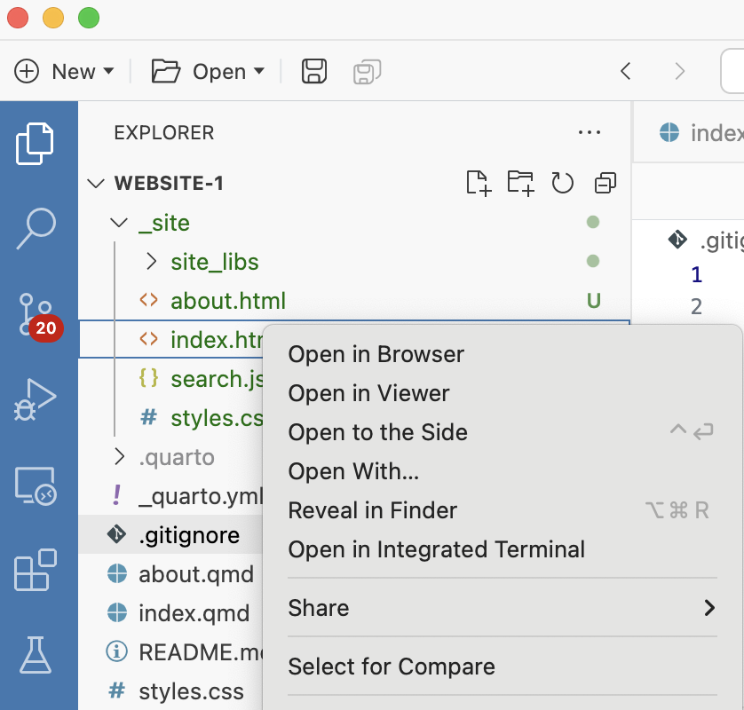
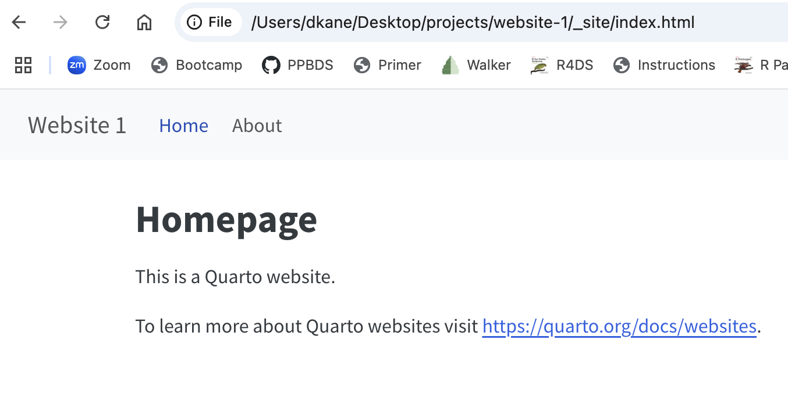

```{r setup, include = FALSE}
knitr::opts_chunk$set(echo = FALSE)
knitr::opts_chunk$set(out.width = '90%')
options(tutorial.exercise.timelimit = 240, 
        tutorial.storage = "local") 

library(learnr)
library(tutorial.helpers)
library(knitr)
library(tidyverse)
```

```{r copy-code-chunk, child = system.file("child_documents/copy_button.Rmd", package = "tutorial.helpers")}
```

```{r info-section, child = system.file("child_documents/info_section.Rmd", package = "tutorial.helpers")}
```

<!-- Maybe have 4 websites to split things up a bit more. website-3 has too many questions. 3 should just do the data. 4 should be the plot, perhaps after forking the final version of 3. -->

<!-- For later websites, show how to add a link to the website to the GitHub repo. -->

## Introduction
### 

This tutorial practices the process of creating and organizing the [Quarto websites](https://quarto.org/docs/websites/) using the [Quarto CLI](https://quarto.org/docs/get-started/) (command line interface). You will learn some new skills, such as how to add a visualization, edit text, and create new pages. You will also learn how to save the results of your data manipulation code in an RDS file and how to save your plots as PNG files. Some material is from [*R for Data Science (2e)*](https://r4ds.hadley.nz/) by Hadley Wickham, Mine Çetinkaya-Rundel, and Garrett Grolemund.

### 

Start a new window with `File -> New Window`. This new window is the location in which you will do all the work for the tutorial, including the creation of new projects. The current window, the one in which you are reading these words, is just used to run this tutorial. 

## Website 1
### 

Let's create and publish a [Quarto website](https://quarto.org/docs/websites/).

### Exercise 1

Create a public GitHub repo (called `website-1`). Make sure to click the "Add a README file" check box. Copy/paste the URL for its GitHub location.

```{r website-1-1}
question_text(NULL,
	answer(NULL, correct = TRUE),
	allow_retry = TRUE,
	try_again_button = "Edit Answer",
	incorrect = NULL,
	rows = 3)
```

### 

Your answer should look something like:

```
https://github.com/davidkane9/website-1
```

Always start a new data science project with a new GitHub repo.

### Exercise 2

Connect the `website-1` GitHub repo to a project on your computer. Close the Positron welcome page in the Editor and then start the interpreter using R, if necessary.

From the Terminal, run `ls`. CP/CR.

```{r website-1-2}
question_text(NULL,
	answer(NULL, correct = TRUE),
	allow_retry = TRUE,
	try_again_button = "Edit Answer",
	incorrect = NULL,
	rows = 3)
```

### 

Your answer should look something like this:

````
dkane@macbook website-1 % ls
README.md
dkane@macbook website-1 % 
````

### Exercise 3

In the Terminal, run `quarto create project website .`.  Don't forget the `.` at the end of the command. If asked for a title, use "Website 1".

Depending on your computer setup, this command will require you to answer some questions. Do so as best you can.

CP/CR.

```{r website-1-3}
question_text(NULL,
	answer(NULL, correct = TRUE),
	allow_retry = TRUE,
	try_again_button = "Edit Answer",
	incorrect = NULL,
	rows = 3)
```

### 

````
dkane@macbook website-1 % quarto create project website .
? Title (website) › Website 1
Creating project at /Users/dkane/Desktop/projects/website-1:
  - Created _quarto.yml
  - Created .gitignore
  - Created index.qmd
  - Created about.qmd
  - Created styles.css
dkane@macbook website-1 % 
````

Quarto is telling you what it did: creating 5 new files and placing them in the *current* directory. Recall that, on the command line, a `.` refers to the current directory. 

### Exercise 4

In the Terminal, run `ls -a`. CP/CR.

```{r website-1-4}
question_text(NULL,
	answer(NULL, correct = TRUE),
	allow_retry = TRUE,
	try_again_button = "Edit Answer",
	incorrect = NULL,
	rows = 3)
```

### 

````
dkane@macbook website-1 % ls -a
.               .git            README.md       about.qmd       styles.css
..              .gitignore      _quarto.yml     index.qmd
dkane@macbook website-1 % 
````

The basic set of files necessary for making a Quarto website has been added to the current directory. 

### Exercise 5

Note that a `.gitignore` file has already been created for you. Quarto knows that any well-designed website needs that file, so it just provides it for you.

From the Terminal, run `cat .gitignore`. CP/CR.

```{r website-1-5}
question_text(NULL,
	answer(NULL, correct = TRUE),
	allow_retry = TRUE,
	try_again_button = "Edit Answer",
	incorrect = NULL,
	rows = 3)
```

###

````
dkane@macbook website-1 % cat .gitignore
/.quarto/
dkane@macbook website-1 % 
````

The `.quarto` directory does not yet exist because we haven't rendered any of our QMD files yet. But when we do, we don't any of the junk in that file to be backed up with Git.

### Exercise 6

In the Console, run:

````
library(tutorial.helpers)
show_file("_quarto.yml")
````

CP/CR.

```{r website-1-6}
question_text(NULL,
	answer(NULL, correct = TRUE),
	allow_retry = TRUE,
	try_again_button = "Edit Answer",
	incorrect = NULL,
	rows = 10)
```

### 

````
> library(tutorial.helpers)
+ show_file("_quarto.yml")
project:
  type: website

website:
  title: "Website 1"
  navbar:
    left:
      - href: index.qmd
        text: Home
      - about.qmd

format:
  html:
    theme: cosmo
    css: styles.css
    toc: true
>
````

Quarto offers a wide range of output formats. You can find the complete list at https://quarto.org/docs/output-formats/all-formats.html. Many formats share some output options (e.g., `toc: true` for including a table of contents), but others have options that are format specific e.g., `code-fold: true` collapses code chunks into a `<details>` tag for HTML output so the user can display it on demand. It’s not applicable in a PDF or Word document.

### Exercise 7

Open the `index.qmd` file using the Explorer pane. Replace the title with `"Homepage"`. Save the file.

In the Console, run:

````
show_file("index.qmd")
````

CP/CR.

```{r website-1-7}
question_text(NULL,
	answer(NULL, correct = TRUE),
	allow_retry = TRUE,
	try_again_button = "Edit Answer",
	incorrect = NULL,
	rows = 3)
```

### 

````
> show_file("index.qmd")
---
title: "Homepage"
---

This is a Quarto website.

To learn more about Quarto websites visit <https://quarto.org/docs/websites>.
>
````

Note that the `title` (`"Website 1"`) in `_quarto.yml` has no necessary connection to the `title` (`"Homepage"`) in `index.qmd`. The former is the title for the entire website. The latter is the title for just the (yet-to-be-created) `index.html` page, which will be the home page for the website.

### Exercise 8

Commit and push all the files in the project. (Recall that the "Sync" button both pushes and pulls from GitHub. Since no one else is adding material to our GitHub, there is nothing to pull. So, we will sometimes just use the word "push," although you can just press the "Sync" button.)

Run `git log -n 1` in the Terminal. CP/CR.

```{r website-1-8}
question_text(NULL,
    answer(NULL, correct = TRUE),
    allow_retry = TRUE,
    try_again_button = "Edit Answer",
    incorrect = NULL,
    rows = 3)
```

### 

````
dkane@macbook website-1 % git log -n 1
commit a84054404f314acd719a89005253fb004c95a540 (HEAD -> main, origin/main, origin/HEAD)
Author: David Kane <dave.kane@gmail.com>
Date:   Sun Mar 16 10:16:34 2025 -0400

    initial version
dkane@macbook website-1 % 
````

<!-- not exactly the best link ... -->

The output from the `git log` command is too complex for us to fully parse. If you want to learn more about how to work with Git/GitHub and R, check out [Happy Git with R](https://happygitwithr.com/existing-github-last.html), a very useful resource.

### Exercise 9

From the Terminal, run `quarto render`. CP/CR.

```{r website-1-9}
question_text(NULL,
	answer(NULL, correct = TRUE),
	allow_retry = TRUE,
	try_again_button = "Edit Answer",
	incorrect = NULL,
	rows = 6)
```

### 

Your answer should look something like:

````
dkane@macbook website-1 % quarto render
[1/2] index.qmd
[2/2] about.qmd

Output created: _site/index.html

dkane@macbook website-1 % 
````

`render` just creates the website. It does not "watch" the website, as `preview` does.

### Exercise 10

<!-- Not click but two finger click, right? -->

You can view a rendered website by hand. Go to the Explorer pane, look in the `_site` directory, and click on the `index.html` file.

```{r}

```

You can view the file in either your browser or in the Viewer tab. In the browser, you would see something like this:

```{r}

```

Click on the "About" link. Copy/paste the material from the webpage.

```{r website-1-10}
question_text(NULL,
	answer(NULL, correct = TRUE),
	allow_retry = TRUE,
	try_again_button = "Edit Answer",
	incorrect = NULL,
	rows = 3)
```

###

````
Website 1

Home
About
About
About this site
````

Your answer might not match ours. That is OK! How the html display varies by browser and screen dimension. The important thing is that, once we have rendered a website, a working version appears in the `_site` directory. 

### Exercise 11

From the Terminal, run `ls _site`. CP/CR.

```{r website-1-11}
question_text(NULL,
	answer(NULL, correct = TRUE),
	allow_retry = TRUE,
	try_again_button = "Edit Answer",
	incorrect = NULL,
	rows = 3)
```

### 

````
dkane@macbook website-1 % ls _site
about.html      index.html      search.json     site_libs       styles.css
dkane@macbook website-1 % 
````

Again, we never edit files in the `_site` directory directly. We run commands, like `quarto render`, which manipulate these files.

### Exercise 12

Add `_site` to the `.gitignore`. Don't forget that the last line of `.gitignore` should always be blank. Save the file. 

In the Terminal, run `cat .ignore`. CP/CR.

```{r website-1-12}
question_text(NULL,
	answer(NULL, correct = TRUE),
	allow_retry = TRUE,
	try_again_button = "Edit Answer",
	incorrect = NULL,
	rows = 3)
```

### 

````
dkane@macbook website-1 % cat .gitignore 
/.quarto/
_site
dkane@macbook website-1 % 
````

Note that `_site` ignores any file or directory named `_site` anywhere in the repository, which is generally what we want.

### Exercise 13

From the Terminal, run `quarto preview`. CP/CR.

```{r website-1-13}
question_text(NULL,
	answer(NULL, correct = TRUE),
	allow_retry = TRUE,
	try_again_button = "Edit Answer",
	incorrect = NULL,
	rows = 3)
```

### 

Your answer should look something like this:

````
dkane@macbook website-1 % quarto preview
Preparing to preview
[1/1] index.qmd

Watching files for changes
Browse at http://localhost:7412/
GET: /
````

The `quarto preview` command does two things. First, it renders the  files, just like `quarto render` does. Second, it sets up a viewer --- probably your default web browser but possibly the "Viewer" tab in the Secondary Activity Bar  --- so that you can see what the website looks like. Click around and check it out!

The message at the end indicates that Quarto is now "watching" your files to see if you make any changes. If you do, it will automatically update the website.

Use `Ctrl + c` to end the `quarto preview` command, although this will only work if the Terminal is the "active" area of the Positron window.

### Exercise 14

Ensure that all the files in the project have been committed and pushed. 

At the Terminal, run `quarto publish gh-pages`. Accept the default settings.

Copy/paste the final URL for your website. 

```{r website-1-14}
question_text(NULL,
	answer(NULL, correct = TRUE),
	allow_retry = TRUE,
	try_again_button = "Edit Answer",
	incorrect = NULL,
	rows = 2)
```

### 

````
https://davidkane9.github.io/website-1/
````

You can also use Quarto to produce presentations. You get less visual control than with a tool like Keynote or PowerPoint, but automatically inserting the results of your R code into a presentation can save a huge amount of time. Presentations work by dividing your content into slides, with a new slide beginning at each second (`##`) level header. Additionally, first (`#`) level headers indicate the beginning of a new section with a section title slide that is, by default, centered in the middle.

### Exercise 15

Press the Source Control button and confirm that there are no changes. There shouldn't be since publishing does not (usually) change any of the files in the project, assuming that you have recently rendered them.

Run `git log -n 1` in the Terminal. CP/CR. 

The `-n 1` option causes Git to just provide the information on the last commit.

```{r website-1-15}
question_text(NULL,
	answer(NULL, correct = TRUE),
	allow_retry = TRUE,
	try_again_button = "Edit Answer",
	incorrect = NULL,
	rows = 3)
```

### 

````
dkane@macbook website-1 % git log -n 1
commit 766d1ad5d4838f2851fd372432c74e2bad8eb17a (HEAD -> main, origin/main, origin/HEAD)
Author: David Kane <dave.kane@gmail.com>
Date:   Sun Mar 16 11:59:04 2025 -0400

    last commit
dkane@macbook website-1 % 
````

We recommend that you use a Quarto project for your websites, books, dashboards and so on. 

## Website 2
### 

Let's create a new website with a beautiful plot of the data from the `billboard` tibble from the **tidyr** package.

### Exercise 1

Create a public GitHub repo called `website-2`. Make sure to click the "Add a README file" check box.

Connect the `website-2` GitHub repo to a project on your computer. 

From the Terminal, run `ls`. CP/CR.

```{r website-2-1}
question_text(NULL,
	answer(NULL, correct = TRUE),
	allow_retry = TRUE,
	try_again_button = "Edit Answer",
	incorrect = NULL,
	rows = 3)
```

### 

````
dkane@macbook website-2 % ls
README.md
dkane@macbook website-2 % 
````

Recall that the `index.qmd` file will always create our "home" page because it is rendered to `index.html`. Browsers, by default, show `index.html`, if one exists, when they visit a new directory. 

### Exercise 2

In the Terminal, run `quarto create project website .`.  Use "Website 2" as the title, if asked.

CP/CR.

```{r website-2-2}
question_text(NULL,
	answer(NULL, correct = TRUE),
	allow_retry = TRUE,
	try_again_button = "Edit Answer",
	incorrect = NULL,
	rows = 3)
```

### 

````
dkane@macbook website-2 % quarto create project website .
? Title (website) › Website 2
Creating project at /Users/dkane/Desktop/projects/website-2:
  - Created _quarto.yml
  - Created .gitignore
  - Created index.qmd
  - Created about.qmd
  - Created styles.css
dkane@macbook website-2 % 
````

The `.` in the `quarto create` command refers to the current working directory. That is, we are telling Quarto to put all the necessary files right here.

We are moving faster in the creation of Website 2 than we did when making Website 1 because you should already be familiar with the steps. We will go even faster when we make Website 3.

### Exercise 3

Add `_site` to the `.gitignore` files. Save it.

In the Terminal, run `cat .gitignore`. CP/CR.

```{r website-2-3}
question_text(NULL,
	answer(NULL, correct = TRUE),
	allow_retry = TRUE,
	try_again_button = "Edit Answer",
	incorrect = NULL,
	rows = 3)
```

### 

````
dkane@macbook website-2 % cat .gitignore
/.quarto/
_site
dkane@macbook website-2 % 
````

Keeping track of all the different files and understanding how they work together is the central skill in creating larger projects.

### Exercise 4

In `index.qmd`, delete everything outside the YAML header. Change `title` to `"Billboard Graphic"`. 

In the Terminal, run `cat index.qmd`. CP/CR.

```{r website-2-4}
question_text(NULL,
    answer(NULL, correct = TRUE),
    allow_retry = TRUE,
    try_again_button = "Edit Answer",
    incorrect = NULL,
    rows = 3)
```

### 

````
dkane@macbook website-2 % cat index.qmd 
---
title: "Billboard Graphic"
---
dkane@macbook website-2 % 
````

Because this is a Quarto website project, the format for all the `qmd` files is `html` by default. So the YAML header does not need to specify that explicitly. 

### Exercise 5

Create a new code chunk in `index.qmd` and load the **tidyverse** package. Save the file.

In the Console, run:

````
show_file("index.qmd", chunk = "Last")
````

CP/CR. (Did you remember to `library(tutorial.helpers)` in the Console so that this function is available?)

```{r website-2-5}
question_text(NULL,
	answer(NULL, correct = TRUE),
	allow_retry = TRUE,
	try_again_button = "Edit Answer",
	incorrect = NULL,
	rows = 3)
```

### 

````
> show_file("index.qmd", chunk = "Last")
suppressPackageStartupMessages(library(tidyverse))
>
````

Although we did not tell you explicitly to use `suppressPackageStartupMessages()`, you should have done so on your own. You *know* that we won't want to have all those annoying messages on the home page, right? Fix it.

### Exercise 6

From the Terminal, run `quarto preview`. 

Copy and paste the home page, leaving out the menu items.

```{r website-2-6}
question_text(NULL,
    answer(NULL, correct = TRUE),
    allow_retry = TRUE,
    try_again_button = "Edit Answer",
    incorrect = NULL,
    rows = 10)
```

### 

````
Website 2

Billboard Graphic
suppressPackageStartupMessages(library(tidyverse))
````

The code is echoed because we have not turned off echoing in the YAML header yet. Do that now with:

````
execute:
  echo: false
````  

Note how changing `index.qmd` causes the `index.html` to be re-rendered, leading to a new homepage display in your browser. Seeing fixes implemented automatically is why many people like working in *preview* mode.

### Exercise 7

Create another code chunk. Ask AI to create a some code which makes a cool looking plot using the `billboard` tibble from the **tidyr** package and `ggplot()`. Make sure you understand what the plot is showing. Work with the AI to solve any errors, improve the code, make the graphic better and so on. 

`Cmd/Ctrl + Shift + K` to ensure that the plot looks good. If it looks bad, or there are some weird messages/warnings, use the AI to fix things.

In the Console, run:

````
show_file("index.qmd", chunk = "Last")
````

CP/CR.

```{r website-2-7}
question_text(NULL,
	answer(NULL, correct = TRUE),
	allow_retry = TRUE,
	try_again_button = "Edit Answer",
	incorrect = NULL,
	rows = 3)
```

### 

What [Grok gave me](https://grok.com/chat/4cc49023-df73-4d2c-ad16-49cb52be7559) after 20 minutes of back-and-forth conversation:

````
data("billboard", package = "tidyr")

# billboard variables:
# - artist: name of the artist
# - track: song title
# - date.entered: date the song entered the Billboard Top 100
# - wk1 through wk76: weekly rankings from first week on chart, lower is better

# Step 1: Calculate week offset and find ranks in early July 2000 (approx. week 26)
billboard <- billboard |> 
  mutate(date.entered = as.Date(date.entered),
         week_offset = as.numeric(difftime(date.entered, as.Date("2000-01-01"), units = "weeks")))

# Approximate July 1, 2000 (week 26 from Jan 1)
jul_week <- 26

# Find the rank of each song around July 1, 2000
billboard_jul <- billboard |> 
  filter(date.entered <= as.Date("2000-07-01")) |> 
  mutate(wk_idx = jul_week - week_offset,
         wk_idx = if_else(wk_idx >= 1 & wk_idx <= 76, wk_idx, NA_real_),
         jul_rank = NA_real_)

# Compute jul_rank by extracting values from wk columns
for (i in seq_len(nrow(billboard_jul))) {
  wk_idx <- billboard_jul$wk_idx[i]
  if (!is.na(wk_idx)) {
    col_name <- paste0("wk", wk_idx)
    billboard_jul$jul_rank[i] <- as.numeric(billboard_jul[[col_name]][i])
  }
}

# Select top 5 songs by jul_rank
top_5_songs <- billboard_jul |> 
  filter(!is.na(jul_rank)) |> 
  arrange(jul_rank) |> 
  slice(1:5) |> 
  pull(track)

# Step 2: Filter data to only the top 5 songs for 2000
billboard_filtered <- billboard |> 
  filter(track %in% top_5_songs)

# Step 3: Reshape data for plotting, limiting to 2000 (weeks 0 to 52)
top_songs <- billboard_filtered |> 
  select(artist, track, wk1:wk76) |> 
  pivot_longer(cols = starts_with("wk"),
               names_to = "week_num",
               values_to = "rank") |> 
  mutate(week_num = as.numeric(gsub("wk", "", week_num))) |> 
  left_join(billboard_filtered |> select(track, week_offset), by = "track") |> 
  mutate(week_num = week_num + week_offset) |> 
  filter(week_num >= 0 & week_num <= 52) |> 
  filter(!is.na(rank)) |> 
  # Create a new column for the legend: "Song (Artist)"
  mutate(song_artist = paste0(track, " (", artist, ")"))

# Step 4: Plot
month_breaks <- seq(0, 48, by = 4)  # 13 breaks: 0 to 48
month_labels <- c("Jan", "Feb", "Mar", "Apr", "May", "Jun", 
                 "Jul", "Aug", "Sep", "Oct", "Nov", "Dec", "Jan")

ggplot(top_songs, aes(x = week_num, y = rank, color = song_artist)) +
  geom_line(linewidth = 1.2, alpha = 0.8) +
  geom_point(size = 2) +
  scale_y_reverse(limits = c(100, 1)) +
  scale_x_continuous(breaks = month_breaks, labels = month_labels) +
  scale_color_manual(values = c("#FF6B6B", "#4ECDC4", "#45B7D1", "#96CEB4", "#FFEEAD")) +
  labs(title = "Billboard Top 100: Top 5 Songs in Jul 2000",
       subtitle = "Tracking rank changes from Jan to Dec 2000",
       x = "Month",
       y = "Chart Position",
       color = "Song (Artist)") +
  theme_minimal() +
  theme(
    plot.title = element_text(size = 16, face = "bold", hjust = 0.5),
    plot.subtitle = element_text(size = 12, hjust = 0.5),
    legend.position = "bottom",
    legend.title = element_text(face = "bold"),
    panel.grid.minor = element_blank(),
    panel.grid.major = element_line(color = "grey90"),
    plot.background = element_rect(fill = "#F5F5F5", color = NA)
  ) +
  guides(color = guide_legend(nrow = 2))
````

As AI gets better, less iteration will be necessary. But you still need to be *intentional*, to demonstrate *agency* and *understanding*. You must be able to explain what the plot means. You don't have to *write* the code, but you should be able to *read* the code, perhaps after asking the AI for help.

### Exercise 8

There are two common modes for working with larger projects. First, as here, we work with an individual file, like `index.qmd`, and ensure that it is working as we want. Second, as before, we work with the project as a whole, using commands like `quarto render`, which render all the files in the project. The former approach is quickest and is how we spend most of our time. But, at the end of the day, we need to build the entire project.

Go to the Source Control pane. Commit and push your new changes to GitHub. Include a descriptive commit message, e.g. "Added plot to home page".

In the Terminal, run `quarto publish gh-pages`. You may need to hit `Enter` once.

Copy/paste the URL below:

```{r website-2-8}
question_text(NULL,
    answer(NULL, correct = TRUE),
    allow_retry = TRUE,
    try_again_button = "Edit Answer",
    incorrect = NULL,
    rows = 3)
```

### 

Your answer should look like this, but with your username instead of mine.

````
https://davidkane9.github.io/website-2/
````

Keep track of the three different versions of the website. 

First, we have the QMD files in the project directory which are used to create the website. This is the original source, the place where changes should be made. 

Second, we have the rendered version of the files which reside in the `_site` directory on our computer. We do not edit these files directly, but we do look at them when we are "previewing" the website.

Third, we have the website itself, the files which other people can see. These reside on GitHub, in this case, but we could put them on a different hosting service.

### Exercise 9

Quarto allows for a combination of plain text and R code. This same feature allows you to add plain text to your website.

Open `about.qmd `. Delete all the current text, except for the YAML header. Ensure that the `title` is `"About"`. Add `## About Me` as the first (and only) line of text. Render the QMD. 

In the Console, run:

````
show_file("about.qmd")
````

CP/CR.

```{r website-2-9}
question_text(NULL,
    answer(NULL, correct = TRUE),
    allow_retry = TRUE,
    try_again_button = "Edit Answer",
    incorrect = NULL,
    rows = 3)
```

### 

````
---
title: "About"
---

## About Me
````

Hash signs in front of text makes the text into a header. The organization of headers is determined by the number of hash signs. Fewer hash signs make higher level headers, i.e. bigger text. More hash signs make lower level headers, i.e. smaller text. 

### Exercise 10

Write a one sentence description of yourself. Write it below the header. Include your name and school, either the one you attend or one from which you have graduated. Write until the end of the line, i.e. do not use the `Enter` key to wrap text. When you are finished, render the QMD. Example:

````
My name is David Kane, and I graduated from Williams College.
````

In the Console, run:

````
show_file("about.qmd")
````

CP/CR.

```{r website-2-10}
question_text(NULL,
    answer(NULL, correct = TRUE),
    allow_retry = TRUE,
    try_again_button = "Edit Answer",
    incorrect = NULL,
    rows = 3)
```

### 

````
---
title: "About"
---

## About Me

My name is David Kane, and I graduated from Williams College.
````

You can have a Quarto document without a YAML header, if you like. You can also have an empty YAML header. But, it will often be the case that we want all the files in a project to have similar YAML headers in order to create a consistent look-and-feel.

### Exercise 11

Let's bold your name and italicize your school's name. In the description you have already written, surround your name with two asterisks, `**`, on both sides. Let's also put a single asterisk, `*`, around both sides of your school. Example:

````
My name is **David Kane**, and I graduated from *Williams College*.
````

`Cmd/Ctrl + Shift + K`

In the Console, run:

````
show_file("about.qmd")
````

CP/CR.

```{r website-2-11}
question_text(NULL,
    answer(NULL, correct = TRUE),
    allow_retry = TRUE,
    try_again_button = "Edit Answer",
    incorrect = NULL,
    rows = 6)
```

### 

````
---
title: "About"
---

## About Me

My name is **David Kane**, and I graduated from *Williams College*.
````

Quarto, which is based on the Markdown language, has a variety of [formatting options](https://quarto.org/docs/authoring/markdown-basics.html).

Examples of Quarto formatting options incclude:

````
**bold** *italic* ~~strikeout~~ `code`

superscript^2^ subscript~2~

[underline]{.underline} [small caps]{.smallcaps}
````

<!-- Can we make the format of the above look like the below? Like put them both in boxes? Right now, only the raw text is in a box, because of the four backticks. -->

These look like:

**bold** *italic* ~~strikeout~~ `code`

superscript^2^ subscript~2~

[underline]{.underline} [small caps]{.smallcaps}

### Exercise 12

At the bottom of `about.qmd`, let's create text which is also a hyperlink to a website. Enclose the text "Kane's Free Data Science Bootcamp" in brackets `[]`. Then, without a space intervening, add parentheses `()` which enclose a link to the relevant website: `https://bootcamp.davidkane.info`.

It should look like:

````
[Kane's Free Data Science Bootcamp](https://bootcamp.davidkane.info)
````

`Cmd/Ctrl + Shift + K`. (Recall that rendering automatically saves the file first.)

In the Console, run:

````
show_file("about.qmd", pattern = "Bootcamp")
````

CP/CR.


```{r website-2-12}
question_text(NULL,
    answer(NULL, correct = TRUE),
    allow_retry = TRUE,
    try_again_button = "Edit Answer",
    incorrect = NULL,
    rows = 3)
```

````
[Kane's Free Data Science Bootcamp](https://bootcamp.davidkane.info)
````

You only need a few [formatting tricks](https://quarto.org/docs/authoring/markdown-basics.html) for working with Quarto files, but you will use those tricks repeatedly.

### Exercise 13

Push all the changes to GitHub, and issue the `quarto publish gh-pages` command in the Terminal. You need to hit `Enter` at least once. CP/CR.

```{r website-2-13}
question_text(NULL,
	answer(NULL, correct = TRUE),
	allow_retry = TRUE,
	try_again_button = "Edit Answer",
	incorrect = NULL,
	rows = 3)
```

### 

Troubleshooting Quarto documents can be challenging because you are no longer in an interactive R environment. You will need to learn some new tricks. Additionally, an error could be due to issues with the Quarto document itself or due to the R code in the Quarto document.

If the errors are due to the R code in the document, the first thing you should always try is to recreate the problem in an interactive session. Render the QMD. If you’re lucky, that will recreate the problem, and you can figure out what’s going on interactively.

### Exercise 14

Let's create new pages for your website, accessible via the navigation bar at the top.

Go to `File -> New File -> Quarto Document...`. Title it "Sources".  Save the file, changing the file name from `Untitled.qmd` to `sources.qmd`. 

### 

In the Terminal, run `ls *qmd`. CP/CR.

```{r website-2-14}
question_text(NULL,
    answer(NULL, correct = TRUE),
    allow_retry = TRUE,
    try_again_button = "Edit Answer",
    incorrect = NULL,
    rows = 3)
```

### 

````
dkane@macbook website-2 % ls *qmd
about.qmd       index.qmd       sources.qmd
dkane@macbook website-2 % 
````

You should see `index.qmd`, `about.qmd`, and `sources.qmd` in the output. If not, make sure you are in the `website-2` directory. The `*qmd` regular expression selects only files with names which end with the letters `qmd`.

### Exercise 15

In the `sources.qmd` file, below the YAML header, add the text `An overview of sources used in my project.` Save the file.

In the Console, run:

````
show_file("sources.qmd", pattern = "overview")
````

CP/CR.

```{r website-2-15}
question_text(NULL,
    answer(NULL, correct = TRUE),
    allow_retry = TRUE,
    try_again_button = "Edit Answer",
    incorrect = NULL,
    rows = 3)
```

### 

````
> show_file("sources.qmd", pattern = "overview")
An overview of sources used in my project.
>
````

Keep in mind that your browser probably has two tabs which show your website. First, the GitHub Pages version, which has not changed since you last hit `quarto publish gh-pages`. The only way to affect the public website is to publish to it. Second, the `localhost` version, which is what you have been changing every time that you render `index.qmd`.

### Exercise 16

Add the following sentence to `sources.qmd`: 

````
These are my sources. Here are some challenges. Quarto websites are awesome.
````

In the Console, run:

````
show_file("sources.qmd")
````

CP/CR.

```{r website-2-16}
question_text(NULL,
    answer(NULL, correct = TRUE),
    allow_retry = TRUE,
    try_again_button = "Edit Answer",
    incorrect = NULL,
    rows = 3)
```

### 

````
---
title: "Sources"
format: html
---

An overview of sources used in my project.

These are my sources. Here are some challenges. Quarto websites are awesome.
````

A website, when you first look closely, may appear overwhelming in its complexity. But it is usually created from of a small collection of text files, each of them quite simple.

You may be directed to the `localhost` version of your website, showing the "Sources" page. You have rendered the QMD into HTML. But notice that there is no way to get to this page via the website menu . . . That is a problem!

### Exercise 17

Open the `_quarto.yml` file. You should see a line that says `navbar`. Below this line you should see the line `left`. Below this is the code that creates the header links for the navigation bar on your site. It should look like:

```
website:
  title: "Website 2"
  navbar:
    left:
      - href: index.qmd
        text: Home
      - about.qmd
```
    

### 

To add `sources.qmd` as a new page which will appear on the menu, we need to edit `_quarto.yml` to look like this:

```
website:
  title: "Website 2"
  navbar:
    left:
      - href: index.qmd
        text: Home
      - about.qmd
      - href: sources.qmd
        text: Sources
```

Note the two additional lines. 

The `href` line tells Quarto to create an HTML page by rendering `sources.qmd` and to include that new page in the website. 

The `text` line tells Quarto to format the link in the **nav**igation tool**bar** as `Sources`. This is the same process by which the home page, created from `index.qmd`, has a link labeled `Home`.

Since `- about.qmd` appears without either the `href` or `text` argument, Quarto assumes that you want the link to be the same as the title of the QMD. 

### 

In the Console, run:

````
show_file("_quarto.yml")
````

CP/CR.

```{r website-2-17}
question_text(NULL,
    answer(NULL, correct = TRUE),
    allow_retry = TRUE,
    try_again_button = "Edit Answer",
    incorrect = NULL,
    rows = 8)
```

### 

````
project:
  type: website

website:
  title: "Website 2"
  navbar:
    left:
      - href: index.qmd
        text: Home
      - about.qmd
      - href: sources.qmd
        text: Sources

format:
  html:
    theme: cosmo
    css: styles.css
    toc: true
````

**YAML files are *very* tricky!** Tabs and white spaces matter. The code `left` before the navbar items puts the navigation bar on the left side of your site. This can be changed to `right`.

### Exercise 18

Run `quarto preview` from the Terminal. (You may need to first use `Ctrl + c` to end whatever program is currently running.) You will need to hit `Enter` once. Check out your new project! See how "Sources" now appears on the navigation toolbar. Click on "Sources" and see how the text you added to `sources.qmd` now appears on the web.

Run `ls _site/*html` in the Terminal. CP/CR.

```{r website-2-18}
question_text(NULL,
    answer(NULL, correct = TRUE),
    allow_retry = TRUE,
    try_again_button = "Edit Answer",
    incorrect = NULL,
    rows = 3)
```

### 

````
dkane@macbook website-2 % ls _site/*html
_site/about.html        _site/sources.html
_site/index.html
dkane@macbook website-2 % 
````

You should see `sources.html`. Quarto websites, like many similar frameworks, place all the pages which appear on the web into a single directory, like `_site`, and then move that directory onto a hosting service like GitHub Pages.

### Exercise 19

In the `_quarto.yml` file, delete the two lines of code that create the link and header for the "Sources" page.

In the Terminal, stop the preview with `Ctrl + c`. Then, use `rm` to remove `sources.qmd`. Run `ls *qmd` in the Terminal. CP/CR.

```{r website-2-19}
question_text(NULL,
    answer(NULL, correct = TRUE),
    allow_retry = TRUE,
    try_again_button = "Edit Answer",
    incorrect = NULL,
    rows = 3)
```

### 

There should not be a `sources.qmd` file. We are practicing these skills to make you more comfortable building up and tearing down the parts of a project. You need to build more than one house to get good at house-building!

### Exercise 20

Make two more empty Quarto documents, in the same way as you did above, with titles `"Source 1"` and `"Source 2"`.  

You should save them both (so they're not `untitled-1` and `untitled-2`). Name them `source-1.qmd` and `source-2.qmd`. 

In the Terminal, run the command `head source-1.qmd source-2.qmd`. CP/CR.

```{r website-2-20}
question_text(NULL,
    answer(NULL, correct = TRUE),
    allow_retry = TRUE,
    try_again_button = "Edit Answer",
    incorrect = NULL,
    rows = 3)
```

### 

````
dkane@macbook website-2 % head source-1.qmd source-2.qmd 
==> source-1.qmd <==
---
title: "Source 1"
format: html
---


==> source-2.qmd <==
---
title: "Source 2"
format: html
---

dkane@macbook website-2 % 
````

In many Terminal commands, you can provide more than one file as the target of the command. In this case, `head` will be applied to `source-1.qmd` and then `source-2.qmd` sequentially.

### Exercise 21

Let's create a drop-down menu called "Sources" through which one could visit either the page for "Source 1" or "Source 2" from the top menu.

We will be changing YAML settings to enable this, so pay very close attention

The Quarto [documentation](https://quarto.org/) provides an [excellent overview](https://quarto.org/docs/websites/website-navigation.html) of approaches to website navigation. 

Change `_quarto.yml` so that the `navbar` section looks like this

````
  navbar:
    left:
      - href: index.qmd
        text: Home
      - text: Sources
        menu:
          - href: source-1.qmd
            text: Source 1
          - href: source-2.qmd
            text: Source 2 
      - about.qmd
````        

In the Console, run:

````
show_file("_quarto.yml")
````

CP/CR.

```{r website-2-21}
question_text(NULL,
    answer(NULL, correct = TRUE),
    allow_retry = TRUE,
    try_again_button = "Edit Answer",
    incorrect = NULL,
    rows = 10)
```

### 

````
project:
  type: website

website:
  title: "Website 2"
  navbar:
    left:
      - href: index.qmd
        text: Home
      - text: Sources
        menu:
          - href: source-1.qmd
            text: Source 1
          - href: source-2.qmd
            text: Source 2 
      - about.qmd

format:
  html:
    theme: cosmo
    css: styles.css
    toc: true
````

Run `quarto preview` to see the changes. 

### Exercise 22

Go to the Source Control pane. Commit and push your new changes to GitHub. Include a descriptive commit message, e.g. "Added source pages".

From the Terminal, run `git log -n 1`. CP/CR. 

```{r website-2-22}
question_text(NULL,
	answer(NULL, correct = TRUE),
	allow_retry = TRUE,
	try_again_button = "Edit Answer",
	incorrect = NULL,
	rows = 3)
```

### 

````
dkane@macbook website-2 % git log -n 1
commit f0973447485da8bb8e8e36f65e39b5640519dccc (HEAD -> main, origin/main, origin/HEAD)
Author: David Kane <dave.kane@gmail.com>
Date:   Mon Mar 17 18:03:23 2025 -0400

    Added source pages
dkane@macbook website-2 % 
````

Type `quarto publish` in the Terminal and hit "Enter." Note how you did not need to specify `gh-pages`. Quarto is smart enough to know that, since GitHub Pages is what you used last time, it is probably what you want now.  

Explore the use of the "Sources" menu on your website. 

## Website 3
### 

Let's make one more website using the same repo/project/quarto approach as above. We will also learn about storing R objects in RDS files.

### Exercise 1

Create a public GitHub repo called `website-3`. Make sure to click the "Add a README file" check box.

Connect the `website-3` GitHub repo to a project on your computer. 

In the Terminal, run `quarto create project website .`.  Use "Website 3" as the title.

In the Terminal, run `ls -a`.

CP/CR.

```{r website-3-1}
question_text(NULL,
	answer(NULL, correct = TRUE),
	allow_retry = TRUE,
	try_again_button = "Edit Answer",
	incorrect = NULL,
	rows = 8)
```

### 

````
dkane@macbook website-3 % quarto create project website .
? Title (website) › Website 3
Creating project at /Users/dkane/Desktop/projects/website-3:
  - Created _quarto.yml
  - Created .gitignore
  - Created index.qmd
  - Created about.qmd
  - Created styles.css
dkane@macbook website-3 % ls -a
.               .git            README.md       about.qmd       styles.css
..              .gitignore      _quarto.yml     index.qmd
dkane@macbook website-3 % 
````

The `title` in `_quarto.yml` determines the title of the entire website. The `title` at the top of `index.qmd` specifies the title of just that page.

### Exercise 2

Add `_site` to the `.gitignore` files. 

Delete everything in `index.qmd` except that YAML header with `title` set to `"My Home Page"`.

Save all files. Commit and push everything. From the Terminal, run `git log -n 1`. CP/CR.

```{r website-3-2}
question_text(NULL,
	answer(NULL, correct = TRUE),
	allow_retry = TRUE,
	try_again_button = "Edit Answer",
	incorrect = NULL,
	rows = 5)
```

### 

````
dkane@macbook website-3 % git log -n 1
commit 06a1895d5d8a3b1780a91777577026fdc76ef1fa (HEAD -> main, origin/main, origin/HEAD)
Author: David Kane <dave.kane@gmail.com>
Date:   Mon Mar 17 18:27:19 2025 -0400

    initial version
dkane@macbook website-3 % 
````

There are some subtleties in whether we add `_site` or `/_site`. The former matches any directory named `_site` regardless of where in the repo it is located, even if it is nested several levels down.  `/_site`, on the other hand, is "anchored" to the same directory as the `.gitgnore` in which it lives which, in this case, is at the top of the repo. 

### Exercise 3

From the Terminal, run `quarto preview` to examine the website. You should see the titles that you have specified. If you don't, fix things. Hit `Ctrl + c`.

From the Terminal, run `quarto publish gh-pages` to publish the website.

Copy/paste the URL for your website.

```{r website-3-3}
question_text(NULL,
	answer(NULL, correct = TRUE),
	allow_retry = TRUE,
	try_again_button = "Edit Answer",
	incorrect = NULL,
	rows = 3)
```

### 

````
https://davidkane9.github.io/website-3/
````

With luck, you have done these steps enough times that, going forward, we can just tell you to set up a website, and you will know what to do without being told.

### Exercise 4

<!-- Should this be AI generated? -->

Replace the contents of `index.qmd` with the below.

````
---
title: "My Home Page"
execute: 
  echo: false
---

```{r}
suppressPackageStartupMessages(library(tidyverse))
```

```{r}
diamonds |> 
  filter(z != 0) |> 
  filter(color == "D") |> 
  ggplot(aes(x = carat, y = price, color = cut)) + 
    geom_point() +
    scale_y_continuous(labels = scales::dollar) +
    labs(title = "Prices and Sizes for Diamonds of Color D",
         subtitle = "'Round' carat values like 1, 1.5 and 2 are more common.",
         x = "Carat",
         y = "Price")
```
````

Publish the website and commit this change. Make sure everything looks OK.

From the Terminal, run `git log -n 1`. CP/CR.

```{r website-3-4}
question_text(NULL,
	answer(NULL, correct = TRUE),
	allow_retry = TRUE,
	try_again_button = "Edit Answer",
	incorrect = NULL,
	rows = 6)
```

### 

````
---
dkane@macbook website-3 % git log -n 1
commit b83259042267be2d6b64b5ad4bb3115c2ade9c00 (HEAD -> main, origin/main, origin/HEAD)
Author: David Kane <dave.kane@gmail.com>
Date:   Mon Mar 17 18:36:03 2025 -0400

    first plot
dkane@macbook website-3 % 
````

### Exercise 5

One problem with this approach is that all our code is run every time we rebuild the homepage. That is wasteful, especially if the code takes a while to run. 

The RDS format allows us to save any R object in a file. When we read from an RDS, we avoid having to run the code which created the object again. Instead, we simply have access to the object. This is very convenient for any code which takes a long time to run, such as intensive data manipulation.

Restart your R session with `Cmd/Ctrl + Shift + 0`.

Go to `File -> New File ... -> R File`. Save the file. Name the file `process_data.R`.

In the Terminal, run `ls`. CP/CR.

```{r website-3-5}
question_text(NULL,
    answer(NULL, correct = TRUE),
    allow_retry = TRUE,
    try_again_button = "Edit Answer",
    incorrect = NULL,
    rows = 3)
```

### 

````
dkane@macbook website-3 % ls
README.md       _site           index.qmd       styles.css
_quarto.yml     about.qmd       process_data.R
dkane@macbook website-3 % 
````

Make sure that `process_data.R` is one of these files. We often use scripts to record the exact steps we used in working with some data or in creating a graphic. We want our work to be reproducible. We will often need to perform the same work again, albeit with some changes. A script can make that much simpler.

### Exercise 6

Though an R script will use the libraries you already have loaded if executed interactively in the Console, it is good practice to include these at the top of the script. Any script you create should run correctly, even if you have just re-started R.

In `process_data.R`, load the **tidyverse** package using the `library()` command. 

In the Terminal, run `cat process_data.R`. CP/CR.

```{r website-3-6}
question_text(NULL,
    answer(NULL, correct = TRUE),
    allow_retry = TRUE,
    try_again_button = "Edit Answer",
    incorrect = NULL,
    rows = 3)
```

###

````
dkane@macbook website-3 % cat process_data.R
library(tidyverse)
dkane@macbook website-3 % 
````

Because this is a script, you don't need to create a code chunk. Scripts are most useful for work which simply creates an object, often a new data set or a graphic. You also don't need `suppressPackageStartupMessages()` since this is a script, not a Quarto document which will produce an HTML that people will see.

### Exercise 7

Skip a line after `library(tidyverse)`. Again, this is a script, so there are no code chunks, but skipping a line in between substantively different parts of the code is a good idea. Add this code:

````
diamonds |> 
  filter(z != 0) |> 
  filter(color == "D") 
````

In the Terminal, run `cat process_data.R`. CP/CR.

```{r website-3-7}
question_text(NULL,
    answer(NULL, correct = TRUE),
    allow_retry = TRUE,
    try_again_button = "Edit Answer",
    incorrect = NULL,
    rows = 6)
```

### 

````
dkane@macbook website-3 % cat process_data.R
library(tidyverse)

diamonds |> 
  filter(z != 0) |> 
  filter(color == "D") 
dkane@macbook website-3 % 
````

You should try to learn how to work in two ways. First is *interactively*, trying things at the Console. Seeing what happens. Going line-by-line. Second is *writtenly* --- yes, I just made up this word --- adding code to your script/QMD and then executing all the code at once. 

<!-- Could explain this better, maybe illustrate some step-by-step examples. -->

Of course, the best approach is to use these two methods during your analysis, depending on which is best for the next step you need to take. 

### Exercise 8

Place your cursor in `process_data.R` at `filter(z != 0) |>`. Hit `Cmd/Ctrl + Enter`. This will cause the pipe to be pasted to the Console and then executed there. (Note that this should generate an error.) CP/CR.

```{r website-3-8}
question_text(NULL,
	answer(NULL, correct = TRUE),
	allow_retry = TRUE,
	try_again_button = "Edit Answer",
	incorrect = NULL,
	rows = 3)
```

### 

````
> diamonds |> 
+   filter(z != 0) |> 
+   filter(color == "D")
Error:
! object 'diamonds' not found
Show Traceback
>
````

The cause of the error is the distinction between the two worlds: the world of the Console and the world of the Script (which is just like QMD world, as we have discussed before). The Script includes `library(tidyverse)`. So, when you source `process_data.R` in the next question, everything works fine. The Console, however, knows nothing about the `diamonds` tibble or about commands like `select()` or `filter()`. Recall that we recently restarted R. So, the **tidyverse** library, which contains `diamonds` and those commands, has not been loaded in the Console. 

A line of code, like `library(tidyverse)`, might exist in a script, but unless/until that line is executed in the Console, the Console won't know anything about it.

### Exercise 9

"Source" the entire script by choosing the "Source R File with Echo" menu option from the "Source" button the upper right (the right-pointing right triangle). This takes all the code from the script and feeds it, line-by-line, to the Console. CP/CR.

```{r website-3-9}
question_text(NULL,
	answer(NULL, correct = TRUE),
	allow_retry = TRUE,
	try_again_button = "Edit Answer",
	incorrect = NULL,
	rows = 10)
```

### 

Your answer should look like this:

````
> source("/Users/dkane/Desktop/projects/website-3/process_data.R", echo = TRUE)

> library(tidyverse)
── Attaching core tidyverse packages ──────────────────────────────── tidyverse 2.0.0 ──
✔ dplyr     1.1.4     ✔ readr     2.1.5
✔ forcats   1.0.0     ✔ stringr   1.5.1
✔ ggplot2   3.5.1     ✔ tibble    3.2.1
✔ lubridate 1.9.4     ✔ tidyr     1.3.1
✔ purrr     1.0.4     
── Conflicts ────────────────────────────────────────────────── tidyverse_conflicts() ──
✖ dplyr::filter() masks stats::filter()
✖ dplyr::lag()    masks stats::lag()
ℹ Use the conflicted package to force all conflicts to become errors

> diamonds |> 
+   filter(z != 0) |> 
+   filter(color == "D") 
# A tibble: 6,774 × 10
   carat cut       color clarity depth table price     x     y     z
   <dbl> <ord>     <ord> <ord>   <dbl> <dbl> <int> <dbl> <dbl> <dbl>
 1  0.23 Very Good D     VS2      60.5    61   357  3.96  3.97  2.4 
 2  0.23 Very Good D     VS1      61.9    58   402  3.92  3.96  2.44
 3  0.26 Very Good D     VS2      60.8    59   403  4.13  4.16  2.52
 4  0.26 Good      D     VS2      65.2    56   403  3.99  4.02  2.61
 5  0.26 Good      D     VS1      58.4    63   403  4.19  4.24  2.46
 6  0.22 Premium   D     VS2      59.3    62   404  3.91  3.88  2.31
 7  0.3  Premium   D     SI1      62.6    59   552  4.23  4.27  2.66
 8  0.3  Ideal     D     SI1      62.5    57   552  4.29  4.32  2.69
 9  0.3  Ideal     D     SI1      62.1    56   552  4.3   4.33  2.68
10  0.24 Very Good D     VVS1     61.5    60   553  3.97  4     2.45
# ℹ 6,764 more rows
# ℹ Use `print(n = ...)` to see more rows
>
````

The output of the pipe is our new tibble with 6,764 rows.

### Exercise 10

Change the code so that the pipe, instead of just vomiting out its result for printing, assigns that result to a new object, named `D_diamonds`. Your script should look like:

````
library(tidyverse)

D_diamonds <- diamonds |> 
  filter(z != 0) |> 
  filter(color == "D") 
````

Source (with echo) the new script. CP/CR.

```{r website-3-10}
question_text(NULL,
	answer(NULL, correct = TRUE),
	allow_retry = TRUE,
	try_again_button = "Edit Answer",
	incorrect = NULL,
	rows = 3)
```

### 

````
> library(tidyverse)

> D_diamonds <- diamonds |> 
+   filter(z != 0) |> 
+   filter(color == "D") 
>
````

Notice how different this looks from the previous output. 

First, none of the messages associated with the **tidyverse** package are displayed. R only shows these messages the first time you load the package in a given R session. 

Second, the rows of the tibble are not shown because the pipe no longer just spits them out at the end. Instead, the results of the pipe are assigned to a new object: `D_diamonds`. Assignment does not result in printed output. 

### Exercise 11

From the Console, run `ls()`. CP/CR.

```{r website-3-11}
question_text(NULL,
	answer(NULL, correct = TRUE),
	allow_retry = TRUE,
	try_again_button = "Edit Answer",
	incorrect = NULL,
	rows = 3)
```

### 

````
> ls()
[1] "D_diamonds"
>
````

We have created a new object in the environment, called `D_diamonds`. You can also see this object if you look in the Session tab in the Secondary Activity Bar. The name `D_diamonds` is meant to remind us that all the diamonds in this tibble are of color "D."

### Exercise 12

Restart your R session again. You can never restart your R session too often! The best way to do this is with the shortcut command: `Cmd/Ctrl + Shift + 0`. (This is the number zero, not the letter "O.")

From the Terminal, run `ls()`. CP/CR.

```{r website-3-12}
question_text(NULL,
	answer(NULL, correct = TRUE),
	allow_retry = TRUE,
	try_again_button = "Edit Answer",
	incorrect = NULL,
	rows = 3)
```

### 

````
R 4.4.3 exited (preparing for restart)
R 4.4.3 restarted.
> ls()
character(0)
>
````

`D_diamonds` has disappeared! Objects in the R environment vanish once R restarts. And that is OK! We have the script, `process_data.R`, which allows us to recreate the object whenever we want.

### Exercise 13

Source `process_data.R`. From the Terminal, run `ls()`. CP/CR.

```{r website-3-13}
question_text(NULL,
	answer(NULL, correct = TRUE),
	allow_retry = TRUE,
	try_again_button = "Edit Answer",
	incorrect = NULL,
	rows = 3)
```

### 

````
> source("/Users/dkane/Desktop/projects/website-3/process_data.R")
── Attaching core tidyverse packages ──────────────────────────────── tidyverse 2.0.0 ──
✔ dplyr     1.1.4     ✔ readr     2.1.5
✔ forcats   1.0.0     ✔ stringr   1.5.1
✔ ggplot2   3.5.1     ✔ tibble    3.2.1
✔ lubridate 1.9.4     ✔ tidyr     1.3.1
✔ purrr     1.0.4     
── Conflicts ────────────────────────────────────────────────── tidyverse_conflicts() ──
✖ dplyr::filter() masks stats::filter()
✖ dplyr::lag()    masks stats::lag()
ℹ Use the conflicted package to force all conflicts to become errors
> ls()
[1] "D_diamonds"
>
````

I sourced without echo above, so the code is not repeated, but we do see the **tidyverse** warnings.

`D_diamonds` is back! If you type `D_diamonds` at the Console and hit "Enter," the contents of the tibble will appear.

### Exercise 14

It is often useful to save a permanent copy of an R object like a plot or a tibble. [`write_rds()`](https://readr.tidyverse.org/reference/read_rds.html) from the **readr** package is the most common approach for tibbles.

From the Console, run `write_rds(D_diamonds, file = "clean_data.rds")`. This function does not produce any output. The first argument is the R object(s) which you want to save. The second argument is the name of the file which will hold that object.

From the Terminal, run `ls clean*`. CP/CR.

```{r website-3-14}
question_text(NULL,
	answer(NULL, correct = TRUE),
	allow_retry = TRUE,
	try_again_button = "Edit Answer",
	incorrect = NULL,
	rows = 3)
```

### 

````
dkane@macbook website-3 % ls clean*
clean_data.rds
dkane@macbook website-3 % 
````

There are now three objects associated with our tibble: 

* The script, `process_data.R`, which we used to create it. 

* The R object, `D_diamonds`, which only exists in the R session in which it was created. 

* The RDS object, `clean_data.rds`, which contains the data and which continues to exist even after the R session ends. Indeed, the RDS object can be committed and pushed to GitHub. (But be careful not to push large objects (greater than 100 megabytes) to GitHub.)


### Exercise 15

Restart your R session with `Cmd/Ctrl + Shift + 0`. When R restarts, you should still be in the `website-3` project. At the Console, run `library(tidyverse)`. We need to reload the **tidyverse** every time we restart R.

At the Console, run `read_rds("clean_data.rds")`. CP/CR.

```{r website-3-15}
question_text(NULL,
	answer(NULL, correct = TRUE),
	allow_retry = TRUE,
	try_again_button = "Edit Answer",
	incorrect = NULL,
	rows = 3)
```

### 

Your answer should look like:

````
> read_rds("clean_data.rds")
# A tibble: 6,774 × 10
   carat cut       color clarity depth table price     x     y     z
   <dbl> <ord>     <ord> <ord>   <dbl> <dbl> <int> <dbl> <dbl> <dbl>
 1  0.23 Very Good D     VS2      60.5    61   357  3.96  3.97  2.4 
 2  0.23 Very Good D     VS1      61.9    58   402  3.92  3.96  2.44
 3  0.26 Very Good D     VS2      60.8    59   403  4.13  4.16  2.52
 4  0.26 Good      D     VS2      65.2    56   403  3.99  4.02  2.61
 5  0.26 Good      D     VS1      58.4    63   403  4.19  4.24  2.46
 6  0.22 Premium   D     VS2      59.3    62   404  3.91  3.88  2.31
 7  0.3  Premium   D     SI1      62.6    59   552  4.23  4.27  2.66
 8  0.3  Ideal     D     SI1      62.5    57   552  4.29  4.32  2.69
 9  0.3  Ideal     D     SI1      62.1    56   552  4.3   4.33  2.68
10  0.24 Very Good D     VVS1     61.5    60   553  3.97  4     2.45
# ℹ 6,764 more rows
# ℹ Use `print(n = ...)` to see more rows
>
````

The value returned by `read_rds()` is whatever is contained in the RDS object. In this case, that is a tibble. But, when the object at the Console is a tibble, the contents of the tibble are just printed out, as here.

### Exercise 16

Open the `process_data`.R` script. At the bottom, skip a line after the pipe and then add this line (the same one we just executed at the Console):

````
write_rds(D_diamonds, file = "clean_data.rds")
````

It is separate from, and unconnected to, the pipe which creates the `D_diamonds` tibble. 

In the Terminal, run `cat process_data.R`. CP/CR.

```{r website-3-16}
question_text(NULL,
	answer(NULL, correct = TRUE),
	allow_retry = TRUE,
	try_again_button = "Edit Answer",
	incorrect = NULL,
	rows = 6)
```

### 

````
dkane@macbook website-3 % cat process_data.R
library(tidyverse)

D_diamonds <- diamonds |> 
  filter(z != 0) |> 
  filter(color == "D") 

write_rds(D_diamonds, file = "clean_data.rds")
dkane@macbook website-3 % 
````

This is a common approach to scripts which are a part of a larger projects. They finish by saving an object which is then used by other code in the project.

### Exercise 17

In the Terminal, run `rm clean_data.rds`. You are starting your workflow with nothing but the code.

Source `process_data.R`. The easiest way of doing so, as before, is to open the file in the Source pane and then click the "Source" button.

In the Terminal, run `ls clean*`. CP/CR.

```{r website-3-17}
question_text(NULL,
	answer(NULL, correct = TRUE),
	allow_retry = TRUE,
	try_again_button = "Edit Answer",
	incorrect = NULL,
	rows = 3)
```

### 

Your answer should look like:

````
dkane@macbook website-3 % ls clean*
clean_data.rds
dkane@macbook website-3 % 
````

`clean*` is a regular expression which matches any file which starts with the letters `clean`. 

Think about the overall workflow.

* First, we worked interactively, just playing around with plots in `index.qmd`, trying to figure out what works.

* Second, once we had a good idea of what we were doing, we moved to a script, `process_data.R`. We don't want that code to be re-run every time we update `index.qmd`. So, we move some of the work to a script, to be run interactively whenever we need to change something.

* Third, we changed the script so that its final output was a permanent object. Later parts of the process can just begin with `clean_data.rds`.

### Exercise 18

A PNG file allows us to save any R graphic in a file. When we use a PNG, we avoid having to re-run the code which created it. This is very convenient for graphics which take a long time to create.

Go to `File -> New File ... -> R File`. Name the file `make_plot.R`. 

In the Terminal, run `ls`. CP/CR.

```{r website-3-18}
question_text(NULL,
    answer(NULL, correct = TRUE),
    allow_retry = TRUE,
    try_again_button = "Edit Answer",
    incorrect = NULL,
    rows = 3)
```

###

````
dkane@macbook website-3 % ls
README.md       _site           clean_data.rds  make_plot.R     styles.css
_quarto.yml     about.qmd       index.qmd       process_data.R
dkane@macbook website-3 % 
````

Make sure that `make_plot.R` is one of these files. We often use scripts to record the exact steps we used in creating a graphic. We want our work to be reproducible. We will often need to perform the same work again, albeit with some small changes. A script can make that much simpler.

### Exercise 19

Though an R script will use the libraries you already have loaded if executed interactively in the Console, it is good practice to include these at the top of the script. Any script you create should run correctly, even if you have just re-started R.

In `make_plot.R`, load the **tidyverse** package using the `library()` command. 

In the Terminal, run `cat make_plot.R`. CP/CR.

```{r website-3-19}
question_text(NULL,
    answer(NULL, correct = TRUE),
    allow_retry = TRUE,
    try_again_button = "Edit Answer",
    incorrect = NULL,
    rows = 3)
```

### 

````
dkane@macbook website-3 % cat make_plot.R
library(tidyverse)
dkane@macbook website-3 % 
````

Naming conventions are important. It is fine to have dashes in a code chunk label. However, any object which might be used from the Terminal, like the name of a script, should avoid dashes because the Terminal sometimes interprets a dash as a special character, not necessarily as part of the file name. Then again, we have totally violated this advice by calling this project --- and hence the directory in which it is stored --- `website-3`!

### Exercise 20

Copy this code into `make_plot.R`, after skipping a line after `library(tidyverse)`.  Save the file.

````
x <- read_rds("clean_data.rds")

x |> 
  ggplot(aes(x = carat, y = price, color = cut)) + 
    geom_point() +
    scale_y_continuous(labels = scales::dollar) +
    labs(title = "Prices and Sizes for Diamonds of Color D",
         subtitle = "'Round' carat values like 1, 1.5 and 2 are more common.",
         x = "Carat",
         y = "Price")
````

In the Terminal, run `cat make_plot.R`. CP/CR.

```{r website-3-20}
question_text(NULL,
    answer(NULL, correct = TRUE),
    allow_retry = TRUE,
    try_again_button = "Edit Answer",
    incorrect = NULL,
    rows = 10)
```

### 

````
dkane@macbook website-3 % cat make_plot.R
library(tidyverse)

x <- read_rds("clean_data.rds")

x |> 
  ggplot(aes(x = carat, y = price, color = cut)) + 
    geom_point() +
    scale_y_continuous(labels = scales::dollar) +
    labs(title = "Prices and Sizes for Diamonds of Color D",
         subtitle = "'Round' carat values like 1, 1.5 and 2 are more common.",
         x = "Carat",
         y = "Price")
dkane@macbook website-3 % 
````

The code does two things. 

First, it reads the tibble from `clean_data.rds` and assigns that tibble to `x`. (The fact that, in our `process_data.R` script, this data was named `D_diamonds` is irrelevant. `write_rds()` just saves the tibble, not the *name* of the tibble.)

Second, it starts a new pipe with `x` and then creates our plot. Because the plot is not assigned to an object, it is just spat back out, and then shows up in the Plots tab.

### Exercise 21

Source (with echo) the entire script. This takes all the code from the script and feeds it, line-by-line, to the Console. CP/CR.

```{r website-3-21}
question_text(NULL,
	answer(NULL, correct = TRUE),
	allow_retry = TRUE,
	try_again_button = "Edit Answer",
	incorrect = NULL,
	rows = 3)
```

### 

````
> source("/Users/dkane/Desktop/projects/website-3/make_plot.R", echo = TRUE)

> library(tidyverse)

> x <- read_rds("clean_data.rds")

> x |> 
+   ggplot(aes(x = carat, y = price, color = cut)) + 
+     geom_point() +
+     scale_y_continuous(labels = scales::dollar) +
+     labs(titl .... [TRUNCATED] 
>
````

At this point, we face the same problem as we faced when working on `process_data.R`. The script creates the object, in this case a graphic, which we want. But we need a way to save a permanent copy of that object.

### Exercise 22

Edit `make_plot.R` in two ways. First, assign the plot to an object named `D_plot`. Second, insert, after the graphic pipe, `ggsave("size_v_weight.png", D_plot)`. 

In the Terminal, run `cat make_plot.R`. CP/CR.

```{r website-3-22}
question_text(NULL,
	answer(NULL, correct = TRUE),
	allow_retry = TRUE,
	try_again_button = "Edit Answer",
	incorrect = NULL,
	rows = 8)
```

### 

````
library(tidyverse)
x <- read_rds("clean_data.rds")

D_plot <- x |> 
  ggplot(aes(x = carat, y = price, color = cut)) + 
    geom_point() +
    scale_y_continuous(labels = scales::dollar) +
    labs(title = "Prices and Sizes for Diamonds of Color D",
         subtitle = "'Round' carat values like 1, 1.5 and 2 are more common.",
         x = "Carat",
         y = "Price")
         
ggsave("size_v_weight.png", D_plot)
````

As with `clean_data.R`, we have created a script which encapsulates, from start-to-finish, a discrete part of our analysis. In this case, we start from the tibble saved in `clean_data.rds` and finish by saving a graphic in `size_v_weight.png`.

### Exercise 23

Source `make_plot.R`. From the Terminal, run `ls`. CP/CR.

```{r website-3-23}
question_text(NULL,
	answer(NULL, correct = TRUE),
	allow_retry = TRUE,
	try_again_button = "Edit Answer",
	incorrect = NULL,
	rows = 3)
```

### 

````
dkane@macbook website-3 % ls
README.md               index.qmd
_quarto.yml             make_plot.R
_site                   process_data.R
about.qmd               size_v_weight.png
clean_data.rds          styles.css
dkane@macbook website-3 % 
````

There are a lot of files! Note the new script `make_plot.R`, the object with which it starts, `clean_data.rds`, and the object which it creates, `size_v_weight.png`. 

### Exercise 24

Open the `index.qmd` file. In the `setup` code chunk, add `library(knitr)`. In the second code chunk, delete all the plotting code. Replace it all with `knitr::include_graphics("size_v_weight.png")`. Save the file.

In the Terminal, run `cat index.qmd`. CP/CR.

```{r website-3-24}
question_text(NULL,
	answer(NULL, correct = TRUE),
	allow_retry = TRUE,
	try_again_button = "Edit Answer",
	incorrect = NULL,
	rows = 10)
```

### 

<!-- Show the answer. -->

There was nothing wrong, *per se*, with having the plotting code in `index.qmd` rather than `make_plot.R`. The problem arises when that plotting code takes a long time to run, as it often will. We don't want to re-run all the code each time we make a small change to the website. It is much better to separate out the plotting code and only run it when we need to.

### Exercise 25

From the Terminal, run `quarto publish gh-pages`. You will need to hit `Enter` at least once.  Commit and push all the files. 

From the Terminal, run `git show --name-status HEAD`. CP/CR.

```{r website-3-25}
question_text(NULL,
	answer(NULL, correct = TRUE),
	allow_retry = TRUE,
	try_again_button = "Edit Answer",
	incorrect = NULL,
	rows = 3)
```

### 

````
dkane@macbook website-3 % git show --name-status HEAD
commit 5ff52befc37ba1a3ac87dac781f48d6c6251c225 (HEAD -> main, origin/main, origin/HEAD)
Author: David Kane <dave.kane@gmail.com>
Date:   Mon Mar 17 20:08:52 2025 -0400

    update main page

A       clean_data.rds
M       index.qmd
A       make_plot.R
A       process_data.R
A       size_v_weight.png
dkane@macbook website-3 % 
````

Note the workflow. At the start, we created a pipe in `index.qmd` which does everything and then, later, we moved the code into separate scripts so that we don't need to run all the analysis each time we render the website. This is a very common approach. First, get something working. Second, organize and clean it all up. 

In a complex project, we will often create directories --- like `code`, `data`, and `images` --- into which we will place files like `process_data.R`, `clean_data.rds`, and `size_v_weight.png`, respectively.

Graphics on the web often appear differently than graphics on your computer, so [many people find it useful](https://rfortherestofus.com/2019/08/themes-to-improve-your-ggplot-figures) to increase the size of the text in their graphics. [A simple way](https://minimaxir.com/2017/08/ggplot2-web/) to do that is to add `theme_minimal(base_size = 18)` to your plot creation code. Fortunately, doing so is as simple as editing and then re-running `make_plot.R`.

When saving graphics for web display, it is often useful to specify their exact size with a command like `ggsave("your-file.png", your-plot, width = 4, height = 3)`. An earlier edition of [*ggplot2: Elegant Graphics for Data Analysis*](https://ggplot2-book.org/) also [notes](https://bookdown.dongzhuoer.com/hadley/ggplot2-book/saving) that:

> For raster graphics (i.e. .png, .jpg), the dpi argument controls the resolution of the plot. It defaults to 300, which is appropriate for most printers, but you may want to use 600 for particularly high-resolution output, or 96 for on-screen (e.g., web) display.

## Summary
### 

This tutorial practiced the process of creating and organizing the [Quarto websites](https://quarto.org/docs/websites/) using the [Quarto CLI](https://quarto.org/docs/get-started/) (command line interface). You learned some new skills, such as how to add a visualization, edit text, and create new pages. You also learned how to save the results of your data-manipulation code in an RDS file and how to save your plots as PNG files. Some material is from [*R for Data Science (2e)*](https://r4ds.hadley.nz/) by Hadley Wickham, Mine Çetinkaya-Rundel, and Garrett Grolemund.

```{r download-answers, child = system.file("child_documents/download_answers.Rmd", package = "tutorial.helpers")}
```
